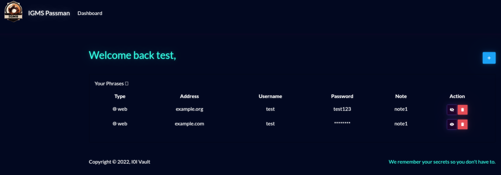
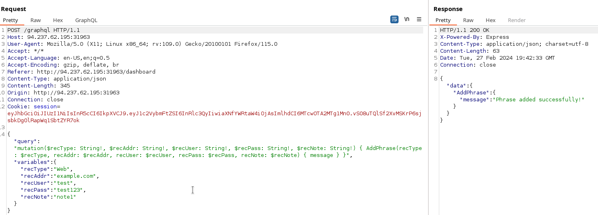
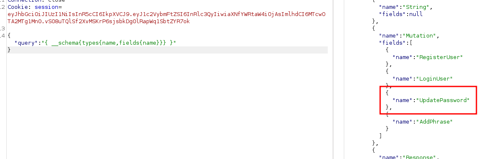
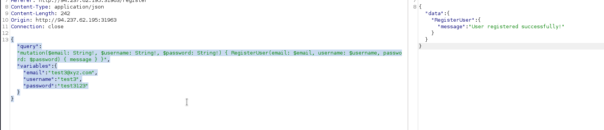
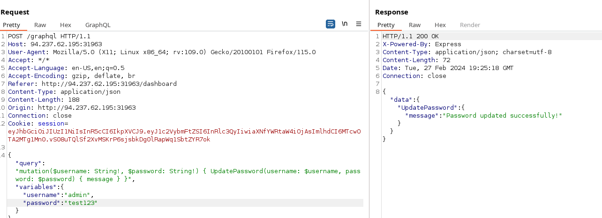
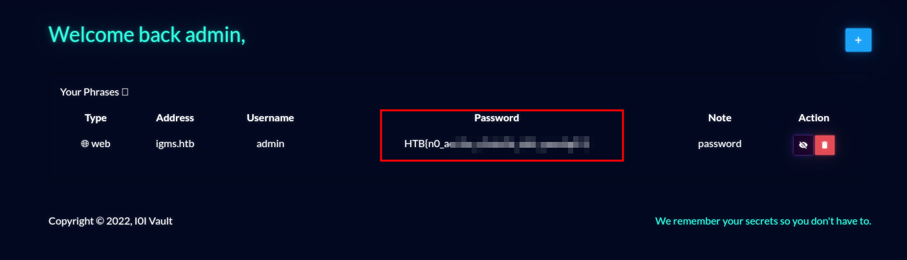

# Web - Passman

## Description
> Pandora discovered the presence of a mole within the ministry. To proceed with caution, she must obtain the master control password for the ministry, which is stored in a password manager. Can you hack into the password manager?

## Walkthrough

For this challenge, we were given the challenge code and an online instance.

I didn't work much with the challenge code here except to take a quick look at it and see that we were dealing with __GraphQL__ and experimented more in Burp.

So here we go!

I first took a look at the web application.

We see a login portal to the password manager.

I registered a test account and looked at what functions the password manager has to offer.

We can add and delete "phrases" and log out.

I observed and intercepted the whole thing in Burp.

Here is an example of what happens behind the scenes when we add a phrase entry to the password manager.

Well, as already mentioned, we are dealing with __GraphQL__ here.

So I first made a so-called introspection which gives me a lot of useful information about the schema and structure.

__Introspection:__ `{"query":"{ __schema{types{name,fields{name}}} }"}`

The __mutations__, the operations that this application makes available to us, are interesting.

And the mutation __UpdatePassword__ aroused my interest.

Because I couldn't find this functionality in the application as a logged-in user.

## Solution

I registered a test user, intercepted and looked at the mutation to register a new user.

I logged in as this user and wanted to see if I could use the __UpdatePassword__ mutation.

I created a query which changed the admin's password from a value I specified and got a positive response.

I now logged in as user __admin__ and got the flag saved as a "phrase"!

