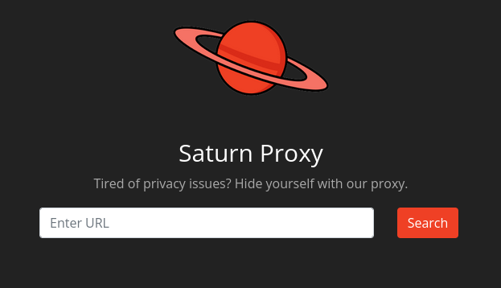
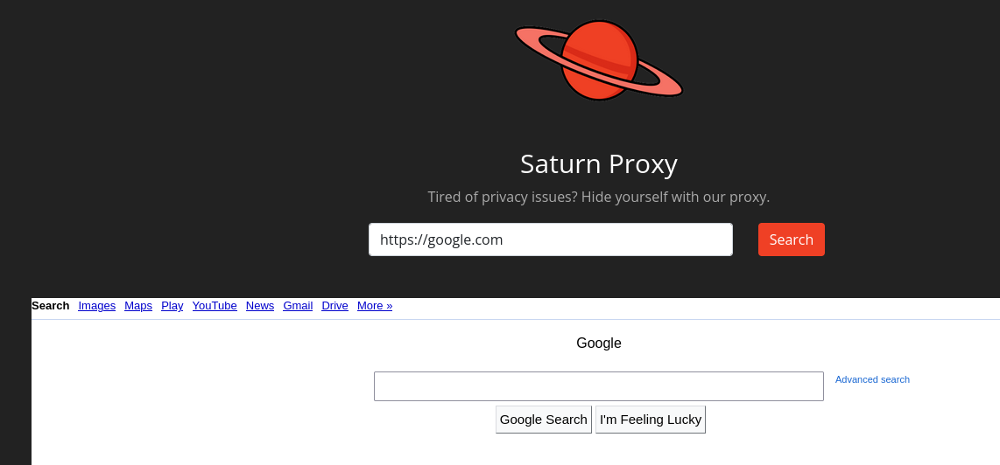
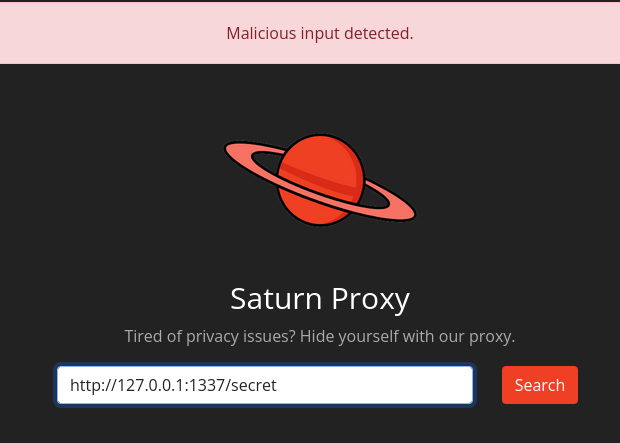
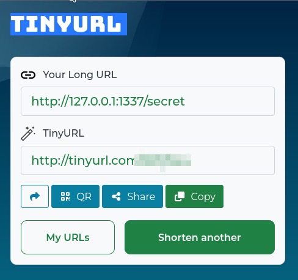
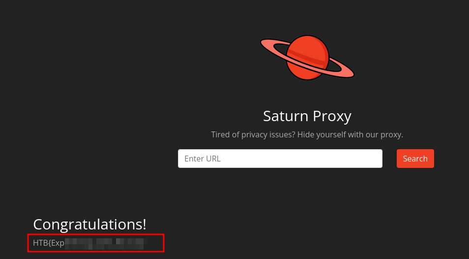

# Web - Saturn

## Description
> Saturn corp just launched their new proxy service. According to them, they have made sure their proxy service contains no security issues as they have implemented decent security measures with up to date components.

## Walkthrough

In this challenge we get the challenge code and a web instance.

I first looked at the page normally in the browser and this is what I saw.



The site wants to work as a proxy service and through this we can call other sites such as Google.



Ok, since we have been given the challenge code, I wanted to know where the flag is.

`tree -a`

```bash
.
├── app.py
├── flag.txt
├── requirements.txt
├── static
│   ├── main.css
│   └── saturn.png
└── templates
    ├── forbidden.html
    ├── index.html
    └── secret.html
```

The flag is located in the web directory.

The __app.py__ file contains the following code:

```python
from flask import Flask, request, render_template
import requests
from safeurl import safeurl

app = Flask(__name__)

@app.route('/', methods=['GET', 'POST'])
def index():
    if request.method == 'POST':
        url = request.form['url']
        try:
            su = safeurl.SafeURL()
            opt = safeurl.Options()
            opt.enableFollowLocation().setFollowLocationLimit(0)
            su.setOptions(opt)
            su.execute(url)
        except:
            return render_template('index.html', error=f"Malicious input detected.")
        r = requests.get(url)
        return render_template('index.html', result=r.text)
    return render_template('index.html')


@app.route('/secret')
def secret():
    if request.remote_addr == '127.0.0.1':
        flag = ""
        with open('./flag.txt') as f:
            flag = f.readline()
        return render_template('secret.html', SECRET=flag)
    else:
        return render_template('forbidden.html'), 403


if __name__ == '__main__':
    app.run(host="0.0.0.0", port=1337, threaded=True)
```

Okay, when calling the end endnode `secret` we should get our flag.

I tried many __SSRF Bypasses__ which were blocked.



## Solution

The solution was to use external services for this bypass.

So I tried various URL shortener services.

It did not work with many of them....

[TinyURL](https://tinyurl.com/app) worked and I entered the link from TinyURL to our challenge application and got the flag.




