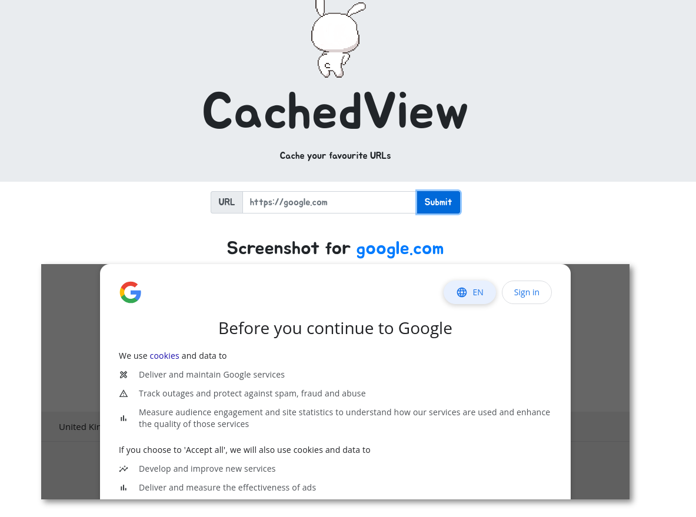
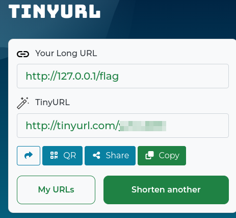
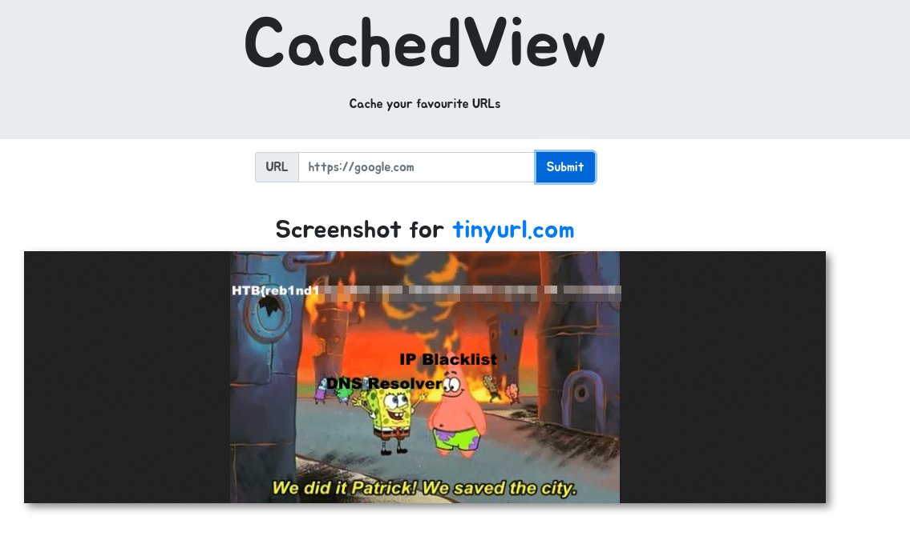

# Web - baby CachedView

## Description
> I made a service for people to cache their favourite websites, come and check it out!

## Walkthrough

For this web challenge, we were given the Challenge Code and an online web instance.

I first looked at the web application normally in the browser and saw this.


I entered the URL `http://google.com` and saw that the page retrieves the page for us and shows us a snippet.



My first thought was, of course, that we are dealing with __SSRF__.

When entering `http://127.0.0.1/` we get a message "Domain 127.0.0.1 is not allowed".


Ok, since we have the challenge code I had a look if there is a white/blacklist somewhere and found the underlying code for our block in the file __util.py__.

```python

<SNIP>
    def is_inner_ipaddress(ip):
        ip = ip2long(ip)
        return ip2long('127.0.0.0') >> 24 == ip >> 24 or \
                ip2long('10.0.0.0') >> 24 == ip >> 24 or \
                ip2long('172.16.0.0') >> 20 == ip >> 20 or \
                ip2long('192.168.0.0') >> 16 == ip >> 16 or \
                ip2long('0.0.0.0') >> 24 == ip >> 24

    if is_inner_ipaddress(socket.gethostbyname(domain)):
        return flash('IP not allowed', 'danger')

<SNIP>
```

Now I tried different SSRF-FIlter bypasses like IPv6, converting the IP to other formats like octal, hexadecimal and so on.

But I had not found a working bypass.

</br>
</br>

## My Quick & Dirty Solution

I tried it now with the help of URL-Shortener Services.And got the flag using [TinyURL](https://tinyurl.com/app).





## But wait...

The name of the flag and the meme suggest that another trick should also work here.

Well, a flag is a flag, but still somewhat unsatisfactory.

</br>
</br>

## Soltution (DNS-Rebind Attack)

Actually I wanted to try the other solution myself.

However, since I can't find an active working online tool for this at the moment and don't have a server, I would like to link two good writeups here that illustrate the whole thing better and will perhaps help me if I come across a similar challenge of this kind in the future.

__Writeup:__ [nullsession.pw](https://www.nullsession.pw/htb-x-uni-ctf-2020-quals-write-up/)

__Writeup:__ [sec.stealthcopter.com](https://sec.stealthcopter.com/htb-ctf-writeup-cached-web/)

__DNS Rebinding Tool:__ [lock.cmpxchg8b.co](https://lock.cmpxchg8b.com/rebinder.html)

__Information:__ [WIkipedia](https://en.wikipedia.org/wiki/DNS_rebinding)

