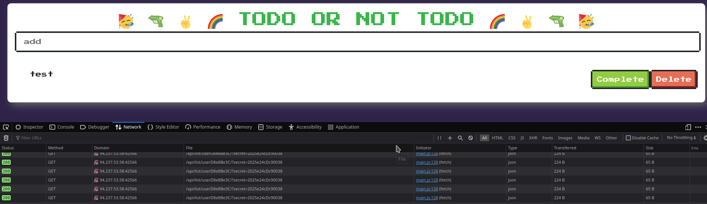
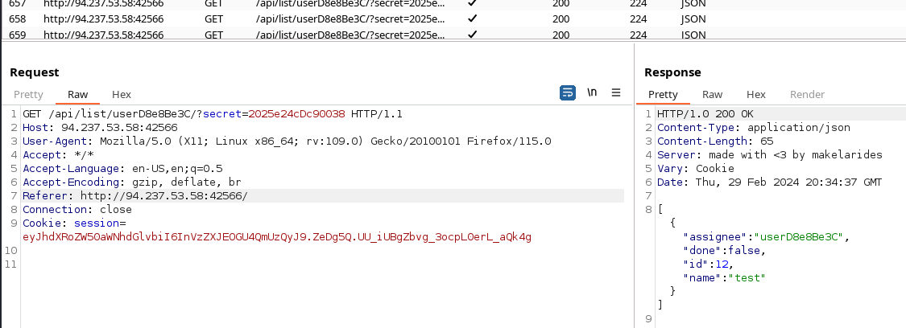
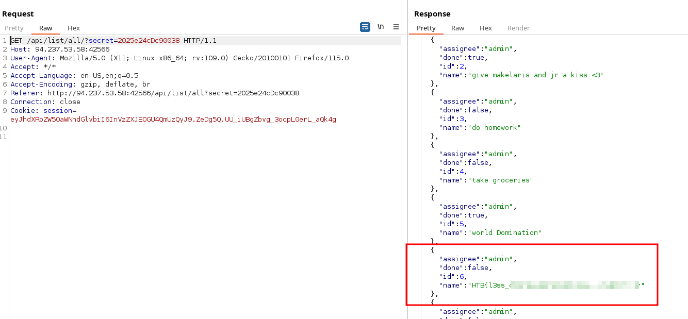

# Web - baby todo or not todo

## Description
> I'm so done with these bloody HR solutions coming from those bloody HR specialists, I don't need anyone monitoring my thoughts, or do I... ?

## Walkthrough

There was a web instance for this challenge and we were also given the challenge code.

As always, I looked at the web application normally in the browser and made a note of all the functions we could do.

The title of the website already tells us that we are dealing with __Broken Access Control__.



It was already noticeable that requests from the __main.js__ file are initiated here all the time.

We can add to-do notes here, delete them again and mark them as completed.

I went through all the options, intercepted them in Burp and saved the requests & responses in my notes.

Then I took a closer look at the source code and noticed two interesting code comments.

__File:__ `routes.py`

```
<SNIP>
# TODO: There are not view arguments involved, I hope this doesn't break
# the authentication control on the verify_integrity() decorator
@api.route('/list/all/')
def list_all():
        return jsonify(todo.get_all())
```

__File:__ `index.html`

```html
<SNIP>

<script>
// don't use getstatus('all') until we get the verify_integrity() patched
const update = () => getTasks('{{ list_access }}')
update()
setInterval(update, 3000)
</script>

<SNIP>
```

I also made a note of all the routes / endnotes that I found in the source code.

This one was interesting in the file __routes.py__:

```
@api.route('/list/all/')
def list_all():
        return jsonify(todo.get_all())
```

I took one of the requests that had been running automatically all along, sent it to the __repeater__ and changed the endnote to `/api/list/all/`.



And now, unexpectedly, the flag already appeared as a to-do entry from user `admin`.

That went faster than expected, because I thought that I still had to manipulate parameters or even the cookie.

Nice...


