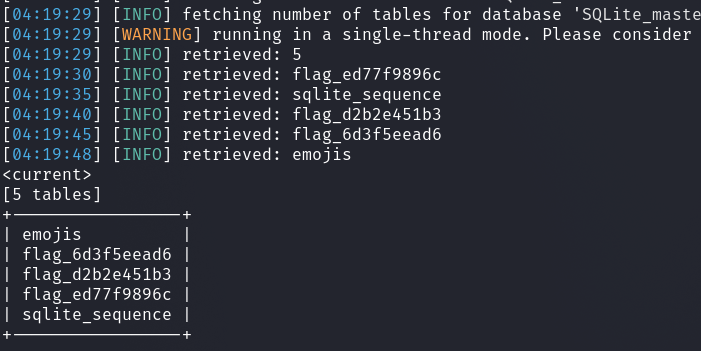

# Web - emoji voting

## Description
> A place to vote your favourite and least favourite puny human emojis!

## Walkthrough

In this challenge, we were given the challenge code and a web instance.

I looked at the web application and saw the following.

It was noticeable that POST requests were sent automatically by the application.

Interpreted in Burp, this looked like this.

Since we have the challenge code here, I wanted to know where the flag is located and found the fake offline flag in the file __database.js__.

In the same file I also found an interesting code comment, as well as the insecure SQL query.

Okay, everything points to a __SQL Injection Vulnerability__.

So I copied the request from burp into a text file for __sqlmap__ called `list.req`.

With Sqlmap I checked for vulnerabilities.

With the `--dbms` flag I set the database to `SQLite` so sqlmap can work faster and more precise.

In addition, sqlmap aborted the first time and recommended that I use `--time-sec=2` for fine tuning.

After a second attempt sqlmap recognized the vulnerability.

__Command:__ `sqlmap -r list.req --dbms=SQLite --level 4 --risk 3 --batch -time-sec=2`

The application saves our flag in a table with the prefix `flag_` and a random suffix.

Well, since unlike MySQL, SQLite does not provide a meta table from which we can extract the table names, sqlmap has to bruteforce the names to be able to dump them finally.

Sqlmap provides another useful fine tuning option to do this.

__Command:__ `sqlmap -hh`

So now I made sqlmap search for the table names.

__Command:__ `sqlmap -r list.req --dbms=SQLite --level 4 --risk 3 --batch -time-sec=2 --tables --table-prefix="flag_"`

Now I knew the table names in which our flag is located and dumped them and got the flag.

__Command:__ `sqlmap -r list.req --dbms=SQLite --level 4 --risk 3 --batch -time-sec=2 --tables --table-prefix="flag_" -T flag_6d3f5eead6,flag_d2b2e451b3,flag_ed77f9896c -C flag --dump`

