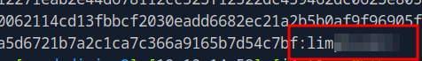

# HackTheBox - Administrator


<br>
<br>

## Table of Contents

- [Enumeration](#Enumeration)
    - [Portscan](#Portscan)
	- [Credentialed Enumeration](#Credentialed-Enumeration)
- [User](#User)
    - [DACL Abuse 1](#DACL-Abuse-1)
    - [ForceChangePassword](#ForceChangePassword)
    - [Credential Harvest](#Credential-Harvest)
- [Privilege Escalation](#Privilege-Escalation)
	- [DACL Abuse 2](DACL-abuse-2)
	- [Targeted Kerberoast](#Targeted-Kerberoast)
	- [DCSync](#DCSync)

<br>

## Foreword

With this box, HTB introduced a small novelty.

We are given initial access data as in a real-life Windows penetration test this is common too.

When I started the box I overlooked this and started to find valid users with `kerbrute` `userenum`.

When I was about to bruteforce the password of the enumerated user `Olivia` I realized that the credentials are already given to us here.

Well, shit happens...

After the __Administrator__ box came the __Certified__ box, which is also an Active Directory box, and I have to say that these two boxes have been the most educational and fun in the last period for me personally.

A really good playground to discover new tools and learn AD stuff.

<br>
<br>
<br>

## Enumeration

### Portscan

As usual, it starts with a port scan and service enumeration.

__Command:__ `nmap -p- -T4 -sV -A <IP>`


Many kinds of ports are open to us and we are obviously dealing with an AD controller here.

### FTP

We keep in mind that there is also an FTP server here.

However, nothing could be done with the FTP server up to this point, no anonymous login.

<br>

### Credentialed Enumeration

OK, now that we already have access data for the user `Olivia` I started to look at the AD structure using various tools.
So I checked my LDAP / SMB Cheat Sheet and made notes.

Who is in important groups like `Remote Management Users` and can log in via WinRM, which user accounts are there, group memberships, rights and and and....

I use tools such as `netexec` together with its modules, `BloodHound` and `bloodyAD`.

<br>
<br>
<br>

## User

### DACL Abuse 1

While searching for rights available to our user Olivia, I found out that Olivia has `GenericAll` rights over the user Michael.

With `bloodyAD` this can be explained as follows.

__Command:__ `bloodyAD --host $IP -d $DOMAIN -u $USER - p $PASSWORD get writable --right ALL`


Or comfortably in the GUI of Bloodhound in the __Node Info__ of `OLIVIA@ADMINISTRATOR.HTB` > __OUTBOUND OBJECT CONTROL__.


So I changed the password of the user Michael with the following command.

```bash
net rpc password "Michael" "hack3d123" -U "DOMAIN"/"Olivia"%"ichliebedich" -S "administrator.htb"
```

As the user Michael is in the 'Remote Management Users' group, I was now able to log onto the machine using the 'evil-winrm' tool.


<br>

### ForceChangePassword

However, there was still no flag in sight.

I started to enumerate the system within the scope of my privileges.

It took me a while to figure it out, our current user Michael has an interesting privilege on the user Benjamin which allows us to change the password again.


So the same scenario again, we change the password of the user Benjamin with our already gained user Michael.

```bash
net rpc password "Benjamin" "hack3d123" -U "DOMAIN"/"Michael"%"hack3d123" -S "administrator.htb"
```

<br>

### Credential Harvest

Now the FTP server came into the game, because with our user Benjamin and the password we changed, we are now able to log into the FTP server.


There was an interesting file on the FTP server which I downloaded.

A password safe!


I cracked the password using hashcat mode `-m 5200` and the proven rockyou list.

Alternatively, you can also use the command `pwsafe2john` from the John Suite and `john`.


I got the [pwsafe](#https://pwsafe.org/) software to open the backup.


The pwsafe backup contained three passwords from the users on the system.

I logged on to the machine with the password I had obtained from the user `emily` via `evil-winrm` and received the first flag.


<br>
<br>
<br>

## Privilege Escalation

I had already noticed the very last step to the Domain Takeover in BloodHound, as the user `ethan` has DCSync Rights.

But now we have to escalate to this user first.

<br>

### DACL Abuse 2

And here again, our current user `Emily` has `GenericWrite` rights over the user `Ethan`.


<br>

### Targeted Kerberoast

Ok, so I made a __Targeted Kerberoast__.

__Command:__ `python3 targetedKerberoast.py -v -d 'administrator.htb' -u 'Emily' -p '<PASS>' -f hashcat`


And then I successfully cracked the password using hashcat and the well-known rockyou.txt list.

__Command:__ `hashcat -m 13100 hash.txt rockyou.txt`



<br>

### DCSync

Finally, I performed a DCSync attack to dump the hashes and gain access to the system using the administrator hash.


I logged into the system as an administrator using `evil-winrm` and got the final flag.


