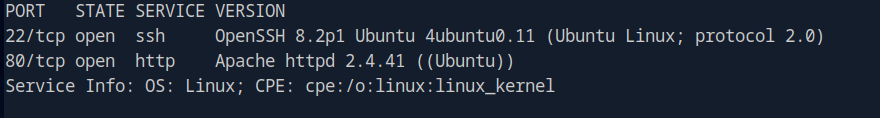

# HackTheBox - BoardLight

 
 

## Table of Contents

- [Enumeration](#Enumeration)
    - [Portscan](#Portscan)
	- [Webserver](#Webserver)
	- [CVE-2023-30253](#CVE---2023---30253)
- [Foothold](#Foothold)
	- [Credential Harvesting](#Credential-Harvesting)
- [User](#User)
	- [Password Reuse](#Password-Reuse)
- [Privilege Escalation](#Privilege-Escalation)
	- [SUID](#SUID)
	- [CVE-2022-37706](#CVE---2022---37706)
	- [root](#root)
	
---------------------------------------
 
 

## Enumeration

### Portscan

It starts with the usual port scan.

__Command:__ `nmap -p- -T4 -sV <IP>`

The number of open ports is manageable, we have one open SSH port and one web server.

 

### Webserver

I moved on to the web server. 

From here I enumerated the webserver.

I entered the found domain name in the `/etc/hosts` file.

When fuzzing for subdomains I got the following result

__Dommand:__ `gobuster vhost -w subdomains-top1million-110000.txt -u board.htb --append-domain`
`

 

### CVE-2023-30253

I also entered the subdomain in the `/etc/hosts` file and looked at what was behind it.

A login interface of __Dolibarr__ is visible and the version couldn't be faster to find.

A quick Google search showed me that this version is vulnerable and I found an exploit on [Github](https://github.com/nikn0laty/Exploit-for-Dolibarr-17.0.0-CVE-2023-30

However, the exploit requires credentials....

...which were found quite quickly.

Default credentials `admin:admin` were still set and working.

 
 
 

## Foothold

I started the exploit, a netcat listener and got the desired reverse shell.

 

### Credential Harvesting

Ok, so we are now operating under the account `www-data`.

The first thing I looked for was the config file of the web application and the database.

Under the path `/html/crm.board.htb/htdocs/conf` there were some interesting config files.

And in the file `conf.php` I found a password for the MySQl database.

 
 
 

## User

### Password Reuse

The password was not only valid for the MySQL database but also for the user larissa.

I logged in via SSH and got the user flag.

 
 
 

## Privilege Escalation

### SUID

I enumerated the system and found the following interesting binaries while searching for SUID binaries.

 

### CVE-2022-37706

I made myself familiar with these files and quickly found an [exploit](https://www.exploit-db.com/exploits/51180).

The exploit failed completely automatically and without any further action.

 

### root

So I took a closer look at the exploit, went through the steps manually and got my root shell.

