# HackTheBox - Builder

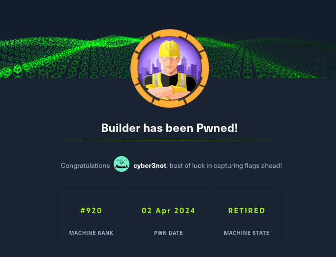

## Table of Contents

- [Enumeration](#Enumeration)
    - [Portscan](#Portscan)
    - [HTTP Header](#HTTP-Header)
- [CVE-2024-23897 - Arbitrary File Read](#CVE-2024-23897---Arbitrary-File-Read)
    - [Confirmation](#Confirmation)
    - [Get Jenkins User jennifer](#Get-Jenkins-User-jennifer)
    - [Get root](#Get-root)
- [Conclusion](#Conclusion)

 
 

## Enumeration

### Portscan

It started with the usual port scan.

__Command:__ `nmap -p- -T4 -sV -sC <IP>`

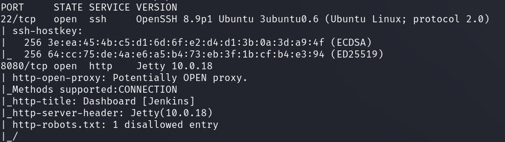

We see an SSH server on port 22 and a web server on port 8080.

On port 8080 we have a __Jenkins__.

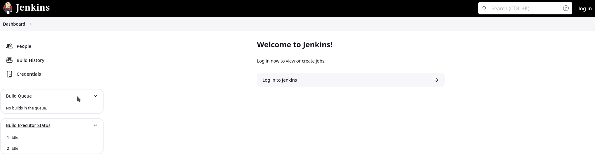

 

### HTTP Header

I wanted to know the exact version number.

And I got the exact version number by inspecting the HTTP header.

__Command:__ `curl -v <IP>:<PORT>`

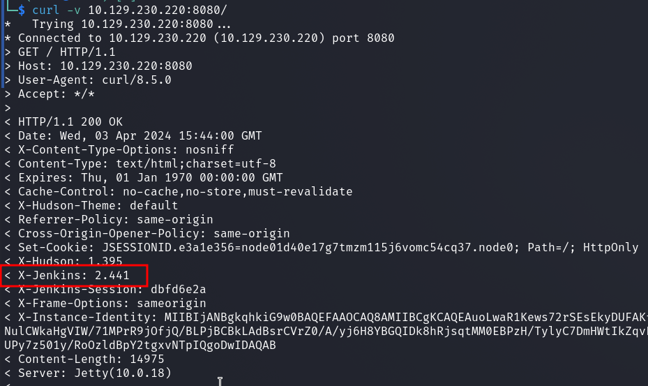

 
 

## CVE-2024-23897 - Arbitrary File Read

With the version number I could now search for vulnerabilities more precisely and after a quick google it became clear that this Jenkins version has an __arbitrary file read vulnerability__ (CVE-2024-23897).

There was also no shortage of exploit scripts and [information](https://medium.com/@red_darkin/how-to-replicate-jenkins-cve-2024-23897-arbitrary-file-read-vulnerability-260c8174dd94).

 

### Confirmation

__Command:__ `java -jar jenkins-cli.jar -s http://10.129.230.220:8080/ -http connect-node "@/etc/passwd"`

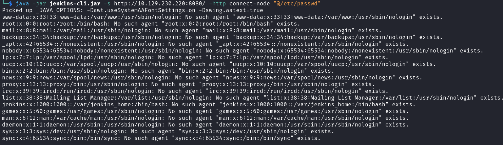

 

### Get Jenkins User jennifer

The vuln was now confirmed, but how can we exploit this further?

I obtained various information about where jenkins stores which information.

The home directory of jenkins is `/var/jenkins_home/` which can be found in `/etc/passwd` or `/proc/self/environ`.

And with the following two files I got a `bcrypt` hash from the Jenkins user account `jennifer`.

1. `/var/jenkins_home/users/users.xml`
> contains the folder name which we need for the second query

2. `/var/jenkins_home/users/jennifer_12108429903186576833/config.xml`
> Config file with password hash

And that's how I got jennifer's password hash:

__Command:__ `/var/jenkins_home/users/jennifer_12108429903186576833/config.xml`

 

### Crack Hash

The hash was quickly cracked with `hashcat`, mode `-m 3200` and the `fasttrack.txt` word list.

__Command:__ `hashcat -m 3200 hash.txt /usr/share/wordlists/fasttrack.txt`

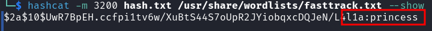

 

### Get root

Now I could log in as user __jennifer__ and had new possibilities.

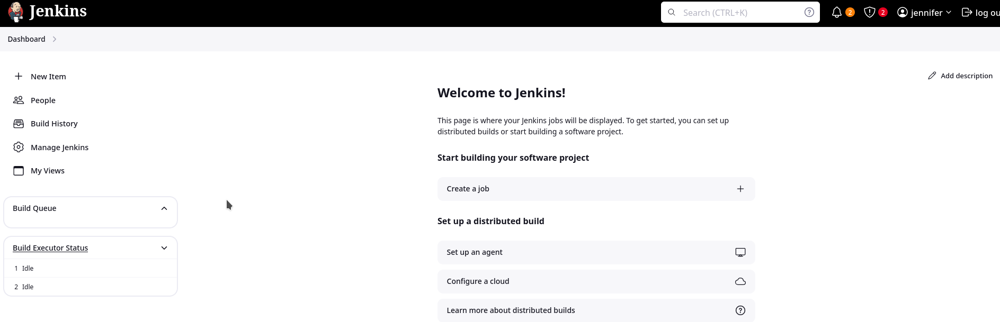

With Jenkins you can save credentials and SSH keys and I found one with the name __root__.

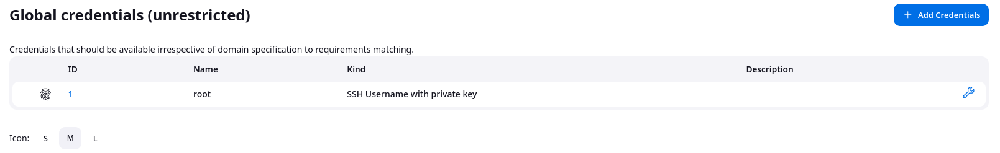

I checked again where Jenkins stores these credentials and two files were important for this.

1. `/var/jenkins_home/credentials.xml`
> XML file with the credentials which are AES encrypted.

2. `/var/jenkins_home/secrets/master.key`
> Master key for AES encryption

So I fetched the `credentials.xml` file.

__Command:__ `java -jar jenkins-cli.jar -s http://10.129.230.220:8080/ -http connect-node "@/var/jenkins_home/credentials.xml"`

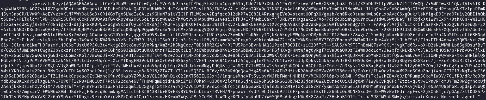

Afterwards I got the __Master Key__ and wanted to find out how to decrypt the key and found a post on [devops.stackexchange.com](https://devops.stackexchange.com/questions/2191/how-to-decrypt-jenkins-passwords-from-credentials-xml) that this can be done very easily under `/scripts` with a simple function.

And there the private key was now in usable form.

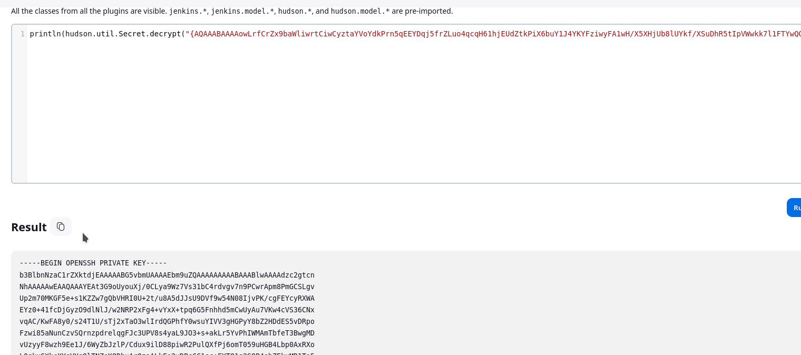

__Final Flags:__

I logged in with the SSH key as root user and got the user and root flag in one go.

__Command:__ `ssh root@<IP> -i <KEYFILE>`

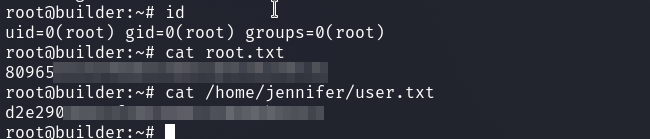

 
 

## Conclusion

This was a fun and staightforward box with the main focus on a recent Jenkins vulnerability.

Finally, a few things I'd like to note here about what this box taught me:

- for file read vulnerabilities work with `/proc/*` for information retrieval

- find out where which data is stored, configuration files of the product, etc.

- install the product local yourself to better understand the file structure
