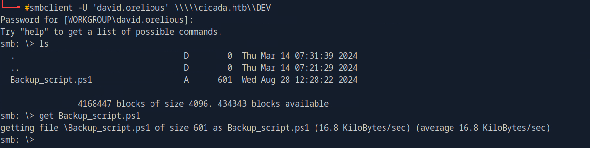
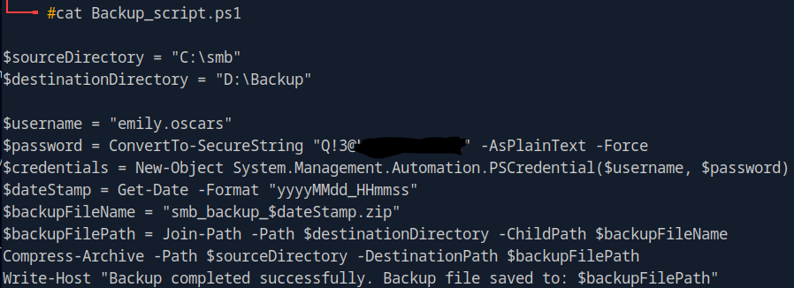

# HackTheBox - Cicada

 
 

## Table of Contents

- [Enumeration](#Enumeration)
    - [Portscan](#Portscan)
	- [SMB-Share HR](#SMB---Share-HR)
- [Foothold](#Foothold)
	- [RID Cycling](#RID-Cycling)
	- [Password Spraying](#Password-Spraying)
	- [Credentiailed Enumeration](#Credentiailed-Enumeration)
	- [Password in Description](#Password-in-Description)
	- [SMB-Share DEV](#SMB---Share-DEV)
- [User]
	- [Hardcoded Credentials](#Hardcoded-Credentials)
- [Privilege Escalation](#Privilege-Escalation)
	- [SeBackupPrivileges](#SeBackupPrivileges)
	- [root](#root)

 
-----------------------------
 

## Enumeration

### Portscan

As always, it starts with a standard port scan.

__Command:__ `nmap -p- -T4 -sV <IP>`

We see all kinds of ports open and can easily recognize that we are dealing with a domain controller.

I ran nmap again with the `-A` switch to get more information from the NSE scripts.

For example, the FQDN of the domain controller we need.

 

### SMB-Share HR

With windows, SMB is often the first thing I look at when it is open.

Using `Guest` or any other random username we can see shares.

The DEV share looks interesting.

Let's take a look at what's there using the spider module from netexec.

__Command:__ `netexec smb cicada.htb -u 'Guest' -p '' --shares -M spider_plus`

So I downloaded the file and took a look at the note.

And we have a default password for new employee accounts.

 
 
 

## Foothold

### RID Cycling

Now I already had a password but no username.

So this is where RID Cycling comes into play, for which I used `netexec`.

__Command:__ `netexec smb cicada.htb -u 'Guest' -p '' --rid-brute`

 

### Password Spraying

I created a small userfile and with a short PassworSpray I got valid credentials.

 

### Credentiailed Enumeration

Now that we have valid access data, we have new possibilities.

A new enumeration cycle began.

I looked at group memberships, since LDAP enumeration was now also open to us, I looked at the accounts and structures graphically using Bloodhound.

 

### Password in Description

At some point I came across a password in the description field of the user `david.orelious` who keeps his password there in case he forgets it.

Bad idea...

 

### SMB-Share DEV

New user, new luck!

With these credentials, we can now access a share that we could not access before.

There is an interesting script on the share.

So let's get it and take a look at the contents.

 
 
 

## User

### Hardcoded Credentials

The backup script obtained contained access data from the account `emily.oscars`.

User `emily.oscars` is in the group `Remote Management Users`, which means that we can log in using WinRm.

I logged in with `evil-winrm` and got the first user flag.

 
 
 

## Privilege Escalation

### SeBackupPrivileges

In comparison to the user part, the privilege Escalation was done quickly.

A view at the output `whoami /all` shows us that the account has `SeBackupPrivileges`.

This gives us the possibility to read all files on the file system.

I fetched the **SAM** and **SYSTEM** file from Windows and then used Impacket to read the hashes.

 

### root

Using **Pass the hash** I logged in with `evil-winrm` and got the final root flag from the administrator.

