# HackTheBox - Editorial


<br>
<br>

## Table of Contents

- [Enumeration](#Enumeration)
    - [Portscan](#Portscan)
	- [Webserver](#Webserver)
	- [SSRF](#SSRF)
- [User](#user)
- [Privilege Escalation](#Privilege-Escalation)
	- [dev -> prod](#dev-->-prod)
	- [prod -> root](#prod-->-root)

<br>

-------------------------


## Enumeration

### Portscan

I started with the usual port scan and service enumeration via Nmap.

__Command:__ `nmap -p- -T4 -sV -A <IP>`

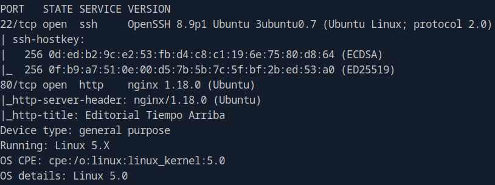

We see an open SSH server and a web server.

<br>

### Webserver

So I took a closer look at the web server.


A website for the publication of books.

I completed my web enumeration cheat sheet step by step, looked at all the functionalities and fuzzed it.

Under `/uploiad` we have a form and the possibility to present a book.

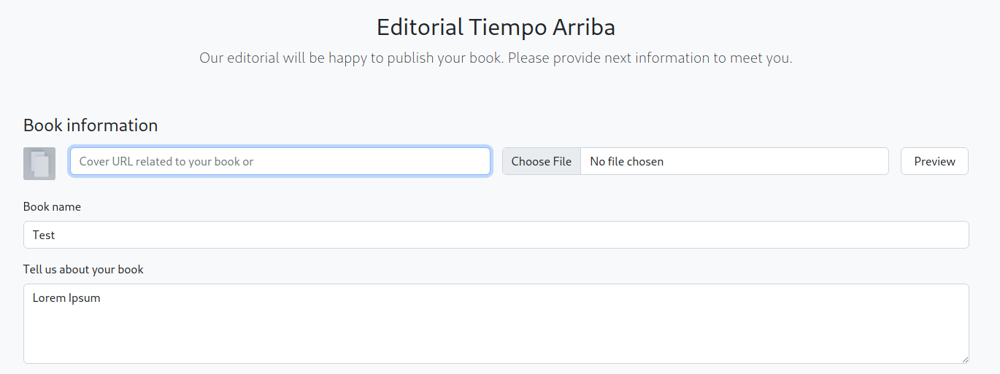

We have various parameters and different options such as a cross-reference to a URL, file upload and other form fields for various information.

My main focus was initially on the URL and file functionality.

I first checked whether the URL thing really reaches outside and entered my IP.

Furthermore you get useful information through HTTP headers.

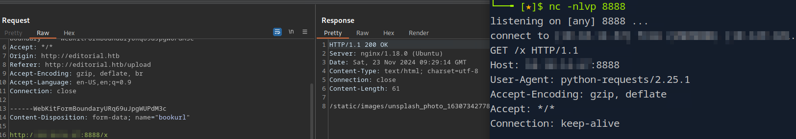

<br>

### SSRF

So far so good, but maybe we can even call something internally?

So I tried different behaviors, tried to provoke error messages to look for __SSRF__.

At port 80, which we know is being used, there was a long delay.

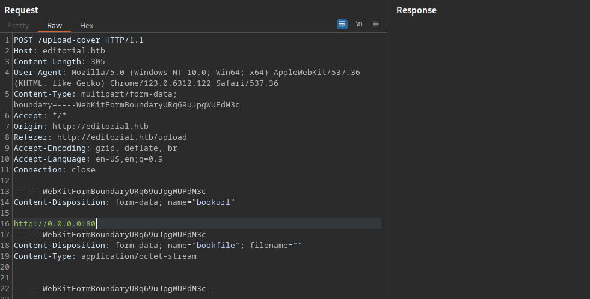

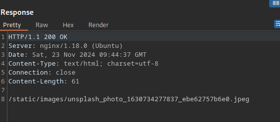

Meanwhile, the response was immediate for other random ports.

I wanted to inspect this further and made a list of all ports and fuzzed them.

Helpful here was __FUFF__.

I saved the request from Burp in a `req.txt` file and set the `FUZZ` marker for FFUF at the port position.

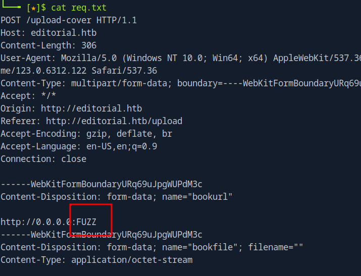

__Command_ `ffuf -u http://editorial.htb/upload-cover -request req.txt -w allPorts.txt -fs 61 -t 15`

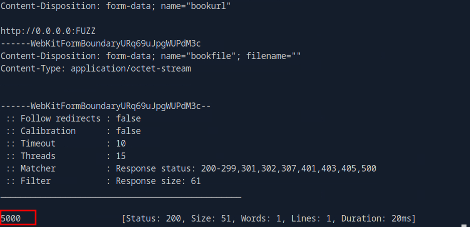

Ok, the response seems to be slightly different at port 5000.

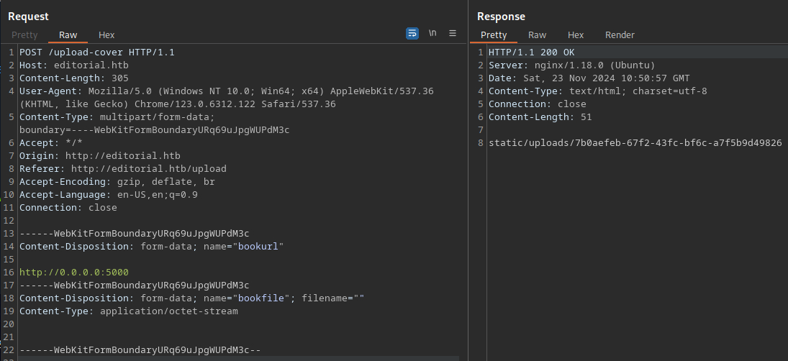

But the cool thing here is that if we call one of these returned paths we can now see API information.

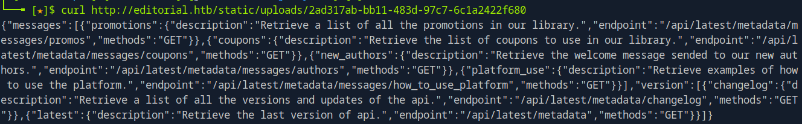

So I enumerated the API endpoints in the same way and looked for information.

Under `/api/latest/metadata/messages/authors` there was an interesting finding.

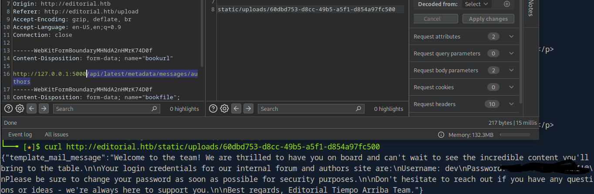

Credentials!

<br>
<br>
<br>

## User

I logged in using SSH with the access data I had found and the first user flag was obtained.

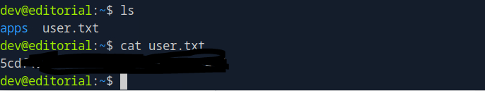

<br>
<br>
<br>

## Privilege Escalation

### dev -> prod

The next step was pretty straightforward, as the `apps` folder in the home folder next to the flag immediately caught my interest.

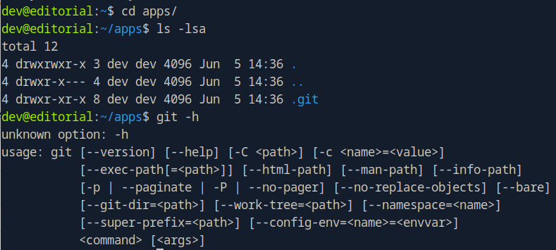

I found a git folder and git was also installed.

So I checked the comments.

__Command:__ `git log`

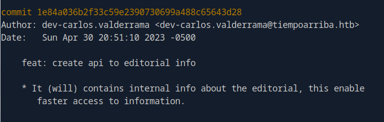

And using `git show 1e84a036b2f33c59e2390730699a488c65643d28` I found a previous password which was valid for the user Prod.

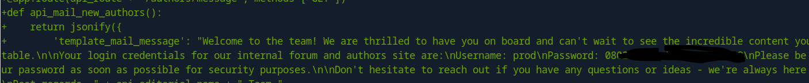

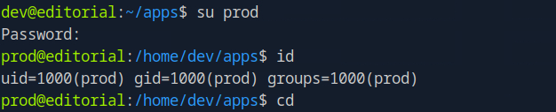

<br>

### prod -> root

The last step to root was also quite straighforward.

When I used `sudo -l` to see if this user was allowed to run things under other permissions using root, I found that he was.

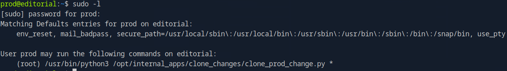

Interesting, let's take a closer look at the code of this script.

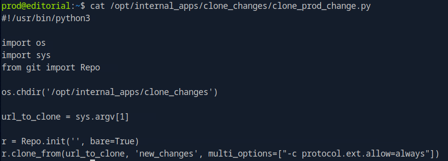

A custom script which probably uses a python git module.

So I had a look to see if I could get a more detailed version using `pip freeze`.

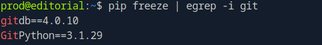

A quick google shows me that this version has an RCE vulnerability.

And the matching [POC](#https://security.snyk.io/vuln/SNYK-PYTHON-GITPYTHON-3113858) is also available.

Final got me the flag with the following two commands via the RCE:

```
sudo -u root /usr/bin/python3 /opt/internal_apps/clone_changes/clone_prod_change.py 'ext::sh -c cp% /root/root.txt% /tmp/;'
```

```
sudo -u root /usr/bin/python3 /opt/internal_apps/clone_changes/clone_prod_change.py 'ext::sh -c chmod% 777% /tmp/root.txt'
```

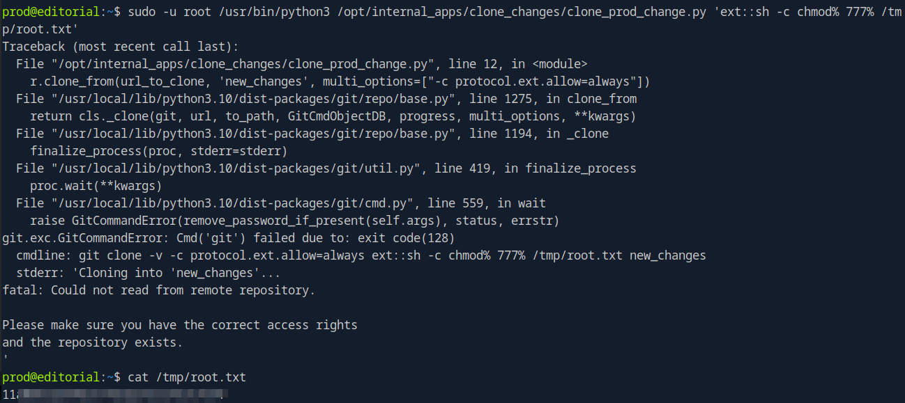
