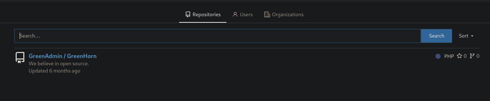

# HackTheBox - GreenHorn

 
 

## Table of Contents

- [Enumeration](#Enumeration)
    - [Portscan](#Portscan)
    - [Webserver 80](#Webserver-80)
    - [Webserver 3000](#Webserver-3000)
- [Foothold](#Foothold)
- [User](#User)
	- [Password Reuse](#Password-Reuse)
- [Privilege Escalation](#Privilege-Escalation)
	- [root](#root)

 
-------------------------
 

## Enumeration

### Portscan

I started with the usual port scan and service enumeration via Nmap.

__Command:__ `nmap -p- -T4 -sV -A <IP>`

Three open ports came to light.

An SSH server on the standard port 22 and two web servers.

 

### Webserver 80

So I took a look at both web servers.

On the standard port 80 we can  see the following.

I fuzzed the application a little according to common file names and made a few more basic enumerations.

Under `/login.php` we see a login page of __pluck__.

And the version is also shown at the same time.

A quick search on the pluck version shows us that the version is vulnerable to a __RCE vulnerability__

However, the [exploit](https://www.exploit-db.com/exploits/51592) requires access to pluck, so we need the password.

Since pluck doesn't even ask for a username in the login panel and we know that we probably only need the password to get Foothold, I started bruteforcing for the password, which came to nothing.

 

### Webserver 3000

On port 3000 we see a Gitea server.

I had a look at the Gitea server and there was an interesting unprotected repo to discover.

The repository had source code and content to pluck.

I looked at the files and the source code.

In code line 49 of `login.php` the password is retrieved from a file `data/settings/pass.php`.

The password was quickly cracked using [crackstation.ne](https://crackstation.net/).

 
 
 

## Foothold

I now logged into the Pluck CMS to test the password.

Now it was clear what to do.

The [Exploit](https://www.exploit-db.com/exploits/51592) had to be adapted a little in the URL paths.

Then I created php reverseshell code, compressed it and passed it to the exploit and got my reverseshell.

 
 
 

## User

The next step to the user was quickly reached after a few other basic checks.

### Password Reuse

When I looked at the Linux system user I tried to log in with the password of the web application.

 
 
 

## Privilege Escalation

First of all, the next step was very straightforward, but it was a bit of a pain until it worked.

There was an interesting document in the home folder.

I downloaded the document to my Attacker Machine and opened it.

Our task is probably to unblur this password.

I had read a few times that it is possible to reconstruct badly blurred / pixelated text.

I tried different tools which didn't work for a long time for the simple reason that I made a screenshot of the blurred text in different sizes.

After n-tries I got the idea to extract the embedded image properly.

 

### root

I extracted the pixelated password using `pdfimages`.

__Command:__ `pdfimages openvas.pdf ./images`

And the image was depixelated using the [Depix](https://github.com/spipm/Depix) tool.

I typed in the password and collected the final flag.

