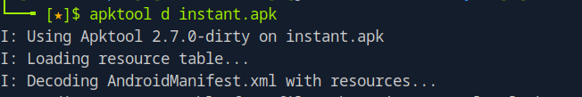
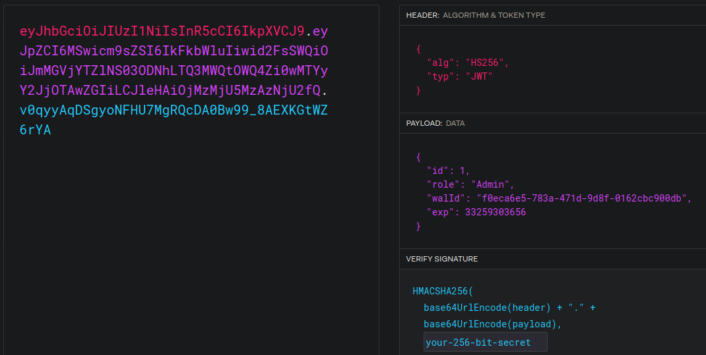
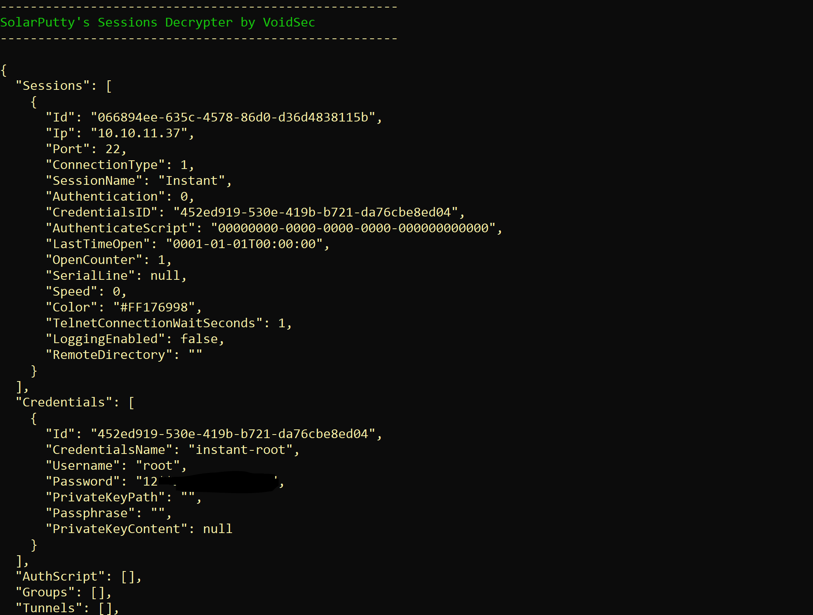

# HackTheBox - Instant

 
 

## Table of Contents

- [Enumeration](#Enumeration)
    - [Portscan](#Portscan)
	- [Webserver](#Webserver)
	- [APK](#APK)
- [Foothold](#Foothold)
	- [Hardcoded Credentials](#Hardcoded-Credentials)
	- [API](#API)
	- [LFI](#LFI)
- [User](#User)
	- [SSH Key](#SSH-Key)
- [Privilege Escalation](#Privilege-Escalation)
	- [Credential Harvesting](#Credential-Harvesting)
	- [Decrypt Backup](#Decrypt-Backup)
	- [root](#root)

 

## Enumeration

### Portscan

As usual, it starts with a port scan and service enumeration.

__Command:__ `nmap -p- -T4 -sV <IP>`

The number of open ports is manageable.

We have an open web server and SSH server.

 

### Webserver

So I went on to the web server.

There wasn't too much to discover on the web server as the site was quite lightweight and an **APK** was quite the focus.

I got an overview of various things, did a few basic enumerations and ran a few scans for directories before I turned my attention to the APK.

 

### APK

I downloaded the APK and unpacked it.

Since I didn't know much about APK's, I started by wildly searching for interesting keywords.

For example, I found two interesting subdomains: `swagger-ui.instant.htb` and `mywalletv1.instant.htb`.

And it's not hard to see that we'll soon be dealing with API hacking here.

The page [mobsf.live](#https://mobsf.live/), where I had the APK analyzed automatically, also proved to be very useful.

Here you get a well-structured report of the analysis.

Like here for example API Endnodes.

 
 
 

## Foothold

### Hardcoded Credentials

I is a hardcoded JSON token in the file `ÀdminActivities.smali`.

 

### API

Now I wanted to interact with the API.

So I entered the subdomain of the API in `/etc/hosts` and off went the API discovery.

First a short test...

...the token works!

In the Swagger UI, we can take a look at the structure of the API.

And we can also authorize ourselves here via the token and then send requests to the API.

 

### LFI

Well, I was quite sure that there must be a vulnerability somewhere here that would allow me to continue.

I tried and tried and finally after a while I found an __LFI Vulnerability__ in the route `/api/v1/admin/read/log` which is there to read log files.

 

## User

### SSH Key

Now I was able to enumerate the file system using the LFI and I looked for juicy information.

In the user directory of user `shirohige` I finally found a private key after some time.

I formatted the key properly, logged in as user `shirohige` and got the user flag.

 
 
 

## Privilege Escalation

The root part was more straightforward compared to the user part.

The API hacking involved a lot of trial and error in other places until I came across the LFI vulnerability.

 

### Credential Harvesting

I looked around on the Linux system and found an interesting SQLite database of the web application.

So I got the database and had a look at it.

These two wallet users came to light.

I was stuck here for a while because I didn't really know how to crack and format these hashes.

And then I formatted them so that they was accepted Hashcat, but I couldn't find a password and had false negatives, which was very annoying.

Doubts arose as to whether this was the right way, so I checked the community and it was confirmed that this was actually the way.

On a second try and with a little new python code I managed to format the hash correctly and crack it using mode `-m 10900` with hashcat.

 

### Backup

When enumerating the system, I had already noticed an interesting backup folder under `/opt`.

I did some research on the internet and came across the following [tool](https://github.com/VoidSec/SolarPuttyDecrypt) for decrypting this backup.

So I quickly went over to my Windows and decrypted the backup.

 

### root

The decrypted backup now contained the password for root and I was able to retrieve the final flag.

