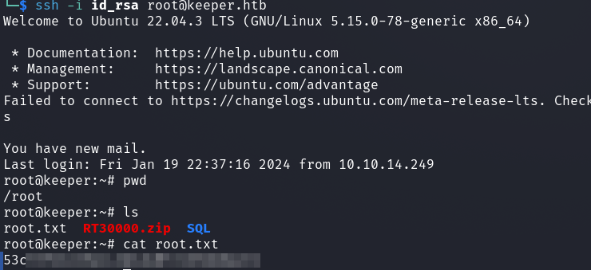

# HackTheBox - Keeper

I started with the usual port scan.

`nmap -p- -T4 -sV -sC <IP>`

I entered the IP in the browser to see what is on the webserver.

And we get a sub-/domain to an __IT support ticket system__.

I briefly tried some __Password Guessing__ and later found out that the working credentials `root:password` were just the __default credentials__ from the installation.

Now I was logged in and first clicked through the menus and looked at everything.

Under the menu `Admin` -> `Users` I found users.

And with the user __lnorgaard__ I found access data for this user.

I logged in with the found password as that user via SSH and got the first flag.

## lnorgaard -> root

An interesting ZIP file immediately appeared which I first downloaded and unpacked.

And a short file command check tells us exactly what files we are dealing with.

Ok, the first thing I tried was to extract the hash with `keepass2john` and try to crack it.

However, this ran for a long time without success.

Well, the second `.dmp` crash file will probably also be there for a reason.

After some searching I learned of a vulnerability that affects certain Keepass versions: [CVE-2023-32784](https://nvd.nist.gov/vuln/detail/CVE-2023-32784).

So I moved the crash dump file to my Windows VM and used the following [POC](https://github.com/vdohney/keepass-password-dumper).

Okay, I tried to open the Keepass file, but `dgrød med fløde` still didn't work.

A simple google search for it and the google "Did you mean XYZ" suggestion then brought me to the full password and meaning.

So the password was kinda a sweet dessert and the `R` was missing at the beginning.

And now i was able to open the Keepass File.

The `PuTTY-User-Key-File-3` was interesting.

I transformed this into an OpenSSH compatible format.

And logged in via SSH as root and got the final flag.

