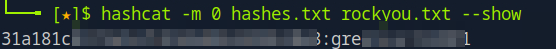
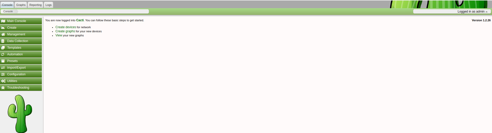
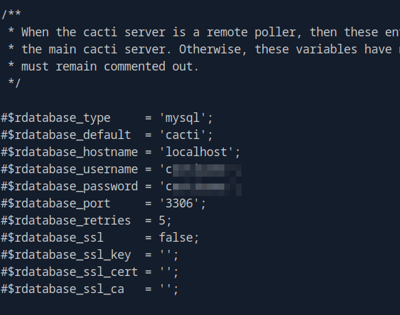
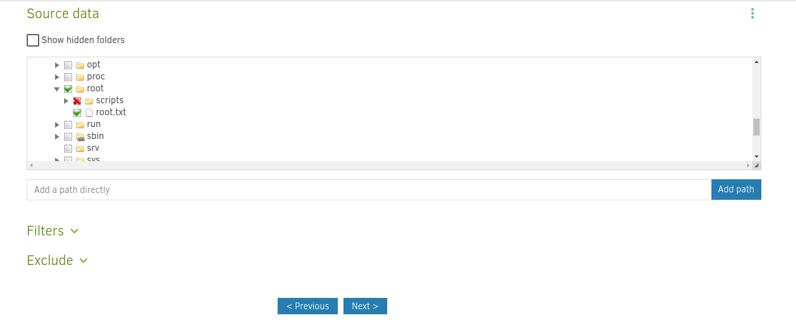
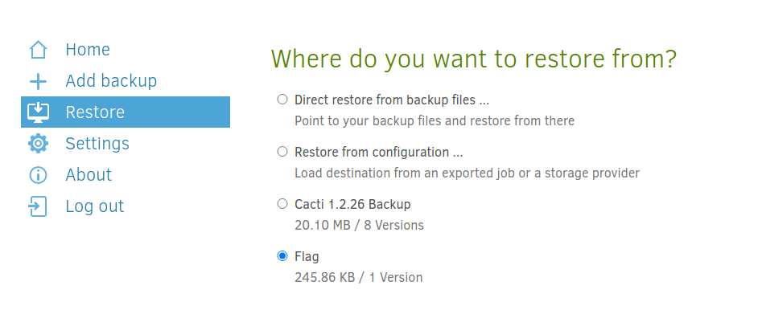

# HackTheBox - MonitorsThree


<br>
<br>

## Table of Contents

- [Enumeration](#Enumeration)
    - [Portscan](#Portscan)
	- [Webserver](#Webserver)
- [Foothold](#Foothold)
	- [SQL Injection](#SQL-Injection)
	- [Hash Cracking](#Hash-Cracking)
	- [CVE-2024-25641](#CVE---2024---25641)
- [User](#User)
	- [www-data -> marcus](#www---data-->-marcus)
- [Privilege Escalation](#Privilege-Escalation)
	- [Local Services](#Local-Services)
	- [Duplicati](#Duplicati)
	- [Duplicati - Authentication Bypass](#Duplicati---Authentication-Bypass)
	- [root](#root)


<br>

## Enumeration

### Portscan

As usual, it starts with a port scan and service enumeration.

__Command:__ `nmap -p- -T4 -sV <IP>`


Two open ports, an open SSH server and a web server came to light.

<br>

### Webserver

We need to add the domain `monitorsthree.htb` to the `/etc/hosts` file and then we can take a look at the page.


On the web server is a slim website which advertises Networking Solutions and Monitoring Solutions.

I took a quick look around and read the content of the page.

At __Login__ we have a login portal probably to an admin portal


I rattled off my web-numbering checklist and went in search of other interesting things.

<br>

### Subdomain

When fuzzing for subdomains, a subdomain named `cacti.monitorsthree.htb` came up.


<br>
<br>
<br>

## Foothold

### SQL Injection

At some point I went to the first exploitation attempts and with the password reset function an interesting error message appeared when inserting a single `'` apostrophe


This looks suspiciously like a SQLi vulnerability.

So I saved the burp request to a file and fired up `sqlmap`.


It didn't take long and the vulnerability was confirmed by SQLMap.


So I enumerated the database using SQLmap with focus of course on access data.


And finally I got the user table.


<br>

### Hash Cracking

I inserted the hashes into a file and cracked the hashes using hashcat and the well-known rockyou list.



I was now able to log in to both admin dashboards with the password I received.




<br>

### CVE-2024-25641

Now that I was able to log in to the Cacti Dashboard.

There was a matching [POC](#https://github.com/cacti/cacti/security/advisories/GHSA-7cmj-g5qc-pj88) and [Metasploit Module](#https://github.com/rapid7/metasploit-framework/blob/master//modules/exploits/multi/http/cacti_package_import_rce.rb) for the exploit

I got a reverseshell as `www-data`.


<br>
<br>
<br>

## User

### www-data -> marcus

So I started to look around on the system.

Under the directory `/var/www/html/cacti/include` I found access data for the MySQL database used by cacti.



So I logged into the mysql database and searched for access data.

There were three users in the `user_auth` table.


I put the three hashes in a file and cracked the hashes using hashcat.

The password from marcus could be recovered and I got the first flag.


<br>
<br>
<br>

## Privilege Escalation

OK, now to the privilege escalation.

In the home directory of the user Marcus I first found his private SSH key, so that I could now continue working with a stable SSH session.

I checked my Linux system enumeration cheat sheet and made notes.

<br>

### Local Services

There were a few local services on the machine that I wanted to take a closer look at, so I tunneled them to me.


__Command:__ `ssh -L 8200:localhost:8200 marcus@monitorsthree.htb -i id_rsa`


### Duplicati

A login panel from __Duplicati__, an open source backup solution, appeared.

The first thing I tried to do was to log in with the passwords I already knew and had discovered, but this did not work.

<br>

### Duplicati - Authentication Bypass

When I was looking for vulnerabilities to Duplicati, I learned that Duplicati has an interesting vulnerability to bypass login.

In this [article](#https://medium.com/@STarXT/duplicati-bypassing-login-authentication-with-server-passphrase-024d6991e9ee) the steps to bypass are well explained.

I familiarized myself with the article and set about exploiting it.

Under `/opt/duplicati/config` is the Duplicati sqlite file which we need and which I downloaded to my Attacker machine.


In the `Options` table we take the `server-passphrase` and base64 encode this.


Then we place a request in Burp and make sure that we go to Intercept and get the Nonce Value.


Now we use the dev console to help us and let us generate the password in JavaScript with everything we have.

```js
var saltedpwd = "59be9ef39e4bdec37d2d3682bb03d7b9abadb304c841b7a498c02bec1acad87a" ;var noncedpwd = CryptoJS.SHA256(CryptoJS.enc.Hex.parse(CryptoJS.enc . Base64 . parse("T61XB3h+VGTUUOBd3bCWE62VCJPMsbRz1A0wjLhncKk=")+ saltedpwd)).toString(CryptoJS . enc . Base64);    console . log (noncedpwd);
```


We receive a valid password, which we replace with the password in the following request.


And we are successfully logged in!


<br>

### root

Now I was successfully logged into Duplicati and somehow I had to continue from here.

Since Duplicati is a backup solution, my first thought was that there was juicy information in some of the backups that would lead me to the root flag.

I spent a long time looking at the file structure, but that was not the way to go.

The way was to get the root flag from a backup and then restore it.

The following steps led me to the root flag.

__1. Create Backup:__

Create and execute a backup.

I specified a folder created under `/tmp` as the destination.

And as source we enter: `/source/rooot/`.




__2. Run Backup:__


__3. Restore:__




And after some trial and error, the final flag was raised.


