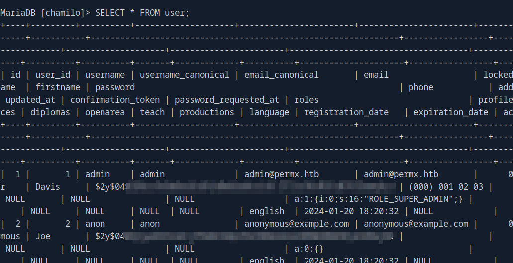

# HackTheBox - PermX


<br>
<br>

## Table of Contents

- [Enumeration](#Enumeration)
    - [Portscan](#Portscan)
	- [Webserver](#Webserver)
- [Foothold](#Foothold)
	- [CVE-2023-4220](#CVE---2023---4220)
- [User](#User)
	- [Credential Harvesting](#Credential-Harvesting)
	- [Password Reuse](#Password-Reuse)
- [Privilege Escalation](#Privilege-Escalation)
	-[root](#root)

<br>
----------------------------
<br>

## Enumeration

### Portscan

I started with the usual port scan and service enumeration via Nmap.

__Command:__ `nmap -p- -T4 -sV -A <IP>`


We see 2 open ports.

An SSH service and a web server on port 80.

When we call up the IP, we also immediately notice that we have to use the domain `permx.htb`, which I entered in the `/etc/hosts` file.

<br>

### Webserver

When we open the page, we can see an __eLearning__ platform.


The page was filled with some informative content.


So now I went over to web enumeration.

I fuzzed for directories, subdomains, looked at the content of the menus and and and...

While fuzzing for subdomains using __ffuf__ I found the following interesting subdomain.


I entered the found subdomain into the `/etc/hosts` file and got the following login interface.


__Chamilo__ an *LMS* / *Learning Management System*.

<br>
<br>
<br>

## Foothold

### CVE-2023-4220

After a short online research I learned that there were recent vulnerabilities to this software.

The PoC is available here: [starlabs.sg](https://starlabs.sg/advisories/23/23-4220/)

I checked if the vulnerable file exists on the server.


And do the exploit steps as in the publication and upload php code which calls to my netcat listener.


I got a reverse shell and operated under `www-data`

<br>
<br>
<br>

## User

### Credential Harvesting

Now I looked at the php files of the web application.

The search took a while, as the webapp is not exactly the most lightweight.

However, I found access data to the local mysql database in the file `/var/www/chamilo/app/config/configuration.php`.


First I logged into the database and got bcrypt hashes from __Chamilo__ and tried to crack them.



Which came to nothing...

<br>

### Password Reuse

It was easier than I thought, because the same credentials also worked for the Linux system user `mtz`.

I logged in as a user via `su` and got the first flag.


<br>
<br>
<br>

## Privilege Escalation

The last step to root was pretty straightforward.

With `sudo -l` I checked if I can run any interesting things with the user privileged.


We can run this script as any user.


The most important thing in this script is the last line.

I had a quick look at this binary and it quickly became clear what to do.

We simply give our user all the rights we want to any file.


Hmm, ok that was probably too hasty, then let's take a look at what this output throws up.

```bash
<SNIP>

if [[ "$target" != /home/mtz/* || "$target" == *..* ]]; then
    /usr/bin/echo "Access denied."
    exit 1
fi

</SNIP>
```

Ah, the script creator wants us to be able to assign rights only in our home directory as we wish.

Makes sense, it should be secure!

However, this is not too big a hurdle.

I created symlinks in mtz's home folder to files I shouldn't have access to....


...and the magic worked.


<br>

### root

So I generated a password for the `/etc/shadow`.


And replaced it with the existing one.


I logged in as `root` user and got the final flag.


