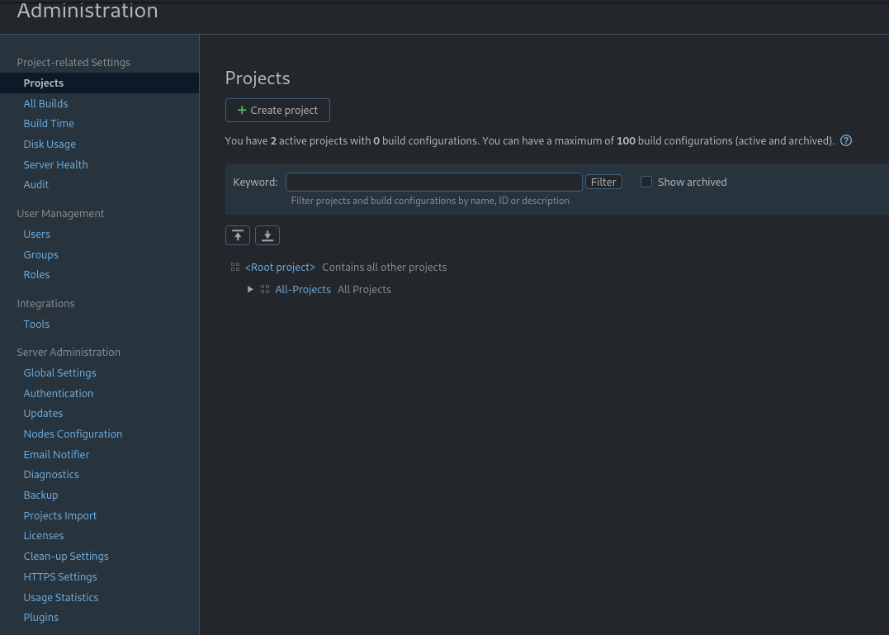
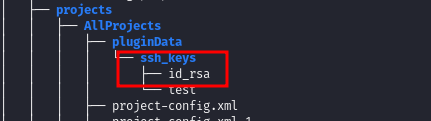

# HackTheBox - Usage

 

 

## Table of Contents

- [Enumeration](#Enumeration)
    - [Portscan](#Portscan) 
	- [Webserver](#Webserver)
	- [Subdomain](#Subdomain)
- [Foothold](#Foothold)
	- [TeamCity - CVE-2023-42793](#TeamCity---CVE-2023-42793)
	- [TeamCity - Administration](#TeamCity---Administration)
	- [TeamCity - Credential Harvesting](#TeamCity---Credential-Harvesting)
	- [User Flag](#User-Flag)
- [Privilege Escalation](#Privilege-Escalation)
	- [System Enumeration](#System-Enumeration)
	- [Portainer - Password Reuse](#Portainer---Password-Reuse)
	- [CVE-2024-21626](#CVE-2024-21626)
	

 
 

## Enumeration

### Portscan 

As always, it started with a port scan.

__Command:__ `nmap -p- -T4 -sV -sC <IP>`

We see an open SSH server, a web server and an open port on 8000 where it is still unclear to me what it is for.

 

### Webserver

So I first went over to the web server and had a look at it and enumerated it by running my CheatSheet.

 

### Subdomain

It took me a while to find this.

When I tried to fuzz for vhosts / subdomains, I couldn't find anything with the large lists of seclists.

So I created a custom fuzzing list with the tool __cewl__ which is generated from the website content.

__Command:__ `cewl http://runner.htb/ >> fuzz.txt`

And now fuzzed with our new custom list for vhosts using __ffuf__.

__Command:__ `ffuf -w fuzz.txt -H "Host: FUZZ.runner.htb" -u http://runner.htb -fs 154`

ffuf found a subdomain called `teamcity` which I added to `/etc/hosts` and accessed.

 
 

# Foothold

When we get to the subdomain, we see a login portal to a TeamCity server.

 

## TeamCity - CVE-2023-42793

Now that we are given a version of the login portal, I searched for vulnerabilities to this version and quickly found what I was looking for.

On [exploit-db](https://www.exploit-db.com/exploits/51884) I found an exploit which gives us access to the TeamCity server.

The exploit created a new user and I logged in.

I first had to find my way around and clicked through various menus.

 

## TeamCity - Administration

In the administration area of TeamCity there was a lot to discover.

On the one hand, there are more usernames, __john__ and __matthew__, which are probably active on the system.

And secondly, there was a __backup__ option.

So I made an up-to-date backup and downloaded it.

 

## TeamCity - Credential Harvesting

I first got an overview of the backup and its contents.

__Command:__ `tree -a `

First I found passwot hashes under `database_dump/users`.

I tried to crack it and got the password from the user __matthew__.

However, this didn't help me...not now!

But there was also more, namely an SSh key!

 

## User Flag

So I use the SSH key which has no password as user __john__ and got the first flag.

 
 

# Privilege Escalation

## System Enumeration

The system enumeration quickly went in the right direction.

If we look at the internal ports, we can see that something interesting is probably going on.

__Command:__ `ss -tulpn`

So I forwarde the ports via SSH to have a look at what is behind it.

__Command:__ `ssh john@runner.htb -i id_rsa`

 

## Portainer - Password Reuse

We remember the cracked password of user __matthew__ from the TeamCity backup?

Here it worked and I logged into __Portainer__ and at the bottom left I saw a version info.

 

## CVE-2024-21626

And from here on I tried and searched for a long time without success.

After a long search and random docker breakout attempts I came across this publication: [nitroc.org](https://nitroc.org/en/posts/cve-2024-21626-illustrated/#exploit-via-setting-working-directory-to-procselffdfd).

__runC Escape__ sounds good and fits the name of the box.

But at this point I had to see for myself how to exploit this with Portainer, as there was no documentation, so I looked at all the given functionalities of Portainer and thought about how to replicate the exploitation here.

As a result, I got access to the root filesystem and read in the final root flag:

1. new container with `ubuntu:latest` as image.

2. Under __Advanced Options__ : set `Interactive & TTY` and `/proc/self/fd/8`.

3. Finally, the running container goes to __Container console__ and connect as `root`.

4. In the containers Console: `cat ../../../root/root.txt`

 
 

# Resources

Finally, I would like to add a few external resources here which helped me to master the box.

- [nitroc.org](https://nitroc.org/en/posts/cve-2024-21626-illustrated/#exploit-via-setting-working-directory-to-procselffdfd)
