# HackTheBox - Sea

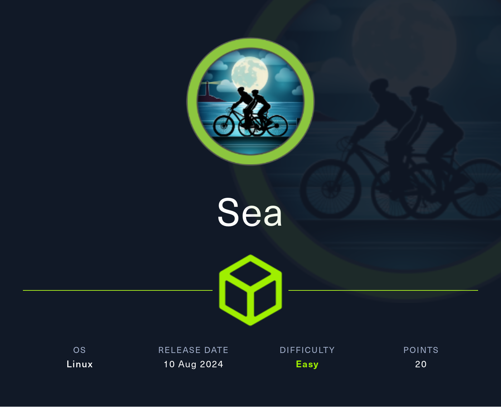

 
 

## Table of Contents

- [Enumeration](#Enumeration)
    - [Portscan](#Portscan)
    - [Webserver](#Webserver)
	- [CVE-2023-41425](#CVE---2023---41425)
- [Foothold](#Foothold)
- [User](#User)
	- [Credential Harvesting](#Credential-harvesting)
	- [Hash Cracking](#Hash-Cracking)
	- [User Flag](#user-Flag)
- [root](#root)
	- [Internal Service](#Internal-Service)
		- [Password-Reuse](#Password-Reuse)
		- [LFI / RCE](#LFI-/-RCE)
		- [root](#root)

 
 

## Enumeration

### Portscan

As always, it starts with a standard port scan.

__Command:__ `nmap -p- -T4 -sV <IP>`

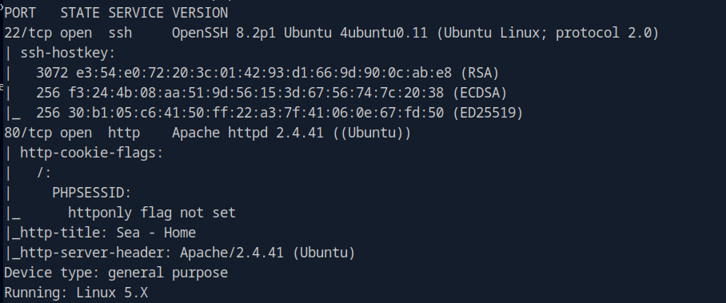

We see an open SSH server and web server.

 

### Webserver

So it's on to the web server.

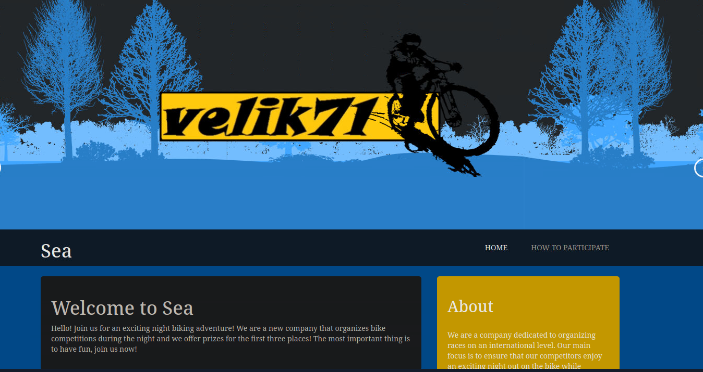

A website for organizing bike tours and competitions.

First of all, I spent a lot of time enumerating the web server and I was stuck for a long time and got lost several times until I found the key I was looking for.

It was important to enumerate carefully and, recursively!

__Command:__ `feroxbuster --url http://sea.htb -w custom.txt`

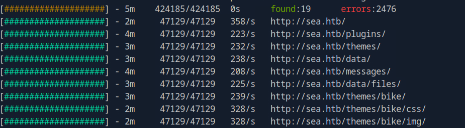

Under the path `/themes/bike/` I found some interesting files after a long search.

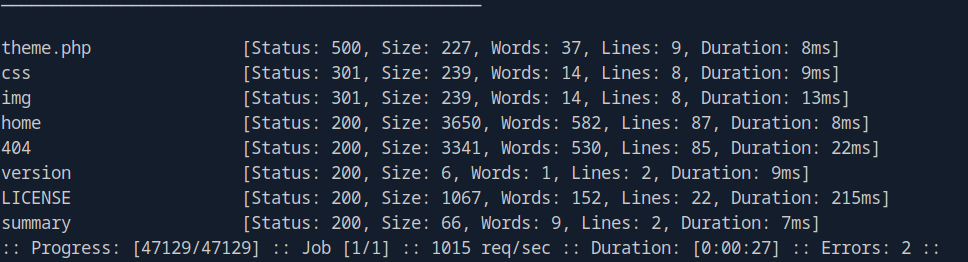

In the file `versions` I finally found a version number.

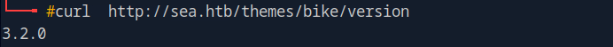

Well, version numbers are good.

But for what?

The next long search began to somehow find out what is being used here in the background.

I don't remember exactly how I came across it, as it's been a while since I solved the box and at the time of writing I'm going through the box a second time.

But here are two important things with which it is possible to enumerate the underlying technology with a little Google dorking.

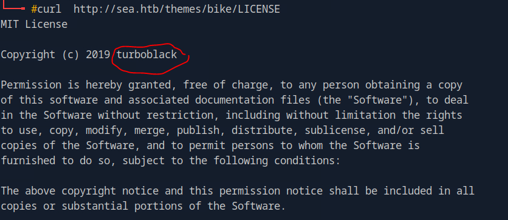

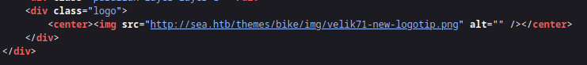

And then I found the key term I had been searching for so long: __WonderCMS_!!!!

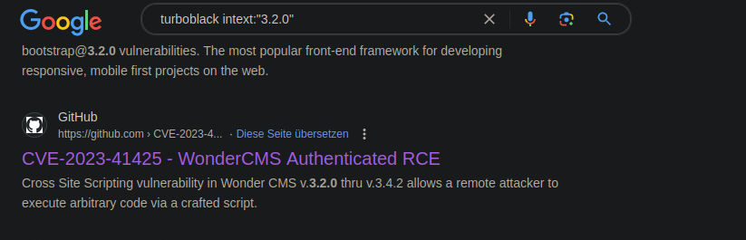

WonderCMS in version 3.2.0 has a vulnerability: __CVE-2023-41425__.

 
 
 

## Foothold

And a [POC](https://github.com/prodigiousMind/CVE-2023-41425) was quickly found with knowledge of the CMS name.

However, it takes a little time to familiarize yourself with the exploit, understand the steps and adapt the code!

After a few attempts and modifications, the __XSS->RCE__ exploitation worked and it first retrieved an `xss.js` file, which in turn retrieved a reverse shell as a second stage.

I got a reverse shell and operated under the user `www-data`.

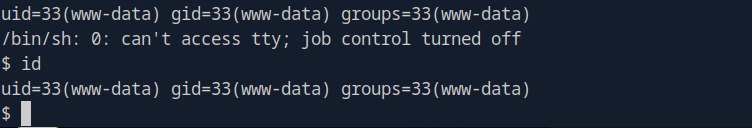

 
 
 

## User

### Credential Harvesting

I enumerated the system.

And the first thing I look for when I am `www-data` is web application access data and database access.

In `/var/www/sea/data/` I found an interesting file which caught my attention called `database.js`.

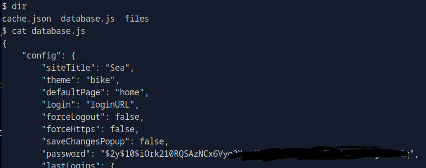

 

### Hash Cracking

So I took hashcat and cracked the bcrypt.

But beware, the hash has escape sequences which have to be removed so that hashcat can work with it!

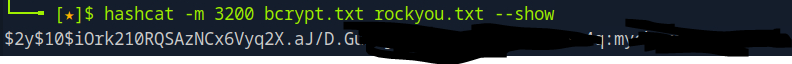

 

### User Flag

I logged in as Linux system user `amay` via SSh and got the first flag.

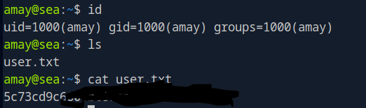

 
 
 

## root

The path to root was much more straightforward and went more quickly.

### Internal Service

I was going through my system enumeration cheat sheet and a web service listening on localhost caught my interest.

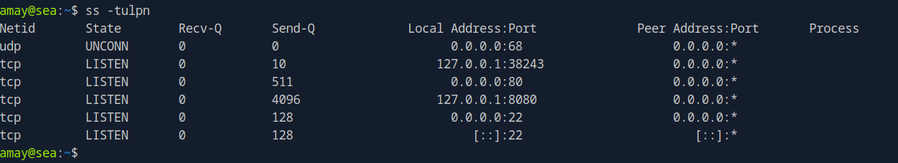

I forwarded the port to me so that I could view the application on my Attacker machine.

__Command:__ `ssh -L 9090:127.0.0.1:8080 amay@sea.htb`

 

#### Password Reuse

The application requires a password, but fortunately the password we already know from `amay` also works here.

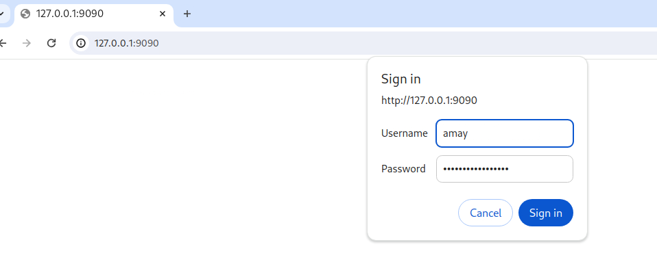

The result is a small system monitoring program with a manageable number of functionalities.

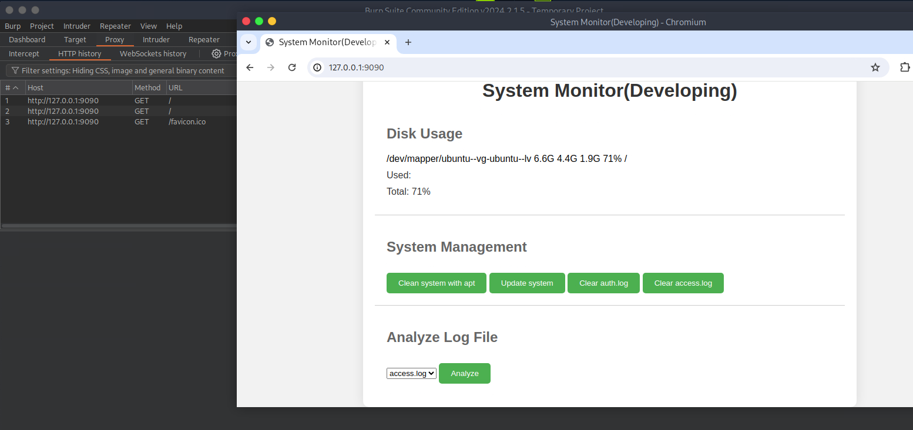

 

#### LFI / RCE

I tested the function for displaying the logs and quickly found an __LFI vulnerability__.

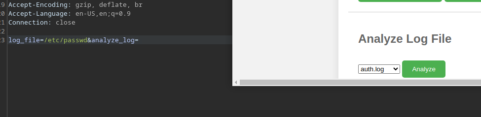

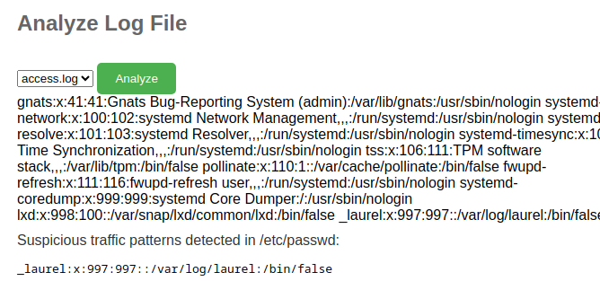

However, this did not yet give me the flag.

I continued testing and soon a __RCE vulnerability__ was also confirmed with the following payload: `/etc/passwd;id;whoami`

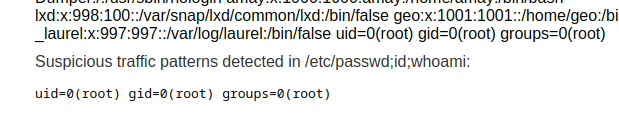

 

#### root Flag

So I got the flag quick & dirty with the following payload: `%2Fetc%2Fpasswd%3Bcat%20%2Froot%2Froot%2Etxt%3Bwhoami`

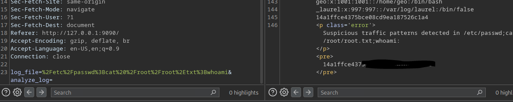

