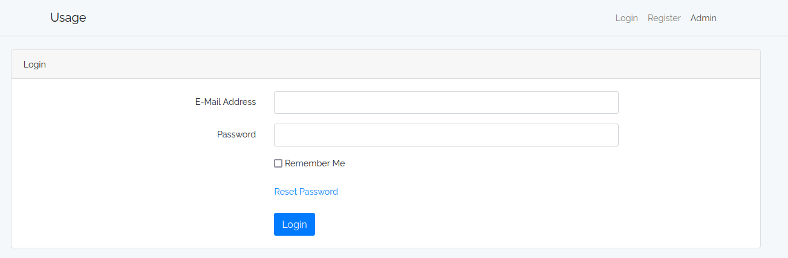
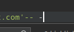
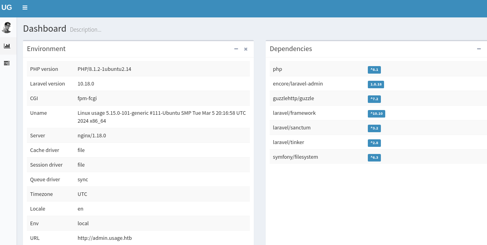
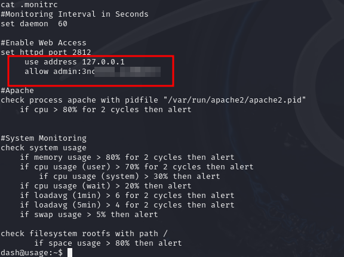

# HackTheBox - Usage

 

<br>

## Table of Contents

- [Enumeration](#Enumeration)
    - [Portscan](#Portscan) 
	- [Webserver](#Webserver)
- [Foothold](#Foothold)
	- [SQLi](#SQLi)
	- [Hashcat](#Hashcat)
	- [Laravel - CVE-2023-24249](#Laravel---CVE-2023-24249)
    - [User Flag](#User-Flag)
- [Horizontal Privilege Escalation](#Horizontal-Privileges-Escalation)
	- [Credential harvesting](#Credential-harvesting)
- [Vertical Privilege Escalation](#Vertical-Privilege-Escalation)
	- [Sudo - Custom Binary](#Sudo---Custom-Binary)
	- [Wildcard Exploitation](#Wildcard-Exploitation)
	- [Root Flag](#Root-Flag)
- [Resources](#Resources)


<br>
<br>

## Enumeration

### Portscan

It starts with the usual port scan.

__Command__: `nmap -p- -T4 -sC -sV <IP>`


We see an open HTTP server and an SSH server.

I also found the usage.htb domain, which I added to the `/etc/hosts` file.

<br>

### Webserver

So I went on to the web page.



I saw a login portal and under the __Admin__ menu there was another one under a new subdomain.


I continued to enumerate the web server and made notes of all the functions.

<br>
<br>

## Foothold

### SQLi

I ran sqlmap on all functions for a long time and they just went nowhere without success.

After a long time of exploit attempts, I analyzed the password reset function more closely and not automatized!


A single quotation mark leads to a `500` error.


Meanwhile `''` or `' -- -` lead to a `302` status code.




Well, that sounds suspiciously like an SQL injection vulnerability.

So I tried again with __sqlmap__ but with a small but important customization.

By telling sqlmap how to evaluate the HTTP status codes!

__Command:__ `sqlmap -r req.txt -p email --dbms=mysql --level 4 --risk 3 --ignore-code=500 --code=302 --batch`


And now a SQLi vuln was confirmed and I could dump password hashes.

<br>

### Hashcat


The bcrypt hash was quickly cracked using hashcat and the rockyou list.


<br>

### Laravel - CVE-2023-24249 

With the cracked password, I logged in under the subdomain admin.usage.htb and found myself on __Laravel__'s dasboard.



I did some searching on the internet and found out that this version has a vulnerability and that it is possible to upload a shell in the profile picture upload function.

The bypass was done simply by manipulating the end of the file.


First of all, I uploaded a webshell and then established another reverse shell from it.


I  had now a reverse shell as user __dash__ and access to the first flag.


<br>
<br>

## Horizontal Privilege Escalation

### Credential harvesting

Now I enumerated the system and found a hidden file called `.monitorc` with credentials directly in the home directory.




With this password I can log in as user __xander__ via SSH.


<br>
<br>

## Vertical Privilege Escalation

### Sudo - Custom Binary

One of the first things I looked for was whether the user xander had sudo rights using `sudo -l` and quickly found what I was looking for.


Looks like a custom binary.

So I looked at what it does.


I went through these menus and tried to find out what exactly happens and is executed under the hood.

Helpful for this was __pspy64__ which I ran to see what commands were running behind the scenes.

Interesting was the one that is executed with the first backup option.


<br>

### Wildcard Exploitation

On hacktricks I found the information that the use of wildcards under these circumstances can lead to the reading of any files.

So I applied the following steps...

```bash
cd /var/www/html/
touch '@root.txt'
ln -s -r /root/root.txt root.txt
```


<br>

### Root Flag

...and got to see the flag.


<br>
<br>
<br>

# Resources

Finally, I would like to add a few external resources here which helped me to master the box.

- [flyd.uk/post/cve-2023-24249/](https://flyd.uk/post/cve-2023-24249/)
- [book.hacktricks.xyz](https://book.hacktricks.xyz/v/de/linux-hardening/privilege-escalation/wildcards-spare-tricks)
