# HackTheBox - Wifinetic

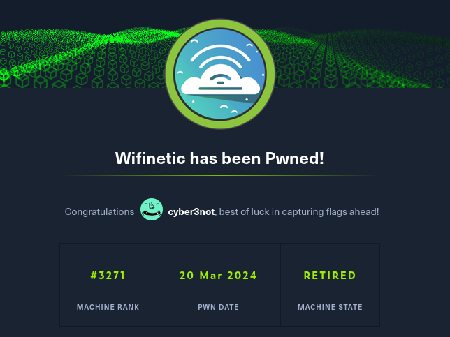

## Foreword

Wifinetic was a pretty cool box with a WiFi setup that I hadn't seen before.

I pwned this meanwhile retired box in preparation for the successor __WifineticTwo__.

<br>
<br>

## Table Of Contents
- [Enumeration](#Enumeration)
    - [Portscan](#Portscan)
    - [Inspect Files](#Inspect-FIles)
    - [Get User](#Get-User)
- [Privilege Escalation](#Privilege-Escalation)
    - [System Enumeration](#System-Enumeration)
    - [Exploitation](#Exploitation)


<br>
<br>


## Enumeration

### Portscan

I started with the usual port scan.

__Command:__ `nmap -p- -sV -sC <IP>`

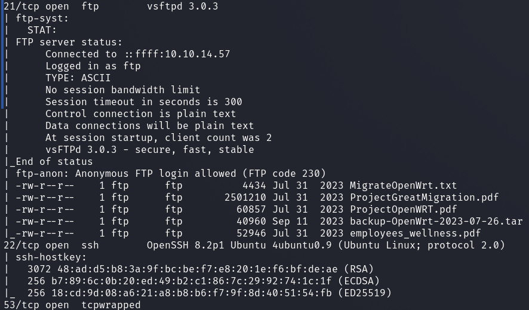

We have an FTP server and an SSH server.

Furthermore, the DNS standard port is open.

Thanks to the `-sC` switch, nmap has already checked for us whether the FTP server has an anonymous login and we see that it is open for us and holds a few documents.

<br>

### Inspect Files

So I logged in and downloaded all the documents.

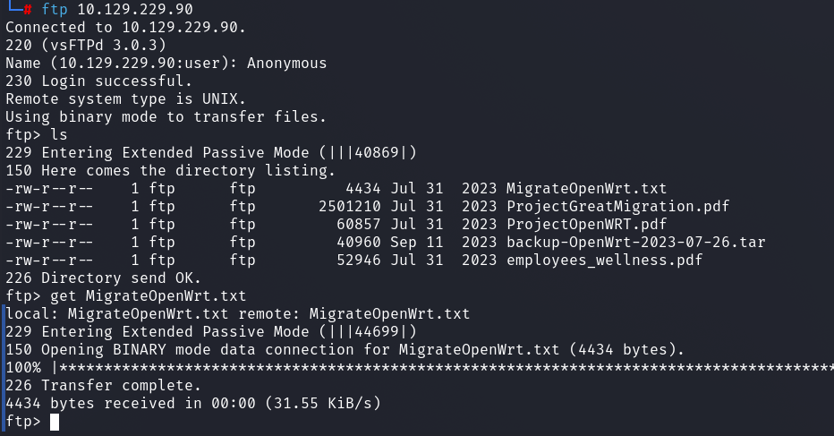

Now I looked carefully at the files one by one.

I noted down all usernames / emails from the pdf files.

I also unpacked the archive `backup-OpenWrt-2023-07-26.tar` which contained some interesting files.

In a __passwd__ file there were other possible usernames.

```
root:x:0:0:root:/root:/bin/ash
daemon:*:1:1:daemon:/var:/bin/false
ftp:*:55:55:ftp:/home/ftp:/bin/false
network:*:101:101:network:/var:/bin/false
nobody:*:65534:65534:nobody:/var:/bin/false
ntp:x:123:123:ntp:/var/run/ntp:/bin/false
dnsmasq:x:453:453:dnsmasq:/var/run/dnsmasq:/bin/false
logd:x:514:514:logd:/var/run/logd:/bin/false
ubus:x:81:81:ubus:/var/run/ubus:/bin/false
netadmin:x:999:999::/home/netadmin:/bin/false
```

And I found a password in a wireless configuration file:

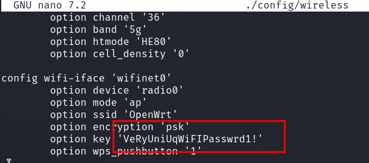

<br>

### Get User

Now I ran a __Password Spray__ with all possible names and usernames found and got a hit.

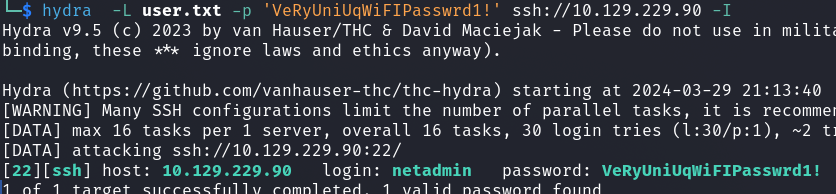

I logged in and got the user flag.

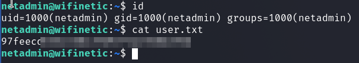

<br>
<br>

## Privilege Escalation

Some "Out" of the box thinking was needed here.

However, the name of the box also leads us in the right direction.

<br>

### System Enumeration

When enumerating the system, I noticed the following things.

__Command:__ `ifconfig`

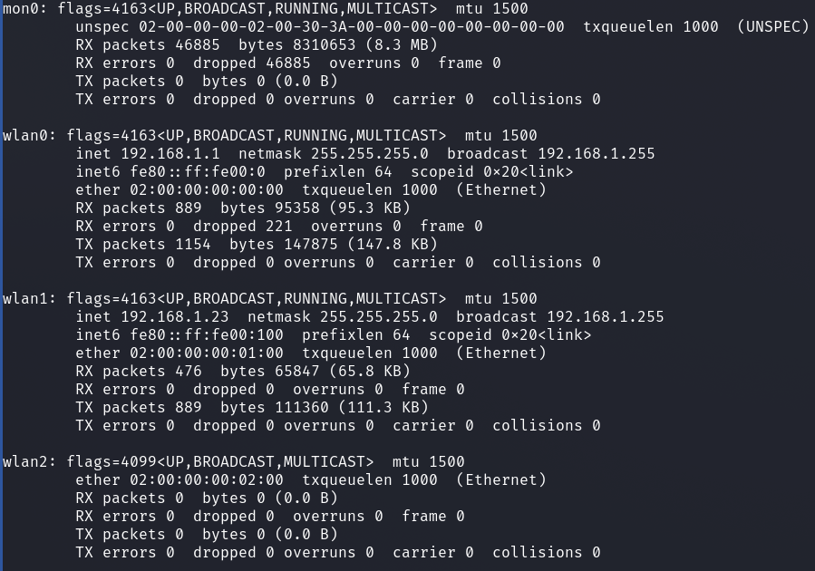

We see different WLAN interfaces in this one.

__Command:__ `iwconfig`

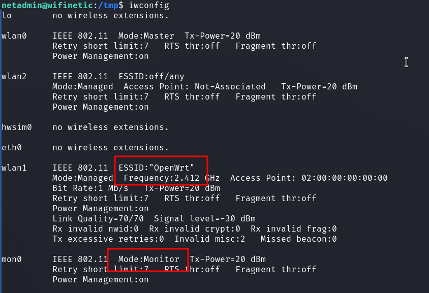

`iwconfig` shows us some more interesting details like that `mon0` is running in __monitor mode__ and the broadcasting SSID from the interface `wlan1`.

Now, based on the name of the box and this setup, it should be clear that WIFI hacking is the key here.

<br>

### Exploitation

A well-known WPS crackin tool is available on the box.

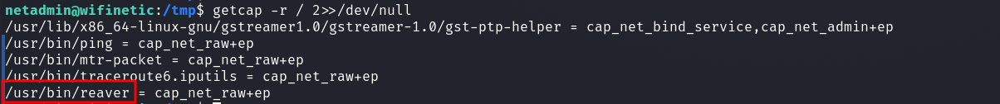

I ran reaver with the minimal basic settings.

We give the flag `-i` the name of the interface which is in monitor mode.

And with the flag `-b` we tell reaver which BSSID/AP it should attack.

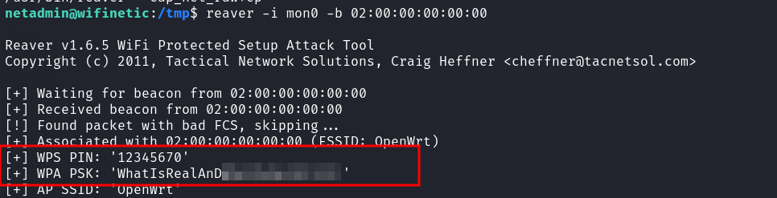

And that was quick!

Reaver cracked the password of the WiFi (Pre Shared Keys).

The password was also set for the user 'root' and I was able to get the final flag.

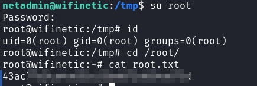
