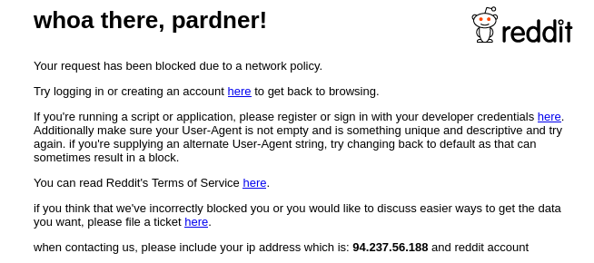
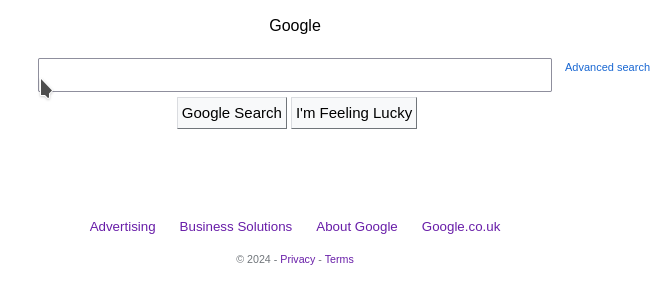
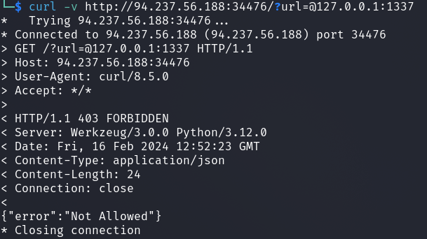
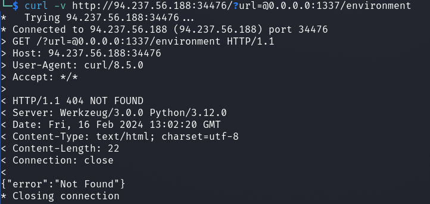
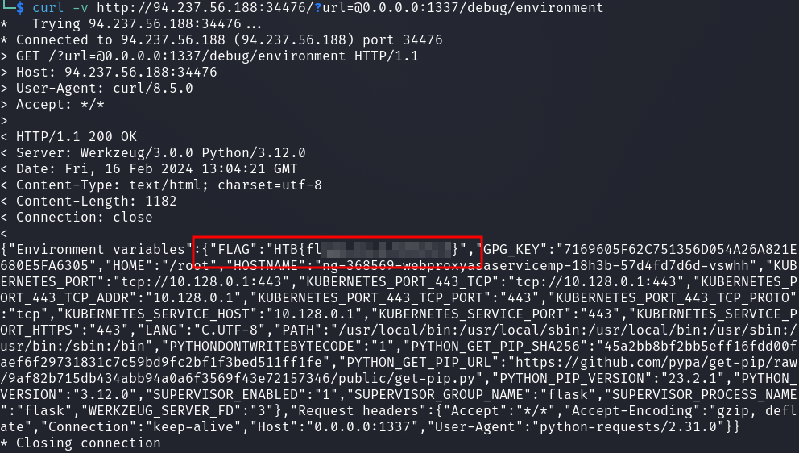

# Web - ProxyAsAService

## Description
> Experience the freedom of the web with ProxyAsAService. Because online privacy and access should be for everyone, everywhere.

## Walkthrough

I first looked at the webchallenge page and got the following under the URL call: `http://<IP>>:34476/?url=/r/catpictures`.



The webchallenge would like to redirect us to reddit to the threat __/r/catpictures__.

At this point I would like to insert the challenge code of the file __routes.py__.

```python3
from flask import Blueprint, request, Response, jsonify, redirect, url_for
from application.util import is_from_localhost, proxy_req
import random, os

SITE_NAME = 'reddit.com'

proxy_api = Blueprint('proxy_api', __name__)
debug     = Blueprint('debug', __name__)


@proxy_api.route('/', methods=['GET', 'POST'])
def proxy():
    url = request.args.get('url')

    if not url:
        cat_meme_subreddits = [
            '/r/cats/',
            '/r/catpictures',
            '/r/catvideos/'
        ]

        random_subreddit = random.choice(cat_meme_subreddits)

        return redirect(url_for('.proxy', url=random_subreddit))

    target_url = f'http://{SITE_NAME}{url}'
    response, headers = proxy_req(target_url)

    return Response(response.content, response.status_code, headers.items())

@debug.route('/environment', methods=['GET'])
@is_from_localhost
def debug_environment():
    environment_info = {
        'Environment variables': dict(os.environ),
        'Request headers': dict(request.headers)
    }

    return jsonify(environment_info)from flask import Blueprint, request, Response, jsonify, redirect, url_for
from application.util import is_from_localhost, proxy_req
import random, os

SITE_NAME = 'reddit.com'

proxy_api = Blueprint('proxy_api', __name__)
debug     = Blueprint('debug', __name__)


@proxy_api.route('/', methods=['GET', 'POST'])
def proxy():
    url = request.args.get('url')

    if not url:
        cat_meme_subreddits = [
            '/r/cats/',
            '/r/catpictures',
            '/r/catvideos/'
        ]

        random_subreddit = random.choice(cat_meme_subreddits)

        return redirect(url_for('.proxy', url=random_subreddit))

    target_url = f'http://{SITE_NAME}{url}'
    response, headers = proxy_req(target_url)

    return Response(response.content, response.status_code, headers.items())

@debug.route('/environment', methods=['GET'])
@is_from_localhost
def debug_environment():
    environment_info = {
        'Environment variables': dict(os.environ),
        'Request headers': dict(request.headers)
    }

    return jsonify(environment_info)
```

Here we can see that the page should redirect us to reddit.

Also interesting is the route `/environment` where we get system env variables.

This system env variables also contains our flag.

Now I tried it with a few __Open Redirect__ attempts.

The `@` sign was helpful.

By calling `http://<IP>>:34476/?url=/?url=@google.com` we are redirected to google and no longer to reddit as it is actually intended.



So far so good, but we want to pick up the flag locally.

`curl -v http://94.237.56.188:34476/?url=@127.0.0.1:1337`



Here we only get __403__ not allowed.

This is quickly explained why if we take a look at the __util.py__ file.

```python3

<SNIP>
RESTRICTED_URLS = ['localhost', '127.', '192.168.', '10.', '172.']
def is_safe_url(url):
    for restricted_url in RESTRICTED_URLS:
        if restricted_url in url:
            return False
    return True

def is_from_localhost(func):
    @functools.wraps(func)
    def check_ip(*args, **kwargs):
        if request.remote_addr != '127.0.0.1':
            return abort(403)
        return func(*args, **kwargs)
    return check_ip

<SNIP>
```

Here we see a blacklisting array, which IPs are not allowed.

Okay, then we just take `0.0.0.0`.



Okay, that seems to work, but now I'm struggling with a `404`.

It took me a while to understand that I had to call `/debug/environment` and I got the flag.


