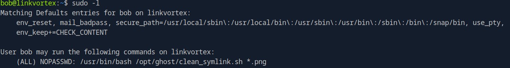

# HackTheBox - LinkVortex


<br>
<br>

## Table of Contents

- [Enumeration](#Enumeration)
    - [Portscan](#Portscan)
	- [Webserver](#Webserver)
	- [Git Repository Exposure](#Git-Repository-Exposure)
- [Foothold](#Foothold)
	- [Credential Exposure](#Credential-Exposure)
	- [CVE-2023-40028](CVE---2023---40028)
- [User](#User)
	- [Credential Harvesting](#Credential-Harvesting)
- [Privilege Escalation](#Privilege-Escalation)
	- [Sudo](#Sudo)
	- [Custom Script](#Custom-Script)
	- [Bypass](#Bypass)

<br>

## Enumeration

### Portscan

It starts as usual with a full portscan with service enumeration.

__Command:__ `nmap -p- -T4 -sV -sC <IP>`

 

We see two open ports, an SSH server and a web server.

Furthermore, the script engine of nmap also shows us a few entries from an existing `robots.txt` file.

<br>

### Webserver

So let's take a look at the web server, but first we have to add the domain to the `/etc/hosts` file.


We get to see this side.


I did some basic enumerations and came across the subdomain `dev.linkvortex.htb` using gobuster.


On the main page `linkvortex.htb` which is operated by __GHOST CMS__, I found an admin login portal under the following url: `http://linkvortex.htb/ghost/#/signin`.


By the Way, it was interesting here that it is possible to enumerate existing users.

If a user does not exist, we are informed that such a user does not exist.


So I tried `admin` + the domain name as box and this CMS lets us know that this user exists, but just the password is wrong. 


Well, that gave me the idea of possibly bruteforcing here, but now I dedicated myself to enumerate the newly found subdomain first.

<br>

### Git Repository Exposure

And found via __FFUF__ that there is probably a Git repository lying around.


Which I retrieved using [git-dumper](https://github.com/arthaud/git-dumper) and then examined using `tig`.


<br>
<br>
<br>

## Foothold

So I used `tig` to look for old commits, passwords etc...

And I found what I was looking for!


This password worked for the Ghost Admin Dashboard.


Now I was looking for ways to take advantage of this.

<br>

### CVE-2023-40028

I went through the menus of the CMS, but didn't really know which of them could help me to establish a shell on the system.

So I did some research on the internet and looked for vulnerabilities and found out that this version has a vulnerability to read files on the system.

I found an exploit to which you pass the access data for the CMS and can then pass a file which the exploit reads for us.

A quick test with the `/etc/passwd` file shows that it works.


<br>
<br>
<br>

## User

Now what to do next?

I rattled through a lot of config files through this vuln hoping to find some interesting passwords, SSH keys or anything else that would help me.

Until I got the idea to go back to the git repository.

<br>

### Credential Harvesting

Here I was looking for paths to configuration files which contain juicy information.


And Yes...this file took me to a configuration file which contained another access data.


I logged in with these credentials and received the first user flag.


<br>
<br>
<br>

## Privilege Escalation

The last step to root was pretty straightforward.

<br>

### Sudo

Often the first thing I do is to see if our current user can run anything using `sudo`.



<br>

### Custom Script

Let's take a look at the script.

```bash
#!/bin/bash

QUAR_DIR="/var/quarantined"

if [ -z $CHECK_CONTENT ];then
  CHECK_CONTENT=false
fi

LINK=$1

if ! [[ "$LINK" =~ \.png$ ]]; then
  /usr/bin/echo "! First argument must be a png file !"
  exit 2
fi

if /usr/bin/sudo /usr/bin/test -L $LINK;then
  LINK_NAME=$(/usr/bin/basename $LINK)
  LINK_TARGET=$(/usr/bin/readlink $LINK)
  if /usr/bin/echo "$LINK_TARGET" | /usr/bin/grep -Eq '(etc|root)';then
    /usr/bin/echo "! Trying to read critical files, removing link [ $LINK ] !"
    /usr/bin/unlink $LINK
  else
    /usr/bin/echo "Link found [ $LINK ] , moving it to quarantine"
    /usr/bin/mv $LINK $QUAR_DIR/
    if $CHECK_CONTENT;then
      /usr/bin/echo "Content:"
      /usr/bin/cat $QUAR_DIR/$LINK_NAME 2>/dev/null
    fi
  fi
fi
```

In short, the script checks png files for dangerous symlinks.

If they point to `etc|root` they are removed.

I played around with the script a bit, created symlinks to files like `/etc/shadow` and looked at how the script works exactly.

As expected with my first attempts I get the following:


<br>

### Bypass

After looking at the code I came up with the following bypass.

The script offers us the possibility that it displays the content by using a `CHECK_CONTENT` variable, which I set to `true` in my terminal.

And via two linked symlinks I was able to access sensitive files.

```bash
export CHECK_CONTENT=true
ln -s /home/bob/flag.txt /home/bob/evil.png
ln -s /root/root.txt /home/bob/flag.txt
sudo -u root /usr/bin/bash /opt/ghost/clean_symlink.sh /home/bob/evil.png
```


And the first flag of the new year was taken down - Happy New Year! :)

<br>


