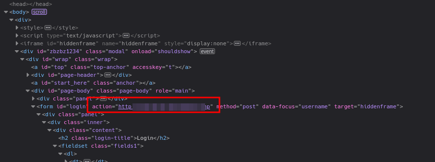
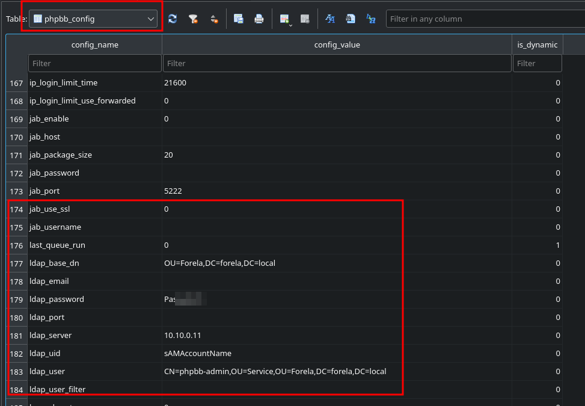

# Bumblebee


## Table of Contents

- [Sherlock Scenario](#Sherlock-Scenario)
- [Evidences](#Evidences)
- [Tasks](#Tasks)
    - [Task 1](#Task-1)
    - [Task 2](#Task-2)
    - [Task 3](#Task-3)
    - [Task 4](#Task-4)
    - [Task 5](#Task-5)
    - [Task 6](#Task-6)
    - [Task 7](#Task-7)
    - [Task 8](#Task-8)
    - [Task 9](#Task-9)
    - [Task 10](#Task-10)

<br>
<br>

## Sherlock Scenario
>An external contractor has accessed the internal forum here at Forela via the Guest Wi-Fi, and they appear to have stolen credentials for the administrative user! We have attached some logs from the forum and a full database dump in sqlite3 format to help you in your investigation.

<br>
<br>

## Evidences

This are the files we have to work with.

```bash
#file *
access.log:    ASCII text, with very long lines (463)
phpbb.sqlite3: SQLite 3.x database, last written using SQLite version 3034001, file counter 1, database pages 255, cookie 0xae, schema 4, UTF-8, version-valid-for 1
```

<br>
<br>

## Tasks

### Task 1
>What was the username of the external contractor?

__Answer:__ `apoole1` 

This could be found in the `phpbb_users` table.


<br>

### Task 2
>What IP address did the contractor use to create their account?

__Answer:__ `10.10.0.78` 

The IP's are also logged in the same table as before.


<br>

### Task 3
>What is the post_id of the malicious post that the contractor made?

__Answer:__ `9` 

This information was in the `phpbb_posts`.


<br>

### Task 4
>What is the full URI that the credential stealer sends its data to?

__Answer:__ `http://10.10.0.78/update.php` 

For this information, I took the source code from the posts table.


Formatted it properly and found the attacker's stealer.



<br>

### Task 5
>When did the contractor log into the forum as the administrator? (UTC)

__Answer:__ `26/04/2023 10:53:12` 

This was recorded here in the `phpbb_log` table.

Of course as a Unix timestamp which we have to convert.


<br>

### Task 6
>In the forum there are plaintext credentials for the LDAP connection, what is the password?

__Answer:__ `Passw0rd1`

Setting parameters can be found in the `phpbb_config` table, where the LDAP password was set.



<br>

### Task 7
>What is the user agent of the Administrator user?

__Answer:__ `Mozilla/5.0 (Macintosh; Intel Mac OS X 10_15_7) AppleWebKit/537.36 (KHTML, like Gecko) Chrome/112.0.0.0 Safari/537.36` 

We can obtain this from the web server's log file.


<br>

### Task 8
>What time did the contractor add themselves to the Administrator group? (UTC)

__Answer:__ `26/04/2023 10:53:51` 

This could also be found in the `phpbb_log` file with focus on the `log_operation` column.


<br>

### Task 9
>What time did the contractor download the database backup? (UTC)

__Answer:__ `26/04/2023 11:01:38` 

This could be found in the log file of the web server.

Here, however, we must be aware of the time difference between the web server and the attacker!


<br>

### Task 10
>What was the size in bytes of the database backup as stated by access.log?

__Answer:__ `34707` 

This can be found in the same logline as before.


<br>
<br>
