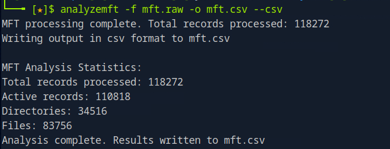

# Hyperfiletable


## Table of Contents

- [Sherlock Scenario](#Sherlock-Scenario)
- [Evidences](#Evidences)
- [Tasks](#Tasks)
    - [Task 1](#Task-1)
    - [Task 2](#Task-2)
    - [Task 3](#Task-3)
    - [Task 4](#Task-4)
    - [Task 5](#Task-5)
    - [Task 6](#Task-6)
    - [Task 7](#Task-7)
    - [Task 8](#Task-8)
    - [Task 9](#Task-9)
    - [Task 10](#Task-10)
- [Conclusion](#Conclusion)

<br>
<br>

## Sherlock Scenario
> There has been a new joiner in Forela, they have downloaded their onboarding documentation, however someone has managed to phish the user with a malicious attachment. We have only managed to pull the MFT record for the new user, are you able to triage this information?

<br>
<br>

## Evidences

As already described in the scenario, we have an MFT file here that we have to work with.

```bash
mft.raw
```

<br>
<br>

## Tasks

### Task 1
> What is the MD5 hash of the MFT?

__Answer:__ `3730c2fedcdc3ecd9b83cbea08373226` 

<br>

This is quickly figured out with an `md5sum` command.


<br>

### Task 2
> What is the name of the only user on the system?

__Answer:__ `Randy Savage` 

<br>

I solved this task quick & dirty with a short combined `strings` / `egrep` command.


<br>

### Task 3
> What is the name of the malicious HTA that was downloaded by that user?

__Answer:__ `Onboarding.hta` 

<br>

With this task I started to use proper tools to extract the MFT values.

With [analyzeMFT](https://github.com/rowingdude/analyzeMFT) I parsed out the MFT records into a CSV file and searched for `.hta` files.

__Command:__ `cat mft.csv | egrep -i '.hta'`
`


__Command:__ `cat mft.csv | egrep -i '.hta'`


<br>

### Task 4
> What is the ZoneId of the download for the malicious HTA file?

__Answer:__ `3` 

<br>


From this challenge on I used the tool [MFTExplorer](https://ericzimmerman.github.io/#!index.md), which proved to be more convenient and useful for answering further questions.

I searched for the previously mentioned file in MFTExplorer and got the information I was looking for.


But wait....what does this zone ID tell us?

With this ID, windows identifies the origin of the file!

And the number 3 tells us that this file comes from the internet.

Further zone IDs and their meanings are:

- 0.Local Machine / Local Machine
- 1.Local Intranet / Local Intranet
- 2.Trusted Sites / Trusted sites
- 3.Internet / Internet
- 4.Restricted Sites / Restricted Sites

<br>

### Task 5
> What is the download URL for the malicious HTA?

__Answer:__ `https://doc-10-8k-docs.googleusercontent.com/docs/securesc/9p3 ... <SNIP>` 

<br>

This could be seen in the same section below.


<br>

### Task 6
> What is the allocated size for the HTA file? (bytes)

__Answer:__ `4096` 

<br>

This was to be found in the **Allocated Size** specification as a hexadecimal value.


<br>

### Task 7
> What is the real size of the HTA file? (bytes)

__Answer:__ `1144` 

<br>

And the actual size of the file used was to the right.


<br>

### Task 8
> When was the powerpoint presentation downloaded by the user?

__Answer:__ `05/04/2023 13:11:49`

<br>

This could be found in the user's `Documents` > `Work` folder.


<br>

### Task 9
> The user has made notes of their work credentials, what is their password?

__Answer:__ `ReallyC00lDucks2023!` 

<br>

This could be found in the file `notes.txt` in the same folder structure as before.

As this text file is small, its content can be found in the MFT itself as a so-called __resident file__.

<br>

### Task 10
> How many files remain under the C:\Users\ directory? (Recursively)

__Answer:__ `3471`

<br>

Up to this final last task, all questions were processed quite quickly one after the other.

But how do I best filter out all files recursively from this MFT file which are under `\Users\`?

First, I parsed out a CSV file using [MFTECmd](https://ericzimmerman.github.io/#!index.md) that I could work with.

__Command:__ `.\MFTECmd.exe -f "mft.raw" --csv mft_output.csv`

After a few attempts with a bash oneliner to get the desired number of files, I decided to use python to determine the number of files I was looking for.

```python3
import csv

file = 'mft_output.csv'
cnt = 0

with open(file,) as file2:
    reader = csv.DictReader(file2)

    for line in reader:
        if "\\Users\\" in line['ParentPath'] and line['IsDirectory'] == 'False' and line['FileName'].strip() != '' and line['InUse'] == 'True':
            print(line)
            cnt = cnt + 1

print("Total:",cnt)
```

The small script filters according to the following criteria:

- “\Users\” appears in the path name
- is not a direktory
- has a file name
- is not deleted

<br>

## Conclusion

This challenge was a great Sherlock to dive into MFT/NTFS forensics.

A cool takeaway was learning how **Zone IDs** mark the origin of files.
