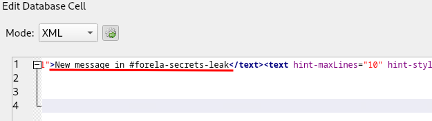
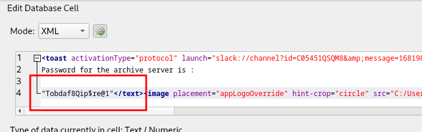

# JingleBell


## Table of Contents

- [Sherlock Scenario](#Sherlock-Scenario)
- [Evidences](#Evidences)
- [Tasks](#Tasks)
    - [Task 1](#Task-1)
    - [Task 2](#Task-2)
    - [Task 3](#Task-3)
    - [Task 4](#Task-4)
    - [Task 5](#Task-5)
    - [Task 6](#Task-6)
    - [Task 7](#Task-7)
    - [Task 8](#Task-8)

<br>
<br>

## Sherlock Scenario
> Torrin is suspected to be an insider threat in Forela. He is believed to have leaked some data and removed certain applications from their workstation. They managed to bypass some controls and installed unauthorised software. Despite the forensic team's efforts, no evidence of data leakage was found. As a senior incident responder, you have been tasked with investigating the incident to determine the conversation between the two parties involved.

<br>
<br>

## Evidences

We have been given the following data for this Sherlock.

```plaintext
Torrincase/
└── C
    └── Users
        └── Appdata
            └── Local
                └── Microsoft
                    └── Windows
                        └── Notifications
                            ├── wpndatabase.db
                            ├── wpndatabase.db-shm
                            ├── wpndatabase.db-wal
                            └── wpnidm

9 directories, 3 files
```

<br>
<br>

## Tasks

### Task 1
> Which software/application did Torrin use to leak Forela's secrets?

__Answer:__ `Slack`

<br>

I opened the SQLite database `wpndatabase.db` and got an overview.

In the __Notification__ table, it quickly became clear that this was `Slack`.

The purpose of this Sherlock was to reconstruct the conversation.

<br>


<br>

### Task 2
> What's the name of the rival company to which Torrin leaked the data?

__Answer:__ `PrimeTech Innovations`

<br>


<br>

### Task 3
> What is the username of the person from the competitor organization whom Torrin shared information with?

__Answer:__ `Cyberjunkie-PrimeTechDev`

<br>


<br>

### Task 4
> What's the channel name in which they conversed with each other?

__Answer:__ `forela-secrets-leak`

<br>



<br>

### Task 5
> What was the password for the archive server?

__Answer:__ `Tobdaf8Qip$re@1`

<br>



<br>

### Task 6
> What was the URL provided to Torrin to upload stolen data to?

__Answer:__ `https://drive.google.com/drive/folders/1vW97VBmxDZUIEuEUG64g5DLZvFP-Pdll?usp=sharing`

<br>


<br>

### Task 7
> When was the above link shared with Torrin?

__Answer:__ `2023-04-20 10:34:49`

Here it was necessary to obtain and convert the timestamp.

<br>


<br>

### Task 8
> For how much money did Torrin leak Forela's secrets?

__Answer:__ `£10000`


<br>


<br>


