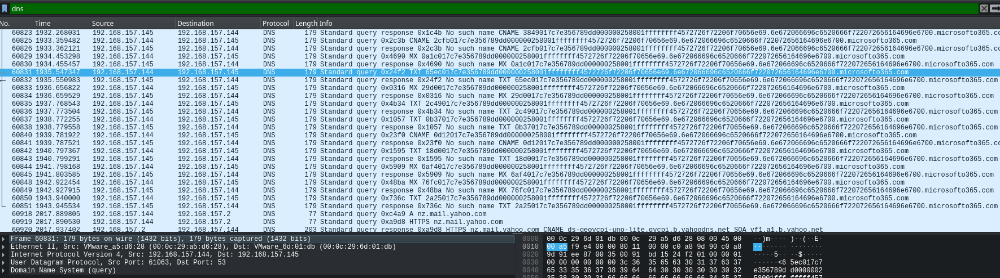

# Litter

## Table of Contents

- [Sherlock Scenario](#Sherlock-Scenario)
- [Evidences](#Evidences)
- [Tasks](#Tasks)
    - [Task 1](#Task-1)
    - [Task 2](#Task-2)
    - [Task 3](#Task-3)
    - [Task 4](#Task-4)
    - [Task 5](#Task-5)
    - [Task 6](#Task-6)
    - [Task 7](#Task-7)
    - [Task 8](#Task-8)

 
 

## Sherlock Scenario
> Khalid has just logged onto a host that he and his team use as a testing host for many different purposes. It’s off their corporate network but has access to lots of resources on the network. The host is used as a dumping ground for a lot of people at the company, but it’s very useful, so no one has raised any issues. Little does Khalid know; the machine has been compromised and company information that should not have been on there has now been stolen – it’s up to you to figure out what has happened and what data has been taken.

 
 

## Evidences

We were given a network log file called `suspicious_traffic.pcap`.

 
 

## Tasks

### Task 1
> At a glance, what protocol seems to be suspect in this attack?

__Answer:__ `DNS`

The relevant protocol is `DNS`.

Here it becomes clear that the attacker has probably extracted data via DNS.

 

 

### Task 2
> There seems to be a lot of traffic between our host and another, what is the IP address of the suspect host?

__Answer:__ `192.168.157.145`

I used the Wireshark statistics menus for this.

Under `Statistics` -> `Conversations` we can see that this IP address has increased traffic and many packets.

 

 

### Task 3
> What is the first command the attacker sends to the client?

__Answer:__ `whoami`

In the frame number `13938` the attacker sent the first command through DNS.

 

 

### Task 4
> What is the version of the DNS tunneling tool the attacker is using?

__Answer:__ `0.07`

Here I used `tshark` to better filter out the hex-encoded DNS queries that contain the command interaction with the target system.

The attacker used the tool `dnscat2` in version `0.07`, a tool that enables command & control over the DNS protocol.

 

 

### Task 5
> The attackers attempts to rename the tool they accidentally left on the clients host. What do they name it to?

__Answer:__ `win_installer.exe`

Here the attacker tried to rename the tool.

 

 

### Task 6
> The attacker attempts to enumerate the users cloud storage. How many files do they locate in their cloud storage directory?

__Answer:__ `0`

No files were in the Cloud Storage Directory.

 

 

### Task 7
> What is the full location of the PII file that was stolen?

__Answer:__ `C:\users\test\documents\client data optimisation\user details.csv`

 

 

### Task 8
> Exactly how many customer PII records were stolen?

__Answer:__ `721`

For this I used the tool [DNScat-Decoder](https://github.com/josemlwdf/DNScat-Decoder/tree/main) with which the number of exfiltrated lines could be counted better.

 

 
