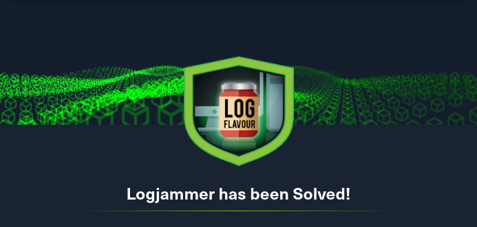

# Logjammer



## Table of Contents

- [Sherlock Scenario](#Sherlock-Scenario)
- [Evidences](#Evidences)
- [Tasks](#Tasks)
    - [Task 1](#Task-1)
    - [Task 2](#Task-2)
    - [Task 3](#Task-3)
    - [Task 4](#Task-4)
    - [Task 5](#Task-5)
    - [Task 6](#Task-6)
    - [Task 7](#Task-7)
    - [Task 8](#Task-8)
    - [Task 9](#Task-9)
    - [Task 10](#Task-10)
	- [Task 11](#Task-11)
	- [Task 12](#Task-12)
- [Conclusion](#Conclusion)

<br>
<br>

## Sherlock Scenario
> You have been presented with the opportunity to work as a junior DFIR consultant for a big consultancy. However, they have provided a technical assessment for you to complete. The consultancy Forela-Security would like to gauge your Windows Event Log Analysis knowledge. We believe the Cyberjunkie user logged in to his computer and may have taken malicious actions. Please analyze the given event logs and report back.

<br>
<br>

## Evidences

Here are the files we have to work with.

```bash
#file *
Powershell-Operational.evtx:       MS Windows 10-11 Event Log, version  3.2, 181 chunks (no. 180 in use), next record no. 579
Security.evtx:                     MS Windows 10-11 Event Log, version  3.2, 3 chunks (no. 2 in use), next record no. 116
System.evtx:                       MS Windows 10-11 Event Log, version  3.2, 19 chunks (no. 18 in use), next record no. 2187
Windows Defender-Operational.evtx: MS Windows 10-11 Event Log, version  3.2, 10 chunks (no. 9 in use), next record no. 445
Windows Firewall-Firewall.evtx:    MS Windows 10-11 Event Log, version  3.2, 15 chunks (no. 14 in use), next record no. 930
```

<br>
<br>

## Tasks

### Task 1
>When did the cyberjunkie user first successfully log into his computer? (UTC)

__Answere:__ `27/03/2023 14:37:09`

This was easy to find out by the eventID 4624 which indicates successful login attempts.

In total there were 4 successful login attempts from user `cyberjunkie`.

__Command:__ `chainsaw search -t 'Event.System.EventID: =4624'`

[!Screenshot1](./screenshots/1.png)

<br>

### Task 2
>The user tampered with firewall settings on the system. Analyze the firewall event logs to find out the Name of the firewall rule added?

__Answere:__ `Metasploit C2 Bypass`

The attacker worked with the well-known Metasploit framework.

[!Screenshot2](./screenshots/2.png)

<br>

### Task 3
>Whats the direction of the firewall rule?

__Answere:__ `Outbound`

<br>

### Task 4
>The user changed audit policy of the computer. Whats the Subcategory of this changed policy?

__Answere:__ `Other Object Access Events`

Here helped a search with the matching event id, which is the ID 4719.

__Command:__ `chainsaw search -t 'Event.System.EventID: =4719'`

[!Screenshot4](./screenshots/4.png)

<br>

### Task 5
>The user "cyberjunkie" created a scheduled task. Whats the name of this task?

__Answere:__ `HTB-AUTOMATION`

The EventID 4698, which is created when sheduled tasks are created, helped us here.

__Command:__ `chainsaw search -t 'Event.System.EventID: =4698'`

[!Screenshot5](./screenshots/5.png)

<br>

### Task 6
>Whats the full path of the file which was scheduled for the task?

__Answere:__ `C:\Users\CyberJunkie\Desktop\Automation-HTB.ps1`

This was also shown in the output of the previous command.

<br>

### Task 7
>What are the arguments of the command?

__Answere:__ `-A cyberjunkie@hackthebox.eu`

<br>

### Task 8
>The antivirus running on the system identified a threat and performed actions on it. Which tool was identified as malware by antivirus?

__Answere:__ `Sharphound`

[!Screenshot8](./screenshots/8.png)

It took me a while to find the attacker's tool I was looking for and I went through various Defender-related EventIDs.

Through the EventID [1116](#https://learn.microsoft.com/en-us/defender-endpoint/troubleshoot-microsoft-defender-antivirus#event-id-1116) I found the tool of the attacker I was using.

__Command:__ `chainsaw search -t 'Event.System.EventID: =1116'`

<br>

### Task 9
>Whats the full path of the malware which raised the alert?

__Answere:__ `C:\Users\CyberJunkie\Downloads\SharpHound-v1.1.0.zip`

This was contained in the same output from the previous command also.

[!Screenshot9](./screenshots/9.png)

<br>

### Task 10
>What action was taken by the antivirus?

__Answere:__ `Quarantine`

<br>

### Task 11
>The user used Powershell to execute commands. What command was executed by the user?

__Answere:__ `Get-FileHash -Algorithm md5 .\Desktop\Automation-HTB.ps1`

[!Screenshot11](./screenshots/11.png)

<br>

### Task 12
>We suspect the user deleted some event logs. Which Event log file was cleared?

__Answere:__ `Microsoft-Windows-Windows Firewall With Advanced Security/Firewall`

Phew..... And this last task took most of my time here, because I was looking for so many other things, and other events.

For a long time I thought it was about deleting event files with the EventID `1102`.

I also tried to disassemble the powershell executions.

At the end it was the EventID `104`, which gave me the solution after a long search.

Here is also a [Resource ](https://attack.mitre.org/techniques/T1070/001/) from the MITRE Framework which was also helpful at this point

__Command:__ `./chainsaw search -t 'Event.System.EventID: =104' Event-Logs/* --json | jq`

[!Screenshot12](./screenshots/12.png)

Here a detection by Sigma rules through the EventID `1104` that the attacker had deleted eventfiles:

[!Screenshot12](./screenshots/12_2.png)

<br>
<br>

## Conclusion

Logjammer was a really cool Sherlock to get to grips with analyzing Windows event files.

I also learned a lot about important EventID's to keep an eye on when looking for suspicious actions in `.evtx` files.

I mainly used the tool [chainsaw](https://github.com/WithSecureLabs/chainsaw) and its search options via Strigns or various EventIDs.

But for the last two questions I sat a bit longer on it  and  I experimented a bit with Sigma rules for the first time.

[!Screenshot13](./screenshots/13.png)
