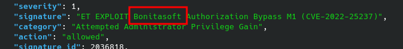

# Meerkat


## Table of Contents

- [Sherlock Scenario](#Sherlock-Scenario)
- [Evidences](#Evidences)
- [Tasks](#Tasks)
    - [Task 1](#Task-1)
    - [Task 2](#Task-2)
    - [Task 3](#Task-3)
    - [Task 4](#Task-4)
    - [Task 5](#Task-5)
    - [Task 6](#Task-6)
    - [Task 7](#Task-7)
    - [Task 8](#Task-8)
    - [Task 9](#Task-9)
    - [Task 10](#Task-10)
- [Conclusion](#Conclusion)

<br>
<br>

## Sherlock Scenario
> As a fast-growing startup, Forela has been utilising a business management platform. Unfortunately, our documentation is scarce, and our administrators aren't the most security aware. As our new security provider we'd like you to have a look at some PCAP and log data we have exported to confirm if we have (or have not) been compromised.

<br>
<br>

## Evidences

Here are the files we have to work with.

```bash
#2 files
meerkat-alerts.json: JSON text data
meerkat.pcap:        pcapng capture file - version 1.0
```

<br>
<br>

## Tasks

### Task 1
>We believe our Business Management Platform server has been compromised. Please can you confirm the name of the application running?

__Answer:__ `BonitaSoft` 

This could be seen in the `meerkat-alert.json` file.



<br>

### Task 2
>We believe the attacker may have used a subset of the brute forcing attack category - what is the name of the attack carried out?

__Answer:__ `Credential Stuffing` 

The logs showed that an attacker was using brute force attacks. Due to the fact that the attacker also tries other accounts with the same password-sets, we can conclude the sub-category [Credential stuffing](#https://attack.mitre.org/techniques/T1110/004/)

<br>

### Task 3
>Does the vulnerability exploited have a CVE assigned - and if so, which one?

__Answer:__ `CVE-2022-25237` 

This was also evident from the JSON file.

<br>

### Task 4
>Which string was appended to the API URL path to bypass the authorization filter by the attacker's exploit?

__Answer:__ `i18ntranslation` 

I took this from the pcap record file after I filtered for `http` traffic and looked at it.


I also found a public [exploit](https://github.com/RhinoSecurityLabs/CVEs/blob/master/CVE-2022-25237/CVE-2022-25237.py) online.

However, it is unclear whether it is the one used in our incident.

<br>

### Task 5
>How many combinations of usernames and passwords were used in the credential stuffing attack?

<br>

__Answer:__ `56` 

Here I had filtered and counted POST requests with the HTTP status `401` as response.

<br>

### Task 6
>Which username and password combination was successful?

__Answer:__ `seb.broom@forela.co.uk:g0vernm3nt` 

This could be easily traced via the Wireshark menu __Follow HTTP Stream__.

Here is the successful credential found and a previous one with a negative return.


<br>

### Task 7
>If any, which text sharing site did the attacker utilise?

__Answer:__ `pastes.io` 

I took this from a DNS request in the pcap record file.


<br>

### Task 8
>Please provide the filename of the public key used by the attacker to gain persistence on our host.

__Answer:__ `hffgra4unv` 

This was evident from the pcap recording file.


And finally in the uploaded paste on pastes.io.


<br>

### Task 9
>Can you confirm the file modified by the attacker to gain persistence?

__Answer:__ `/home/ubuntu/.ssh/authorized_keys` 

<br>

### Task 10
>Can you confirm the MITRE technique ID of this type of persistence mechanism?

__Answer:__ `T1098.004`

This persistence mechanism was to be found here: [T1098.00](https://attack.mitre.org/techniques/T1098/004/)

<br>
<br>

## Conclusion

This was my first Sherlock this year and also my first writeup of such a Sherlock.

As my resolution for the year is to change my perspective and explore new learning opportunities, more will surely follow.
