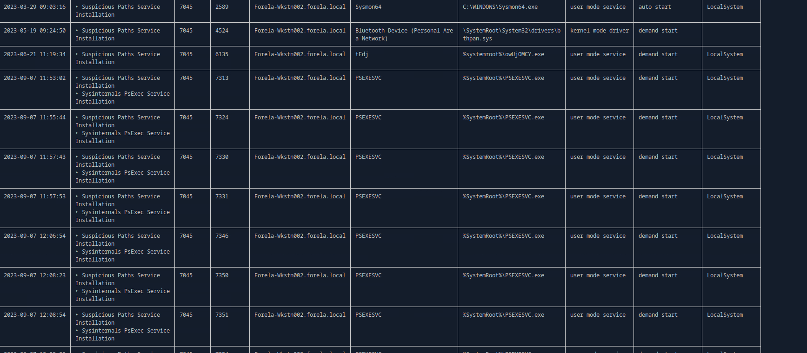
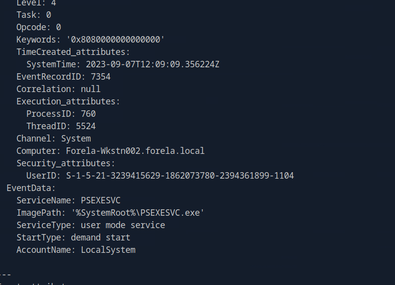
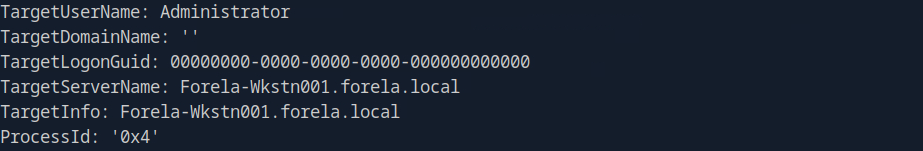
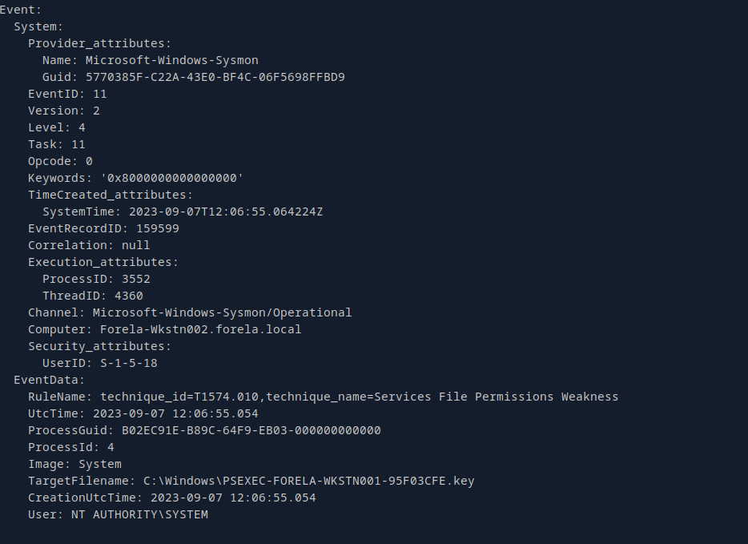
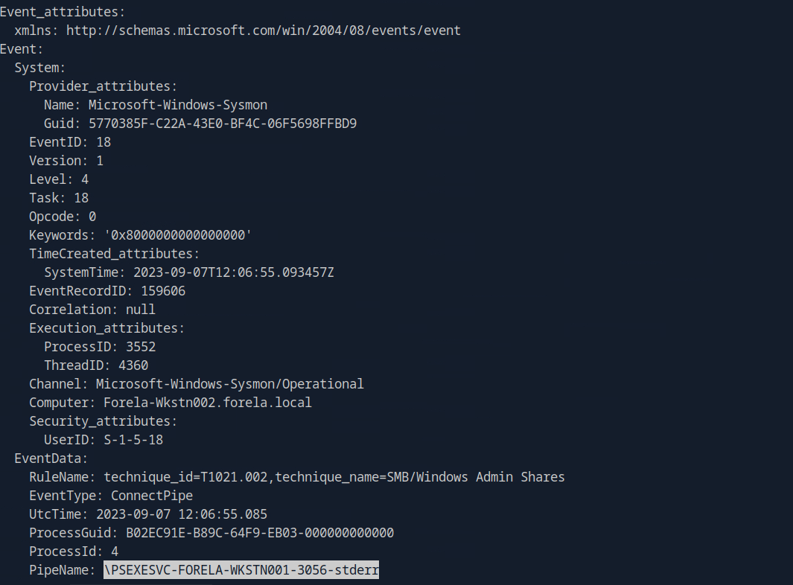

# Tracer


## Table of Contents

- [Sherlock Scenario](#Sherlock-Scenario)
- [Evidences](#Evidences)
- [Tasks](#Tasks)
    - [Task 1](#Task-1)
    - [Task 2](#Task-2)
    - [Task 3](#Task-3)
    - [Task 4](#Task-4)
    - [Task 5](#Task-5)
    - [Task 6](#Task-6)
    - [Task 7](#Task-7)
- [Conclusion](#Conclusion)

<br>
<br>

## Sherlock Scenario
> A junior SOC analyst on duty has reported multiple alerts indicating the presence of PsExec on a workstation. They verified the alerts and escalated the alerts to tier II. As an Incident responder you triaged the endpoint for artefacts of interest. Now please answer the questions regarding this security event so you can report it to your incident manager.

<br>
<br>

## Evidences

We were given various saved files under `C:\`, which I do not want to list here all.

Many prefetch files (`*.pf`) and event files `*.evtx` were given to us here.

I mainly worked with the EVTX files, although it later turned out that analyzing the prefetch files would have been more convenient.

<br>

<br>

## Tasks

### Task 1
> The SOC Team suspects that an adversary is lurking in their environment and are using PsExec to move laterally. A junior SOC Analyst specifically reported the usage of PsExec on a WorkStation. How many times was PsExec executed by the attacker on the system?

__Answer:__ `9`

I started with the tool [Chainsaw](https://github.com/WithSecureLabs/chainsaw) and found the actions using PsExec and counted them.

<br>



<br>

### Task 2
> What is the name of the service binary dropped by PsExec tool allowing attacker to execute remote commands?

__Answer:__ `psexesvc.exe`

This was quickly found.

<br>



<br>

### Task 3
> Now we have confirmed that PsExec ran multiple times, we are particularly interested in the 5th Last instance of the PsExec. What is the timestamp when the PsExec Service binary ran?

__Answer:__ `07/09/2023 12:06:54`

<br>

Here I created a small timeline note with all PSEXEC executions and their times.

```plaintext
EventID: 7045
1.) 7313 - 2023-09-07 11:53:02
2.) 7324 - 2023-09-07 11:55:44
3.) 7330 - 2023-09-07 11:57:43
4.) 7331 - 2023-09-07 11:57:53
5.) 7346 - 2023-09-07 12:06:54
6.) 7350 - 2023-09-07 12:08:23
7.) 7351 - 2023-09-07 12:08:54
8.) 7354 - 2023-09-07 12:09:09
9.) 7355 - 2023-09-07 12:10:03
```

<br>

### Task 4
> Can you confirm the hostname of the workstation from which attacker moved laterally?

__Answer:__ `Forela-Wkstn001`

This was also quickly found using the name scheme `Wkstn00X` and a search via chainsaw for other workstations.

<br>



<br>

### Task 5
> What is full name of the Key File dropped by 5th last instance of the Psexec?

__Answer:__ `PSEXEC-FORELA-WKSTN001-95F03CFE.key`

Here I searched for pattern with key using chainsaw and found the solution in EventID number 11.

<br>



<br>

### Task 6
> Can you confirm the timestamp when this key file was created on disk?

__Answer:__ `07/09/2023 12:06:55`

<br>

The time stamp could be taken from the same output from before.

<br>

### Task 7
> What is the full name of the Named Pipe ending with the "stderr" keyword for the 5th last instance of the PsExec?

__Answer:__ `\PSEXESVC-FORELA-WKSTN001-3056-stderr`

This was evident from the EventID number 18 that followed shortly afterwards.

<br>



<br>

# Conclusion

A good and fun Sherlock in any case and a good opportunity to deal with evtx forensic.

The biggest takeaway for me was reading other writeups afterwards, as I see that many people tend to analyze the prefetch files using tools like `PECmd.exe`.

With the prefetch files I could have found out more quickly how often and when PsExec was executed instead of laboriously searching through EVTX logs.

