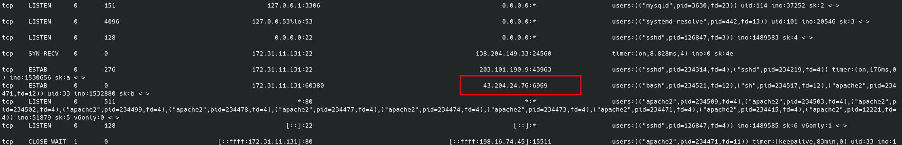

# Ultimatum


## Table of Contents

- [Sherlock Scenario](#Sherlock-Scenario)
- [Evidences](#Evidences)
- [Tasks](#Tasks)
    - [Task 1](#Task-1)
    - [Task 2](#Task-2)
    - [Task 3](#Task-3)
    - [Task 4](#Task-4)
    - [Task 5](#Task-5)
    - [Task 6](#Task-6)
    - [Task 7](#Task-7)
    - [Task 8](#Task-8)
    - [Task 9](#Task-9)
    - [Task 10](#Task-10)
    - [Task 11](#Task-11)
- [Conclusion](#Conclusion)

<br>
<br>

## Sherlock Scenario
> One of the Forela WordPress servers was a target of notorious Threat Actors (TA). The website was running a blog dedicated to the Forela Social Club, where Forela employees can chat and discuss random topics. Unfortunately, it became a target of a threat group. The SOC team believe this was due to the blog running a vulnerable plugin. The IT admin already followed the acquisition playbook and triaged the server for the security team. Ultimately (no pun intended) it is your responsibility to investigate the incident. Step in and confirm the culprits behind the attack and restore this important service within the Forela environment.

<br>
<br>

## Evidences

Here is an overview of the files we have to work with.

These files come from [CatScale](https://github.com/WithSecureLabs/LinuxCatScale), an IR-Collection script that automatically collects the most important stuff on a Linux environment for Analysing the Incident.

```bash
#tree
.
├── Docker
├── ip-172-31-11-131-20230808-0937-console-error-log.txt
├── Logs
│   ├── ip-172-31-11-131-20230808-0937-last-btmp.txt
│   ├── ip-172-31-11-131-20230808-0937-lastlog.txt
│   ├── ip-172-31-11-131-20230808-0937-last-utmpdump.txt
│   ├── ip-172-31-11-131-20230808-0937-last-utmp.txt
│   ├── ip-172-31-11-131-20230808-0937-last-wtmp.txt
│   ├── ip-172-31-11-131-20230808-0937-passwd-check.txt
│   ├── ip-172-31-11-131-20230808-0937-var-crash-list.txt
│   ├── ip-172-31-11-131-20230808-0937-var-crash.tar.gz
│   ├── ip-172-31-11-131-20230808-0937-var-log-list.txt
│   ├── ip-172-31-11-131-20230808-0937-var-log.tar.gz
│   ├── ip-172-31-11-131-20230808-0937-whoandwhat.txt
│   └── ip-172-31-11-131-20230808-0937-who.txt
├── Misc
│   ├── ip-172-31-11-131-20230808-0937-dev-dir-files-hashes.txt
│   ├── ip-172-31-11-131-20230808-0937-dev-dir-files.txt
│   ├── ip-172-31-11-131-20230808-0937-exec-perm-files.txt
│   ├── ip-172-31-11-131-20230808-0937-full-timeline.csv
│   ├── ip-172-31-11-131-20230808-0937-pot-webshell-first-1000.txt
│   ├── ip-172-31-11-131-20230808-0937-pot-webshell-hashes.txt
│   └── ip-172-31-11-131-20230808-0937-Setuid-Setguid-tools.txt
├── Persistence
│   ├── ip-172-31-11-131-20230808-0937-cron-folder-list.txt
│   ├── ip-172-31-11-131-20230808-0937-cron-folder.tar.gz
│   ├── ip-172-31-11-131-20230808-0937-cron-tab-list.txt
│   ├── ip-172-31-11-131-20230808-0937-persistence-systemdlist.txt
│   ├── ip-172-31-11-131-20230808-0937-service_status.txt
│   ├── ip-172-31-11-131-20230808-0937-systemctl_all.txt
│   └── ip-172-31-11-131-20230808-0937-systemctl_service_status.txt
├── Podman
├── Process_and_Network
│   ├── ip-172-31-11-131-20230808-0937-ip-a.txt
│   ├── ip-172-31-11-131-20230808-0937-iptables-numerical.txt
│   ├── ip-172-31-11-131-20230808-0937-iptables.txt
│   ├── ip-172-31-11-131-20230808-0937-lsof-list-open-files.txt
│   ├── ip-172-31-11-131-20230808-0937-process-cmdline.txt
│   ├── ip-172-31-11-131-20230808-0937-process-details.txt
│   ├── ip-172-31-11-131-20230808-0937-process-environment.txt
│   ├── ip-172-31-11-131-20230808-0937-processes-axwwSo.txt
│   ├── ip-172-31-11-131-20230808-0937-process-exe-links.txt
│   ├── ip-172-31-11-131-20230808-0937-process-fd-links.txt
│   ├── ip-172-31-11-131-20230808-0937-processhashes.txt
│   ├── ip-172-31-11-131-20230808-0937-process-map_files-link-hashes.txt
│   ├── ip-172-31-11-131-20230808-0937-process-map_files-links.txt
│   ├── ip-172-31-11-131-20230808-0937-routetable.txt
│   ├── ip-172-31-11-131-20230808-0937-ss-anepo.txt
│   ├── ip-172-31-11-131-20230808-0937-ssh-folders-list.txt
│   └── ip-172-31-11-131-20230808-0937-ssh-folders.tar.gz
├── System_Info
│   ├── ip-172-31-11-131-20230808-0937-cpuinfo.txt
│   ├── ip-172-31-11-131-20230808-0937-deb-packages.txt
│   ├── ip-172-31-11-131-20230808-0937-deb-package-verify.txt
│   ├── ip-172-31-11-131-20230808-0937-df.txt
│   ├── ip-172-31-11-131-20230808-0937-dmesg.txt
│   ├── ip-172-31-11-131-20230808-0937-etc-key-files-list.txt
│   ├── ip-172-31-11-131-20230808-0937-etc-modified-files-list.txt
│   ├── ip-172-31-11-131-20230808-0937-etc-modified-files.tar.gz
│   ├── ip-172-31-11-131-20230808-0937-host-date-timezone.txt
│   ├── ip-172-31-11-131-20230808-0937-lsmod.txt
│   ├── ip-172-31-11-131-20230808-0937-lsusb.txt
│   ├── ip-172-31-11-131-20230808-0937-meminfo.txt
│   ├── ip-172-31-11-131-20230808-0937-modinfo.txt
│   ├── ip-172-31-11-131-20230808-0937-module-sha1.txt
│   ├── ip-172-31-11-131-20230808-0937-mount.txt
│   ├── ip-172-31-11-131-20230808-0937-procmod.txt
│   ├── ip-172-31-11-131-20230808-0937-release.txt
│   └── ip-172-31-11-131-20230808-0937-sudo.txt
├── User_Files
│   ├── hidden-user-home-dir-list.txt
│   └── hidden-user-home-dir.tar.gz
└── Virsh

10 directories, 64 files
```

<br>
<br>

## Tasks

### Task 1
>Which security scanning tool was utilized by the attacker to fingerprint the blog website?

__Answer:__ `wpscan/3.8.24` 

<br>

For this I extracted the file `ip-172-31-11-131-20230808-0937-var-log.tar.gz` to be able to view the Apache log files.

And in the file `access.log.1` it quickly becomes clear that the attacker used the well-known tool `wpscan` to enumerate the Wordpress.


<br>

### Task 2
>Which CVE was exploited by the attacker?

__Answer:__ `CVE-2023-3460` 

<br>

I solved Task 2 by checking the apache logs to see what plugins the attacked wordpress site was using.

And matching the challenge name I found out that the site had the plugin `ultimate-member` installed.


A short online search for vulnerabilities to this plugin brought me to this [article](#https://www.cyfirma.com/research/analyzing-the-ultimate-member-plugin-vulnerability-cve-2023-3460/), which was also useful for answering further questions.

<br>

### Task 3
>What was the IP Address utilized by the attacker to exploit the CVE?

__Answer:__ `23.106.60.163` 

<br>

To answer this question, it was useful to see how the exploit / vulnerability works.

The previous article was helpful here.

Because this gave me the idea of using `egrep` filtered for `POST` requests + the keyword `register`.


<br>

### Task 4
>What is the name of the backdoor user added to the blog as part of the exploitation process?

__Answer:__ `secragon` 

<br>

This was quickly answered by the output of the previous task.

Because it can be taken from the next logline.


<br>

### Task 5
>After the exploit, the SOC team observed that the attacker's IP address changed and from the logs, it seems that the attacker manually explored the website after logging in. The SOC team believes that the previous IP seen during exploitation was a public cloud IP. What is the IP Address the attacker used after logging in to the site?

__Answer:__ `198.16.74.45` 

<br>

This was answered just as quickly.

Let me emphasize how it can be shown clearly that the attacker probably continues manually under a different IP after successful exploitation.


<br>

### Task 6
>The SOC team has suspicions that the attacker added a web shell for persistent access. Confirm the full path of the web shell on the server.

__Answer:__ `/var/www/html/wp-content/themes/twentytwentythree/patterns/hidden-comments.php` 

<br>

It took me here a while to find the right answer.

I took a look at the collected data from the IR script.

The hash sums of the collected data from the CatScale program helped me here.

The file `hidden-comments.php` had 2x two different hashsums which indicates a manipulation.


The apache log files also showed that this file was used when the attacker was logged in.


<br>

### Task 7
>What was the value of the $shell variable in the web shell?

__Answer:__ `'uname -a; w; id; /bin/bash -i';` 

<br>

It took me a while to find the Code of the Webshell.

The Catscale script had saved the Attackers webshell in the file `ip-172-31-11-131-20230808-0937-pot-webshell-first-1000.txt`.


<br>

### Task 8
>What is the size of the webshell in bytes?

__Answer:__ `2592`

<br>

Here, I recursively grabbed the name of the manipulated file in the entire catscale output. 


<br>

### Task 9
>The SOC team believes that the attacker utilized the webshell to get RCE on the server. Can you confirm the C2 IP and Port?

__Answer:__ `43.204.24.76:6969` 

<br>

I answered this with the file `ip-172-31-11-131-20230808-0937-ss-anepo.txt`.

However, this was also evident from the attacker's webshell, which I had already been viewed...



<br>

### Task 10
>What is the process ID of the process which enabled the Threat Actor (TA) to gain hands-on access to the server?

__Answer:__ `234521`

<br>

The process ID could be taken from the previous shell output.


<br>

### Task 11
>What is the name of the script/tool utilized as part of internal enumeration and finding privilege escalation paths on the server?

__Answer:__ `LinEnum.sh`

<br>

I got the used Script from the file `ip-172-31-11-131-20230808-0937-dev-dir-files-hashes.txt`.

<br>
<br>

## Conclusion

This was a really cool and enjoyable Sherlock in my opinion.

Analyzing and understanding how the attacker worked here was fun.
