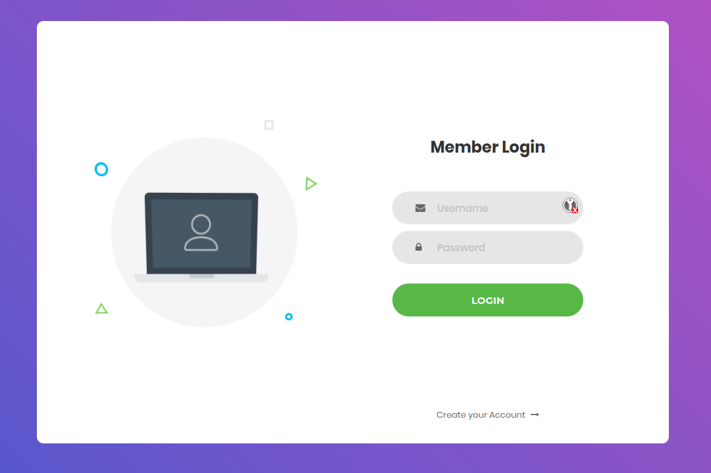

# HackTheBox - baby auth

We see a Simple Login page.

If we don't have a user yet, we can register one, what I did.

When we log in we only see "You are not an admin" and we get a cookie.

The cookie is simply encoded `base64` and is the value `{"username": "test"}` for my `test` user.

To get the user admin we just have to encode `{"username": "admin"}` `base64`, replace the cookie and after reloading the page we see the flag.

