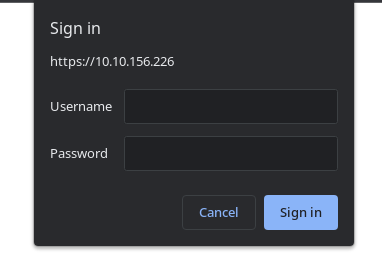

# TryHackMe - Lookback

I started as usual with a portscan.

`nmap -p- -T4 -sV <IP>`

We can see two open webserver ports and one open RDP port.I started to take a closer look at the webserver and ran __FFUF__.

On port 443 we are redirected to an Outlook login.

On port 80 __FFUF__ spit out the following results:

First I tried to exploit the vulnerability on port 443, which was too early at this point.

Only later did I look at what the `/test` directory on port 80 was all about.

We get to see a basic auth window.

The credentials were set very simple, so a second guess attemp let me log in.

I got to see the first flag and a custom interface.Now I tried __Command Injection__, and since we also get the Powershell Errors, I quickly found a vulnerability and a working POC code.

RCE: `') ; whoami #`

I established a reverse shell from here and looked around on the file system.

At the Desktop from user __dev__ I found the user flag and an important note called `TODO.txt`.

When I saw the contents of the note I was glad to see a few emails, as this was the missing piece of the puzzle for the __ProxyShell Exploit__ I had jumped on at the very beginning where i  got a bit lost at the start.

I used the exploit `windows/http/exchange_proxyshell_rce`, could now set the email and the exploit worked with the email `dev-infrastracture-team@thm.local`.

I operated as `NT authority\system` and fetched the final flag from the `Documents` folder of the `Administrator`.

