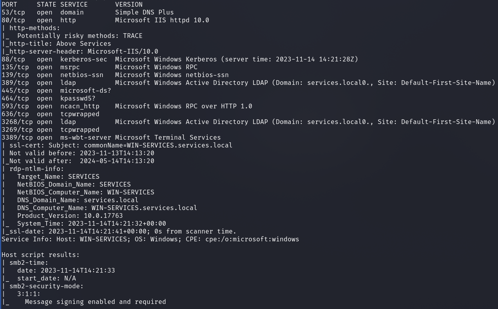
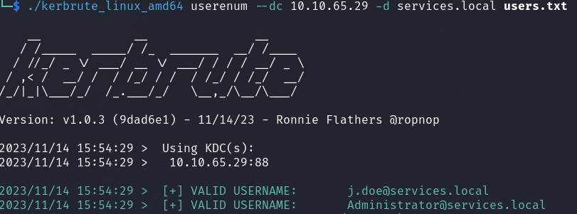
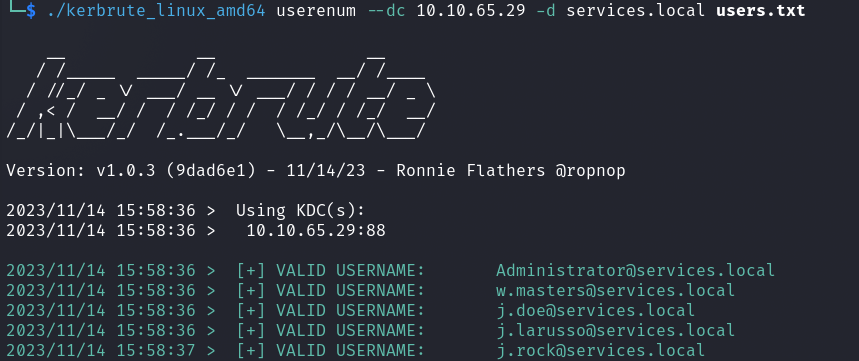
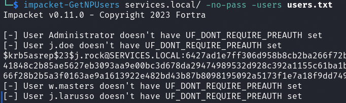
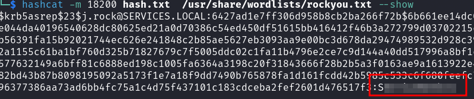
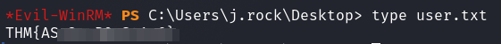
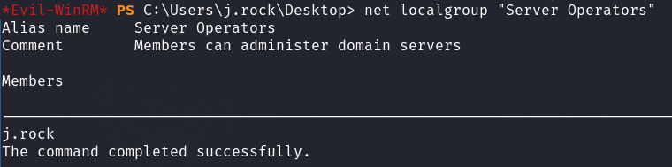
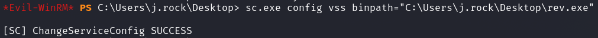
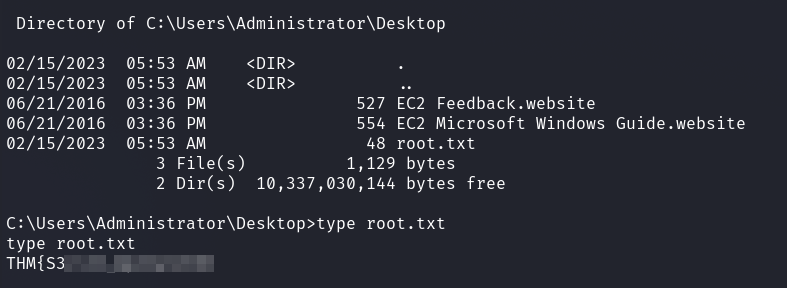

# TryHackMe - Services

I started with a port scan.

`nmap -sV -sC`

Based on the ports, we can immediately see that we are most likely dealing with a DomainController.

We also have an open web server on port `80`.

After my first standard checks on the SMB server, which did not bring me any useful results, I looked at what was behind the web server.

The first thing I did on the website was to make a note of the e-mail address in the contact Infos.

I wrote the user in a users.txt file and checked if `kerbrute` `userenum` matches the name and schema.

OK great.

I continued to look around the website and went through all the menus looking for other users and wrote the following users I found into my user file according to the same scheme.

The other persons were also confirmed.

Now I tried __ASREP Roasting__.

User `j.rock` has `preauth` disabled and we got a hash which I then cracked with `hashcat`.

`hashcat -m 18200 hash.txt  /usr/share/wordlists/rockyou.txt --show`

I logged in using `evil-winrm` and got the user flag on the desktop.

## Privilege Escalation

I managed the privilege escalation quite quickly.

First of all, I enumerated all users, groups and memberships via `net commands`.

`net localgroup "Server Operators"`

Our current user `j.rock` belongs to the group `Server Operators`.

With this group membership we are able to stop and start services.

I generated a reverse exe file with `msfvenom` and uploaded it to the target system.

Then I set the `binpath` of the `vss` service to the path of my `exe` file.

`sc.exe config vss binpath="C:\Users\j.rock\Desktop\rev.exe"`

I started the service `sc.exe start vss` and got a meterpreter as `SYSTEM`.

Root Flag:

